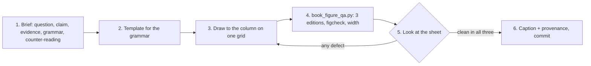

# TikZ Diagram Craft

A Book figure earns its page by letting a reader read one fact off its
geometry faster than the prose could say it. This skill is the house standard
for drawing that geometry and the loop that proves a figure prints: the
language (`figures/pd-figure-language.tex`, v2), ten grammar templates, three
worked redraws, and `scripts/book_figure_qa.py`.

## When to use

✅ **Use for**
- redrawing a Book figure that overflows, collides, or reads as a field of equal boxes;
- drawing a new figure for a chapter of the Book;
- restyling a fragment onto the v2 role names (from raw colours or v1 names);
- auditing a chapter's figures across the three editions before a build.

❌ **NOT for**
- deciding the figure's semantic form: settle the brief with `whitepaper-figure-system`
  (atlas row) first, then come back here;
- the research corpus (`docs/harbor-research/figures/`): `harbor-chartwork`;
- plots whose data lives in a script: compute them there, then draw with `pgfplots` here;
- plates, covers, chapter art: those are images, never TikZ.

## The standard in one screen

| Axis | Rule | Style names |
|---|---|---|
| Type | three voices, `\footnotesize`, never smaller; mixed case; no hyphenation | `pd title` (bold heads), `pd label` (upright names), `pd note` (one italic aside); `pd tag` = label knocked out of the page; `pd kind` = small-caps kind tag |
| Hue | the figure's subject in the **chapter hue**; anything else in its **concept hue**; 2–4 hues; every hue doubled by shape, dash or a word | `pd focus …`; `pd truth` cobalt, `pd legible` teal, `pd ready` green, `pd protocol` indigo, `pd identity` violet, `pd reputation` rust, `pd value` gold, `pd breach` red (dashed, diamonds), `pd warn` amber (rules only, never text) |
| Weight | .5 / .9 / 1.6 pt: guide and hairline / rule and edge / spine and focus | `pd hairline`, `pd guide`, `pd rule`, `pd spine`, `pd focus rule`, `X rule` |
| Surface | page < subordinate < subject: `pd state` (white, ink edge) < `pd artifact` (white, grey edge) < `pd focus state` / `X state` (24 % tint, same-hue edge) | fills always edged; text always ink |
| Ground | the page is white; knockouts and neutral surfaces are `pdpage`, never cream | `pd neutral fill` = warm grey band |
| Marks | numbered badges for guards and steps, keyed to a ruled legend *table*, never a paragraph in the picture | `pd badge`, `pd focus badge`, `pd datum`, `X datum` |
| Width | drawn to the **4.5 in column** (11.4 cm); 6.0 in full width only on purpose; never `\resizebox`, never scaled by the safety net | one `\def` grid per figure |

The file's header comment is the long form; `references/figure-standard.md`
is the rulebook with the reasons; `references/migration-v1-to-v2.md` maps
every v1 name and raw colour to its role.

## Core process



1. **Brief.** Six lines, written into the fragment's header comment: reader
   question; one-sentence claim; the evidence (the chapter's own names and
   numbers, and its script); what must be distinguished; the grammar chosen
   and the one rejected, with why it would mislead; the five-second test.
   Look up the figure's row in
   `skills/whitepaper-figure-system/references/semantic-figure-atlas.md`.
   Read the paragraph that cites the figure: the figure must agree with it.
2. **Template.** Start from the template for the grammar (table below). Do
   not start from the old fragment's coordinates.
3. **Draw.** Declare the grid once (`\def\dy{..}`, `\def\sx{..}`) and place
   everything on it. Subject in `pd focus …`; other named things in their
   concept hue; guards as badges keyed to a `tabular` legend under the
   picture; one `pd note` at most. Keep `\pdfigurehue{<chapter hue>}` on the
   line before the picture (the QA driver sets the same hue).
4. **Prove it prints.**
   ```bash
   python3 skills/tikz-diagram-craft/scripts/book_figure_qa.py FRAGMENT.tex
   python3 skills/tikz-diagram-craft/scripts/book_figure_qa.py --chapter spawn-to-person
   ```
   Compiles in the Book's preamble (Palatino / Heros, 7 × 10 in, 4.5 in
   column) in Swiss (canonical), maritime and technical, in the chapter's hue;
   runs `harbor-chartwork`'s figcheck (T1–T5, T8 hard) and `beauty_lint.py`
   (B1–B10; every warning is read and either fixed or justified); fails any
   ink wider than the column; writes one contact sheet, editions side by side.
5. **Look.** Open the sheet at 100 %. PASS means the machine found nothing;
   it does not mean the figure is good. Check the five-point rubric in
   `skills/harbor-chartwork/references/craft-rules.md` on each edition.
6. **Caption and commit.** First sentence says what is drawn, second what it
   shows with the number, then the idealisation, then `[provenance]`.

## Grammar → template

| Reader question | Grammar | Template |
|---|---|---|
| what state can this be in, and what moves it | state machine, spine + off-ramps + badges | `templates/tpl-state-machine.tex`, `examples/redraw-workunit-machine.tex` |
| who sends what to whom, in what order | sequence with lifelines and numbered messages | `templates/tpl-sequence.tex` |
| what overlaps in time, what order comes out | swimlane Gantt over a commit rail | `templates/tpl-swimlane-gantt.tex` |
| what holds, from when to when | timeline of epochs | `templates/tpl-timeline-epochs.tex`, `examples/redraw-anchor-card-lifecycle.tex` |
| what sits on what | block stack with a bracket | `templates/tpl-block-stack.tex` |
| which cell of a 2 × 2 a case is | quadrant with an instance per cell | `templates/tpl-quadrant.tex` |
| what is inside what | nested sets on real axes | `templates/tpl-nested-sets.tex` |
| where each item lands | grid matrix | `templates/tpl-grid-matrix.tex` |
| what derives from what | tree / DAG, time left to right | `templates/tpl-tree-dag.tex` |
| what one change changes | before/after on identical geometry | `templates/tpl-before-after.tex` |
| what may pass a narrow gate | converging references into an aperture | `examples/redraw-commitment-oracle.tex` |
| how a quantity moves with a parameter | computed plot in `pd axis`, direct labels, worked point dropped to its tick | `whitepaper/figures/fig-swk-marker-decay.tex` |
| what range a quantity may legally take | regime plot, region between two curves via `fillbetween` | `templates/tpl-regime-plot.tex` |
| how a shape changes with one varying parameter | small multiples, `groupplot`, one shared scale | `templates/tpl-small-multiples.tex` |
| how two rankings compare | slope chart, two ranked columns, one line per item | `templates/tpl-slope-chart.tex` |
| how a quantity narrows through categorical stages | step chart, `const plot`, never interpolated | `templates/tpl-step-chart.tex` |
| what a running total owes to each correction | waterfall, floating bars computed base-to-top | `templates/tpl-waterfall.tex` |
| who sends what to whom, keyed to what each message binds | message-sequence ladder, numbered and forward-sloped, ruled legend | `templates/tpl-message-ladder.tex` |

**After any change to `pd-figure-language*.tex`**, re-prove the whole corpus
before committing: `book_figure_qa.py --all --editions swiss` (every fragment
the Book inputs), then one full Book build. A library that is harmless in the
figure you are editing can break another (the `bending` library divides by zero
on every self-loop, 2026-09-11).

A classification (n items × m properties) is a `booktabs` table, not a
figure. A quantity against a parameter is a `pgfplots` plot from the
chapter's script, with the worked point marked: `pd axis`, series named at
their ends (`pd series`, `pd focus series`, `pd <concept> series`), regions
with `fillbetween`, small multiples with `groupplots`. The language loads
pgfplots itself, so a plot works in every chapter build.

## Anti-patterns (every one was found in the Book, 2026-09-10 audit)

**Stickers.** *Novice:* back every label with a cream box so it reads over
lines. *Expert:* place labels in clear space; knock out with `pd tag`
(white) only where a label must sit on a rule. Cream on a white page is a
sticker; the v1 Book had hundreds.

**Label on the line.** *Novice:* put the relation word at the midpoint of
the edge. *Expert:* put it beside the edge, on the grid's half-pitch, or turn
it into a badge. figcheck T4 finds these; 20 of 63 v1 fragments had one.

**Scaled to fit.** *Novice:* `\resizebox{\textwidth}` or let the safety net
shrink it. *Expert:* redraw to 11.4 cm. Scaling takes an 8 pt label to 5.5 pt
(13 v1 fragments under 7 pt; 39 wider than the column).

**Prose in the picture.** *Novice:* a paragraph legend under the drawing,
set inside the tikzpicture. *Expert:* a ruled `tabular` keyed by badges, or
the sentence goes to the caption.

**Every node equal.** *Novice:* same box for the subject, its artifacts
and its failure. *Expert:* the surface ladder: subject tinted in the chapter
hue, artifacts subordinate, the refusal in `pd breach` dashed.

**Raw colour.** *Novice:* `draw=hhteal`, `fill=blue!20`. *Expert:* a
role (`pd legible state`). A raw colour does not follow the edition, so it
stays maritime-coloured in the Swiss and technical books.

**Empty or orphan marks.** A box with nothing in it, an arrow into white
space, a title another label runs through: the author reads these first.

## Scripts

| Script | What it does |
|---|---|
| `scripts/book_figure_qa.py` | compile × 3 editions in the chapter hue, figcheck, width gate, contact sheet, `results.json`; exit 1 on any failure |
| `scripts/beauty_lint.py` | the near-misses figcheck cannot see: B1 moat, B2 crowding, B3 text gap, B4 weight count, B5 hue count, B6 type sizes, B7 near-miss alignment, B8 height, B9 hyphenated label, B10 provenance; run by `book_figure_qa.py`, warnings drawn on the sheet |
| `scripts/palette_check.py` | CIEDE2000 separation between the hues in one figure, WCAG contrast of ink on a tint or a hue as text |
| `../harbor-chartwork/scripts/compile_fragment.sh` | the Book-mode compile underneath (`PD_EDITION`, `PD_CHAPTER_HUE`) |
| `../harbor-chartwork/scripts/tikz_precheck.py` | source lint (tiny text, fills without edges, raw colours) |

## References

| File | Consult when |
|---|---|
| `references/figure-standard.md` | drawing or reviewing: every rule, its number, and its source |
| `references/migration-v1-to-v2.md` | converting an existing fragment: v1 names, raw colours, and what replaces them |
| `references/exemplars.md` | picking a technique for a grammar: exemplars from the pgfplots manual, TeXample.net/tikz.net, Tufte, Wilke, Economist/Datawrapper, Lamport, RFCs and Harel, mapped onto the house role names |
| `templates/` | starting a figure of a given grammar |
| `examples/` | three Book figures redrawn to the standard, with their briefs in the header |

## Validation

```bash
python3 -m unittest skills/tikz-diagram-craft/tests/test_beauty_lint.py
```
`tests/test_beauty_lint.py` draws a synthetic PDF per check with a case it must flag and a case it must pass.
