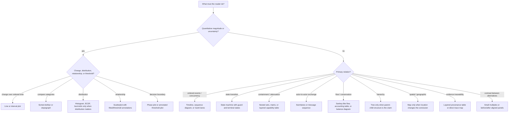

# TikZ Figure Engineering

The expert move is to choose the **visual grammar before drawing boxes**. A
figure is successful only when a reader can recover the paper's claim from the
marks, relationships, scale, and annotations without reconstructing it from the
caption. A beautiful node graph that makes every entity look equivalent is a
semantic failure.

This skill turns a claim into a tested figure through four gates:

1. characterize the reader question and evidence;
2. select the smallest truthful visual grammar;
3. compose it with a measured TikZ layout system; and
4. render, inspect, revise, and retain the review record.

For a canonical Port Daddy whitepaper figure whose semantic form is not yet approved, activate
`whitepaper-figure-system` first and apply its stable atlas row or cross-volume reuse contract.
Return here once the reader question, required evidence, counter-reading, and representation
family are settled. This skill owns TikZ source, typography, spacing, rendering, page fit, and
contact sheets; `whitepaper-figure-system` owns what the figure must mean.

Run the local tool before trusting a figure:

```bash
python3 skills/tikz-figure-engineering/scripts/render_tikz_figure.py figure.tex \
  --out-dir build/figure --preview --strict --max-width-in 6.5 --max-height-in 4.6
```

For a contact sheet while auditing a paper suite:

```bash
python3 skills/tikz-figure-engineering/scripts/render_tikz_figure.py figures/ \
  --out-dir build/contact-sheet --contact-sheet --strict
```

The ordinary edit loop emits one color PNG only. It does not generate grayscale
copies. `--contact-sheet` is a batch-review option and needs ImageMagick for
composition; a normal single-figure preview needs only `pdftocairo` *or*
ImageMagick.

## Gate 0: write the figure brief before TikZ

Copy [the figure brief](templates/figure-brief.md). Do not begin with an
object list. State one reader question, one primary claim, the available
evidence, and what would make the claim false. If the figure cannot answer a
specific question, it should probably be a paragraph, table, or deleted.

Required brief fields:

- **Reader question:** the decision or comparison the figure enables.
- **Claim:** one sentence, with the direction or relation explicit.
- **Data/objects:** type, cardinality, units, order, uncertainty, and source.
- **Must distinguish:** relationships that cannot be flattened or implied.
- **Visual grammar candidate:** chosen below, plus rejected alternatives.
- **Reader action:** compare, trace, locate, audit, estimate, or decide.
- **Acceptance test:** what a five-second reader should be able to say.

## Gate 1: select the grammar, not the decoration



Read [the visual grammar atlas](references/visual-grammar-atlas.md) for the
full mapping and rejection rules. Read [plot design and perception](references/plot-design-and-perception.md)
when quantities are encoded.

### Fast rejection rules

- **Do not use a node-link graph** for a sequence, a schedule, a pipeline, a
  comparison, or a subset relation. A graph earns its complexity only when
  topology itself is the finding.
- **Do not use arrows as prose underlines.** Every arrow must encode direction,
  timing, causality, transfer, authority, or a defined relation.
- **Do not put a sentence on an edge.** Use a short relation label, a numbered
  callout, or a nearby annotation band.
- **Do not make color carry a distinction without an independent cue** such as
  line style, marker, position, label, or pattern.
- **Do not use an illustration where a measured structure is claimed.** Cover
  art belongs in front matter; figures make arguments inspectable.

## Gate 2: layout architecture

Use [the layout system](references/tikz-layout-system.md) and the publication
template. Establish a canvas, columns/lanes, annotation territory, and label
hierarchy before routing an edge.

Non-negotiable constraints:

- Keep a 5--8 pt clear moat from node border to its text; use `text width` and
  `align`, never manual line-break roulette.
- Reserve top/bottom bands for titles, legends, equations, and callouts; do not
  route paths through them.
- Align repeated structures by named coordinates, matrices, or `fit` nodes.
  Never eyeball offsets in a repeated layout.
- Put labels beside, not on, dense plots; use leaders that terminate outside the
  plotting rectangle.
- Use no more than one semantic accent and one warning/error accent unless the
  data itself has categories that demand more.
- Keep prose out of the figure. A node gets a noun and a short qualifier, not a
  paragraph that duplicates the caption.
- If a figure needs a legend, make the legend occupy a deliberate region and
  repeat the critical term near its mark.

## Gate 3: render-review loop

1. Create a self-contained `.tex` source from
   [the publication template](templates/publication-figure.tex).
2. During an edit loop, run `render_tikz_figure.py ... --preview --strict` on
   the one figure being changed. It compiles once and emits one color PNG; do
   not rebuild a parent paper, rasterize every page, or generate grayscale
   copies after a small adjustment.
3. Inspect that generated PNG at 100%. Compile the parent paper only at a
   batch gate (after a coherent set of figure changes), then inspect the
   relevant color page. Generate a contact sheet only when several figures
   are changing and their cross-figure balance needs review.
4. Treat every warning as evidence: overfull boxes, missing glyphs, undefined
   references, cropped ink, missing output, and forbidden tiny text fail the
   gate. The tool also reports long edge labels and dense nodes for review.
5. Record diagnosis, chosen grammar, rejected grammar, and remaining caveat in
   the figure brief. Then rebuild the parent paper with
   `latex-whitepaper-engineering`.

The renderer checks compilation and page-level fit, not whether the claim is
true. That is why Gate 0 exists. Use [quality gates](references/figure-quality-gates.md)
for the manual review ledger.

## Anti-patterns that previously ruined papers

| Novice move | Expert replacement | Timeline consequence |
|---|---|---|
| Turn every relationship into rounded boxes and arrows | Select a schedule, matrix, plot, state machine, or small multiple from the reader task | Homogeneous nodes erase the actual distinction immediately |
| Add labels after routing | Reserve labels/callouts first, then route through whitespace | Text eventually overlaps curves, shapes, and prose |
| Encode “good” as saturated blue everywhere | Use a restrained semantic palette: ink, muted fill, one positive accent, one warning accent | Visual hierarchy collapses and print contrast suffers |
| Explain a quantitative claim with an icon diagram | Use an axis, measured scale, uncertainty band, and direct annotations | The evidence cannot be checked or compared |
| Hide all complexity in a caption | Let the figure expose the decisive structure and let the caption state the takeaway | Readers see decorative prose instead of an argument |
| Treat generated cover art as diagram material | Place unmodified art as a cover/frontispiece only; engineer diagrams separately | Art is damaged and the paper gains neither a cover nor evidence |

## Output contract

Deliver all of the following for each figure:

1. completed figure brief;
2. self-contained TikZ source with semantic styles and stable coordinates;
3. PDF + PNG render report from the local tool;
4. a concise manual review ledger with pass/fail for claim, grammar, hierarchy,
   spacing, labels, color, page fit, and caption independence; and
5. a one-sentence explanation of why the rejected visual grammar would mislead.

## Package choices

Start small and load packages for a clear reason. `tikz` + `positioning`,
`calc`, `fit`, `matrix`, `arrows.meta`, and `backgrounds` cover most structured
diagrams. Use `pgfplots` for measured plots, `booktabs`/`tabularray` for
evidence matrices, `siunitx` for quantities, `microtype` for paper typography,
and `caption`/`subcaption` for caption discipline. Read the full
[package catalog](references/latex-package-catalog.md) before adding specialized
libraries; package accumulation is not quality.

## Validation

```bash
python3 -m unittest skills/tikz-figure-engineering/tests/test_render_tikz_figure.py -v
python3 skills/tikz-figure-engineering/scripts/render_tikz_figure.py \
  skills/tikz-figure-engineering/examples/clean-two-lane-sequence.tex \
  --out-dir build/tikz-skill-smoke --preview --strict --max-width-in 6.5 --max-height-in 4.6
```

For research rationale and citations, read [research notes](references/research-notes.md).

<!-- BEGIN BUNDLE INDEX (generated by the skill-architecture validator) -->

## Skill Bundle Index

*Every file in this skill, and when to open it. Generated by the skill-architecture validator.*

**root**
- [`CHANGELOG.md`](CHANGELOG.md) — Changelog — - First release: task-first visual-grammar selection, publication-layout constraints, professional TikZ package guidance, research notes, te
- [`README.md`](README.md) — TikZ Figure Engineering skill assets — Run the self-contained renderer: The script requires a local LaTeX engine (`pdflatex`, `xelatex`, or `lualatex`) and one rasterizer (`pdftoc

**`examples/`**
- [`examples/clean-two-lane-sequence.tex`](examples/clean-two-lane-sequence.tex)

**`references/`**
- [`references/figure-quality-gates.md`](references/figure-quality-gates.md) — Figure quality gates — Review at full page size and at 100% raster size.
- [`references/latex-package-catalog.md`](references/latex-package-catalog.md) — LaTeX/TikZ package catalog — Load only what the chosen grammar requires.
- [`references/plot-design-and-perception.md`](references/plot-design-and-perception.md) — Plot design and perception — Use measured plots when the conclusion depends on a quantitative relationship.
- [`references/research-notes.md`](references/research-notes.md) — Research notes and sources — This skill uses a task-first process because visualization design errors cascade: an attractive encoding cannot repair an incorrect task/dat
- [`references/tikz-layout-system.md`](references/tikz-layout-system.md) — TikZ layout system — Set a target canvas before drawing: single-column (`3.2in`), text width (`6.5in`), or full page.
- [`references/visual-grammar-atlas.md`](references/visual-grammar-atlas.md) — Visual grammar atlas — Start with the *reader operation*, not the nouns in the prose.

**`scripts/`**
- [`scripts/render_tikz_figure.py`](scripts/render_tikz_figure.py) — Compile TikZ/LaTeX figures, rasterize them, and emit review evidence.

**`templates/`**
- [`templates/figure-brief.md`](templates/figure-brief.md) — Figure brief — - **Figure ID / paper / section:** - **Reader question:** - **One-sentence claim:** - **Evidence / objects / units:** - **Reader action:** c
- [`templates/publication-figure.tex`](templates/publication-figure.tex)

**`tests/`**
- [`tests/test_render_tikz_figure.py`](tests/test_render_tikz_figure.py) — script

<!-- END BUNDLE INDEX -->
