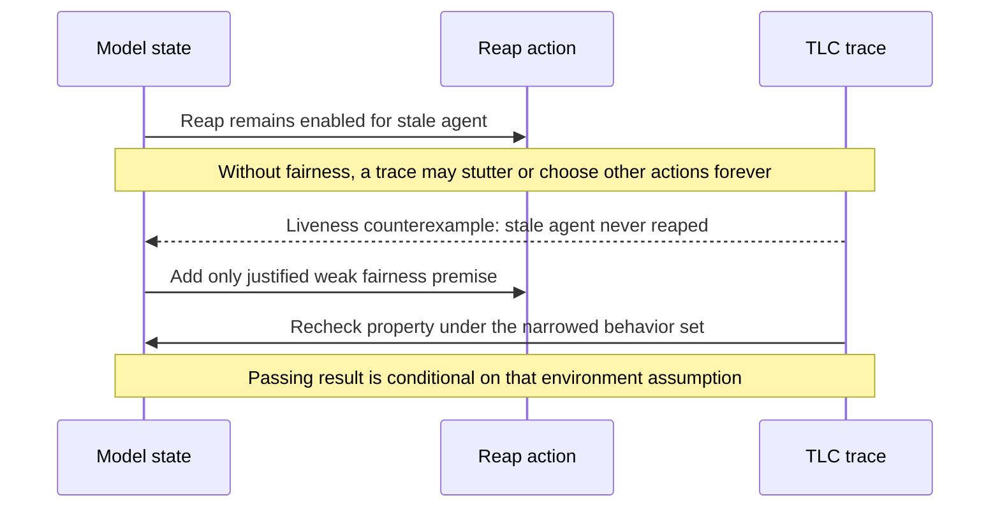

# T03 — Fairness changes the temporal claim

```mermaid
sequenceDiagram
  participant M as Model state
  participant R as Reap action
  participant T as TLC trace
  M->>R: Reap remains enabled for stale agent
  Note over M,T: Without fairness, a trace may stutter or choose other actions forever
  T-->>M: Liveness counterexample: stale agent never reaped
  M->>R: Add only justified weak fairness premise
  T->>M: Recheck property under the narrowed behavior set
  Note over M,T: Passing result is conditional on that environment assumption
```
