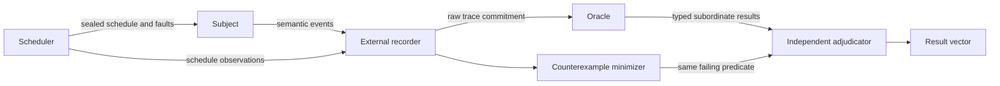

# Trial Basin Deterministic Systems Evaluation

Use this skill to say exactly what a deterministic test proved, what model it used, and what it did not touch. Evaluation is orthogonal to provenance: authentic bytes still need a proposition, model, schedule, faults, oracle, negative controls, and independently held evidence.

## Activate when

- a simulator, deterministic fake, model checker, replay, shadow, or canary result supports a readiness claim;
- concurrency, retries, cancellation, ambiguity, capacity, resurrection, or settlement need reproducible fault schedules;
- a counterexample should be minimized without losing the failing predicate;
- an oracle or test harness could pass tautologically;
- multiple subordinate outcomes must remain visible rather than collapse into one green verdict;
- fixture promotion needs a versioned raw-trace and model-correspondence receipt.

## Do not activate for

- launching Port Daddy, a daemon, an agent, a VM, or a provider call;
- granting network, filesystem, process, spend, or credential authority;
- claiming OS or hypervisor containment from an in-process fake;
- approving a real canary or production release;
- replacing security, accessibility, legal, market, or human research;
- ordinary unit tests whose result is not used as system-level evidence.

## Evaluation envelope

Freeze before execution:

- proposition and subject;
- repository anchor, policy digest, truth state, and environment class;
- model correspondence and explicit exclusions;
- schedule, virtual clock, seeds, and fault envelope;
- recorder ownership and raw evidence destination;
- oracle version and mutation set;
- manifest-declared negative controls;
- typed result axes and promotion ceiling.

Late changes create a new envelope. A passing rerun under a different model, oracle, schedule, or fault set does not repair the old result.

## Independent evidence topology



Scheduler, subject, recorder, oracle, and adjudicator must not share a decisive control domain. Guest evidence may corroborate; it cannot be the sole decisive witness.

## Deterministic method

1. Define semantic events and the observation projection.
2. Seal virtual clock, scheduler, seed, interleaving, provider model, and fault envelope.
3. Commit the raw trace before filtering, minimization, or oracle changes.
4. Exercise crash-before/after, duplicate, reorder, delay, drop, stale generation, lost acknowledgement, and permanent unavailability.
5. Declare negative controls by manifest, not filename convention.
6. Mutate every bound digest, gate, deny/permit branch, nonce, obligation, and oracle predicate.
7. Replay semantic events; do not require incidental byte-for-byte envelope equality.
8. Minimize only if raw and minimized traces trigger the same named predicate.
9. Emit a typed result vector preserving `PASS`, `FAIL`, `INCOMPLETE`, and `UNKNOWN` axes.
10. Promote only within the envelope's evidence class.

## Model correspondence

Every modeled mechanism maps to a claimed real mechanism, with:

- modeled substitute;
- shared semantic contract;
- known mismatch;
- excluded behaviors;
- falsifier for the correspondence.

Unmapped behavior is non-evidence. Deterministic fake results can establish reducer, conservation, and protocol properties inside the model. They cannot establish OS containment, provider cancellation, real spend refusal, network mediation, accessibility, or operator comprehension.

## Human-semantic boundary

Static fixtures may test wording, focus order, reflow, contrast tokens, and expected announcements. They do not prove assistive-technology integration, comprehension, reaction time, or live control. Those axes remain `INCOMPLETE`, `UNKNOWN`, or `BLOCKED_BY_HALT` until the matching witness exists.

## Anti-patterns

### Self-certified harness

**Wrong:** one process schedules, records, minimizes, evaluates, and declares success.
**Right:** separate decisive control domains and retain the raw trace.

### Determinism theater

**Wrong:** seed a random number generator while leaving clocks, process order, network, and provider replies uncontrolled.
**Right:** name every nondeterministic source and either model, seal, or exclude it.

### Green scalar

**Wrong:** one PASS hides containment `UNKNOWN` and accessibility `INCOMPLETE`.
**Right:** preserve the typed result vector and subordinate disagreement.

### Negative control by filename

**Wrong:** assume files named `failure-*` prove the harness catches failures.
**Right:** declare expected predicate and result in a signed manifest.

## Output and validation

- [`schemas/trial-basin-evaluation-v1.schema.json`](schemas/trial-basin-evaluation-v1.schema.json)
- [`examples/valid-deterministic-fake-evaluation.json`](examples/valid-deterministic-fake-evaluation.json)
- [`scripts/validate-trial-basin-evaluation.mjs`](scripts/validate-trial-basin-evaluation.mjs)
- [`scripts/test-bundle.mjs`](scripts/test-bundle.mjs)
- [`references/evidence-model-and-replay.md`](references/evidence-model-and-replay.md)
- [`tests/activation.md`](tests/activation.md)

```bash
node skills/trial-basin-deterministic-systems-evaluation/scripts/validate-trial-basin-evaluation.mjs \
  skills/trial-basin-deterministic-systems-evaluation/examples/valid-deterministic-fake-evaluation.json
node skills/trial-basin-deterministic-systems-evaluation/scripts/test-bundle.mjs
```

A valid static envelope authorizes no runtime, canary, release, or truth promotion.
