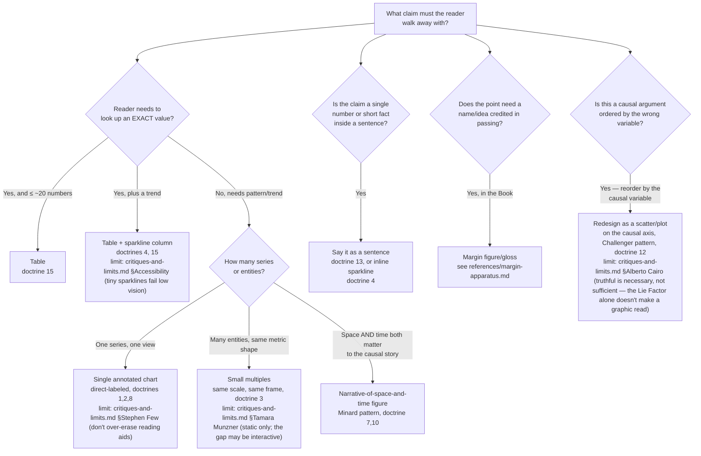

# Tufte Evidence Design

Before drawing anything, name the claim the reader needs to walk away with, then pick the smallest, most honest form
that carries it — per Tufte, "graphical excellence is that which gives to the viewer the greatest number of ideas in
the shortest time with the least ink in the smallest space" (paraphrase of VDQI's stated ideal; see
`references/sources.md` for verification notes on exact wording).

## When to Use

✅ **Use for**: choosing between a table, sparkline, small-multiples grid, single annotated chart, margin figure, or a
plain sentence for a piece of evidence; auditing an existing chart, table, dashboard, or slide for chartjunk, a
misleading Lie Factor, or a buried comparison; deciding where a Book chapter should carry a `\pdmarginfigure`,
`pdboundary`, or `pdexample`; reviewing whether a docs page integrates text and figure or segregates them; writing a
caption or a claim as a sentence instead of a bullet fragment.

❌ **NOT for**: choosing a charting library, its API, or its color-scale implementation (see `dataviz` skill); drawing
the actual TikZ source for a figure once its form is chosen (see `harbor-chartwork` and `tikz-figure-engineering`);
general web-app visual design unrelated to evidence display (see `swiss-modern-website-design`, `ui-ux-pro-max`); the
statistical analysis or modeling that produces the numbers (this skill starts once you have the numbers and a claim).

## Core Process: Evidence Form Decision Tree

Walk the tree top to bottom for the dominant need; a single piece of evidence often needs two branches together (a
table with a sparkline column; a small-multiples grid where each panel is itself direct-labeled). The four "limit"
lines are not detours — read the named section of `references/critiques-and-limits.md` before applying that branch's
rule, so the rule is applied with its known objection already in view rather than discovered later in review.

## Checklists

### Graphical integrity (run on every chart before shipping)

- [ ] Lie Factor is between 0.95 and 1.05 (physical size of the effect shown ÷ actual size of the effect in the data).
- [ ] Axes are labeled in standard units, on the graphic itself, not only in a caption.
- [ ] Every series/point that can be labeled directly is — no legend required for ≤6 series.
- [ ] Number of visual dimensions ≤ number of data dimensions (no 3D bar for a 1D number; no area encoding a scalar).
- [ ] Monetary/indexed values are deflated/normalized when the point is comparison across time.
- [ ] All the relevant data is shown, not a subset chosen to make the point look stronger (see the Challenger and
      Snow cases in `references/doctrines.md` #10–12).

### Data-ink / chartjunk audit

- [ ] Every mark on the page either encodes data or labels/orients the reader — nothing is purely decorative.
- [ ] No gratuitous 3D, gradient fill, drop shadow, or background image behind a data mark.
- [ ] Any retained "redundant" ink (a gridline, both a legend and direct labels) is retained because it demonstrably
      speeds reading for this audience, not by default — see `references/critiques-and-limits.md` (Few, Wilke) before
      reflexively stripping it.
- [ ] Run `scripts/ink_audit.py` on the rendered PNG as a second opinion, not a verdict (see below).

### Small multiples (when the tree says "many entities, same shape")

- [ ] All panels share the same scale/domain on every shared axis.
- [ ] All panels are the same physical size and use the same visual encoding.
- [ ] Exactly one dimension varies panel-to-panel (time window, entity, region) — not two confounded at once.
- [ ] The panel-to-panel *difference* is the finding, not a caption explaining what to look for.

### Sparklines (when the tree says "table + trend" or "sentence")

- [ ] Roughly word/line-height sized — if it needs its own row, it's a chart, not a sparkline.
- [ ] No axis, no gridlines, no legend on the sparkline itself.
- [ ] The one number that matters (current/last value) is direct-labeled as text, not read off the pixels.
- [ ] Placed inline in the sentence or table cell it describes, at first use.

### Margin apparatus (Book chapters — see `references/margin-apparatus.md` for the full state)

- [ ] The idea, not just the name, carries the sentence before you add a `\pdmarginfigure`.
- [ ] At most one PORTRAIT per section (a `\pdmarginfigure` slug that resolves under `plates/marginalia/`, checked
      against `docs/harbor-research/exposition/MARGINALIA-PLACEMENT.md`) — a small multiple, sparkline, or regime
      strip in the margin faces no such quota; the Book's margin column is meant to be used generously.
- [ ] The plate is cleared (no `.NOT-CLEARED.json` sidecar) before writing a portrait's macro call.
- [ ] Two margin figures of any kind are not placed within about a dozen source lines of each other, or they will
      likely collide on the printed page (`scripts/margin_lint.py` warns advisory; the real gate is the build log's
      "Marginpar on page" count).
- [ ] Every house term gets its own `\pdgloss{Term}{one-line definition}` at its first use — a chapter may (and
      should) carry many glosses, one per term — not `\pd@marginhead{Term}` by hand, and never the SAME term glossed
      twice (`scripts/margin_lint.py` checks both this and that the term actually appears in the chapter's own prose).
- [ ] A "wall of text" finding (no figure/table/session for 4+ pages) is fixed with `pdsession`/`pdexample`/a redrawn
      figure, not a margin portrait — those are different failure modes.

### Words, numbers, images, and sentences-over-bullets

- [ ] A figure sits at its first mention in the reading column, not in a gallery or a caption three screens away.
- [ ] Every caption states the figure's *claim* as a sentence, not a label ("X stays flat until Y crosses Z, then
      rises linearly" beats "Figure 3: X vs Y").
- [ ] Any list of independent, unordered facts is a bullet list; any argument with a logical connective (because,
      therefore, unless, compared to) is a sentence or paragraph, not a bullet fragment.
- [ ] A slide deck for a decision meeting is backed by a dense written document the room reads first (doctrine 12,
      18) — bullets are not the argument, they are, at best, an agenda.

## Anti-Patterns

### Anti-Pattern: Maximizing the data-ink ratio by literally deleting ink

**Novice**: "Tufte says maximize data-ink ratio, so I deleted the gridlines, the legend, and the axis tick labels to
raise the ratio."
**Expert**: The ratio is a diagnostic for *finding* chartjunk, not a score to literally maximize by pixel count. A
light gridline a reader uses to line up a bar with its axis label is doing real work; deleting it raises the ratio
number while making the reader search harder for the same fact. Ask "does removing this make the reader work harder
for the same fact?" — if yes, keep it (see `references/critiques-and-limits.md`, Few and Wilke).
**Detection**: A figure with the most ink removed but a reader now needs the caption or a legend elsewhere on the
page to decode a value they used to read directly off the mark.

### Anti-Pattern: The stat-card dashboard

**Novice**: "Six services, six pretty cards with icons, gradients, and a big number each — looks impressive."
**Expert**: This maximizes chartjunk per comparison: six differently-scaled mini-charts force the reader to hold five
numbers in memory while reading the sixth. A small-multiples sparkline table (same scale, direct-labeled) lets the
comparison resolve visually. See `examples/dashboard-to-sparkline-table.md` for the full before/after.
**Detection**: `scripts/ink_audit.py` flags high `ink_fraction` and high `distinct_colors` on the card backgrounds;
more reliably, ask whether comparing two entities requires the reader to look away and back.

### Anti-Pattern: Ordering the causal chart by the wrong variable

**Novice**: "Here's a table of incidents in chronological order, with the suspected cause noted in a footnote."
**Expert**: This is the exact Morton Thiokol/Challenger failure (doctrine 12): the causally relevant variable
(temperature, load, whatever the hypothesis is) belongs on an axis, and every case — not just the failures — needs to
be plotted, or the correlation stays invisible even though the data was "shown." See
`examples/challenger-style-redesign.md`.
**Detection**: A report argues "X causes Y" but the accompanying table/chart is sorted by date or by an ID, not by X.

### Anti-Pattern: Reaching for `\pdgloss` a second time in the same chapter

**Novice**: "This term of art comes up three times in the chapter, so I'll `\pdgloss` it at each occurrence to make
sure the reader always has the definition handy."
**Expert**: `\pdgloss` is now implemented (`figures/pd-pedagogy.tex`), but it is a first-use device, not a recurring
one — a margin note repeated at every mention crowds the column and stops meaning anything special the second time.
Gloss the term once, at the first use in the chapter where it does real work; every later mention relies on the reader having
read that one note, the same way a paper defines a term once and uses it freely afterward.
**Detection**: `scripts/margin_lint.py` flags a term glossed more than once in one chapter.

## References

Consult these for depth — none is loaded automatically:

| File | Consult when |
|------|-------------|
| `references/doctrines.md` | You need the reasoning/source behind a rule, not just the checklist form — data-ink, Lie Factor, small multiples, Minard, Snow, Challenger, the six analytical-design principles, the one-day course rules. |
| `references/margin-apparatus.md` | Adding or reviewing a Book chapter's sidenotes, margin figures, full-width figures, or the measure — includes the tufte-latex reference implementation and this repo's exact macro state (what exists, what's planned). |
| `references/web-application.md` | Applying the doctrines to `website-v2` docs pages — sparklines in tables, small multiples in a CSS grid, direct labeling, margin notes in a reading column. |
| `references/critiques-and-limits.md` | Deciding whether to deviate from a Tufte rule — Few, Cairo, Munzner, Wilke, Kosara, and the accessibility gap none of the four books address. |
| `references/sources.md` | Checking whether a specific claim in this skill is `[verified]` (fetched/search-confirmed this pass) or `[unverified]` before citing it further. |
| `examples/dashboard-to-sparkline-table.md` | Working a stat-card-dashboard redesign end to end. |
| `examples/challenger-style-redesign.md` | Working a chronological-to-causal chart redesign end to end. |
| `scripts/ink_audit.py` | Getting a heuristic second opinion (ink fraction, distinct colors, edge density) on a rendered PNG figure — `python3 scripts/ink_audit.py figure.png`. Degrades to a pure-stdlib PNG decoder if Pillow isn't installed. |
| `scripts/margin_lint.py` | Mechanically checking a Book chapter's margin apparatus — one PORTRAIT `\pdmarginfigure` per section (non-portrait margin figures are unlimited, advisory-warned only if two sit close together in source), every portrait slug's plate and sidecar present, no `\pdgloss` term repeated in a chapter and every glossed term present in its own running prose — over the eight chapters by default; `\footnote` findings are reported but advisory (see the script's own docstring for why). |
| `scripts/tufte.py` | The single entry point for this skill's scripts: `tufte.py audit <png...>` (ink_audit.py, `--strict` to fail on flags), `tufte.py margin-lint [tex...]` (margin_lint.py), `tufte.py checklist <kind>` (one checklist from SKILL.md, kinds read from the file), `tufte.py decision-tree` (this section's flowchart as text). |

<!-- BEGIN BUNDLE INDEX (auto: index_references.py) -->

## Skill Bundle Index

*Every file in this skill, and when to open it. Auto-generated by skill-architect's <!-- phantom-ok --> `scripts/index_references.py --fix` (that script lives in the skill-architect toolkit, not in this skill).*

**root**
- [`CHANGELOG.md`](CHANGELOG.md) — Tufte Evidence Design — Changelog — - Initial skill creation, built from a research pass over Edward Tufte's four books (The Visual Display of Quantitative Information; Envisio
- [`README.md`](README.md) — Tufte Evidence Design — Applies Edward Tufte's evidence-design doctrine — data-ink ratio, graphical integrity and the Lie Factor, small multiples, sparklines, layer

**`examples/`**
- [`examples/challenger-style-redesign.md`](examples/challenger-style-redesign.md) — Before/After: Chronological Incident Chart → Causal Scatter (the Challenger pattern) — **Situation**: A postmortem or reliability report needs to argue that a specific factor (temperature, load, config version, region) causally
- [`examples/dashboard-to-sparkline-table.md`](examples/dashboard-to-sparkline-table.md) — Before/After: Stat-Card Dashboard → Sparkline Table — **Situation**: A docs or ops page needs to show six services' request rate, error rate, and p99 latency, each with a one-week trend.

**`references/`**
- [`references/critiques-and-limits.md`](references/critiques-and-limits.md) — Critiques and Limits — Tufte's doctrines are not universally accepted engineering law; they are one strong, historically influential design philosophy with real, n
- [`references/doctrines.md`](references/doctrines.md) — The Doctrines — Every principle below names its source book.
- [`references/margin-apparatus.md`](references/margin-apparatus.md) — Margin Apparatus: Sidenotes, Margin Figures, Full-Width, and the Measure — Tufte's own books are laid out with a narrow text column and a wide outer margin carrying notes, small figures, and dates — the reader never
- [`references/sources.md`](references/sources.md) — Sources — Every claim in this skill traces to one of the entries below.
- [`references/web-application.md`](references/web-application.md) — Applying the Doctrines to a Documentation Website — The four books are about print.

**`scripts/`**
- [`scripts/ink_audit.py`](scripts/ink_audit.py) — ink_audit.py — heuristic data-ink / chartjunk audit for a rendered PNG figure.
- [`scripts/margin_lint.py`](scripts/margin_lint.py) — !/usr/bin/env python3
- [`scripts/tufte.py`](scripts/tufte.py) — tufte.py -- one entry point for this skill's scripts and reference lookups.

<!-- END BUNDLE INDEX -->
