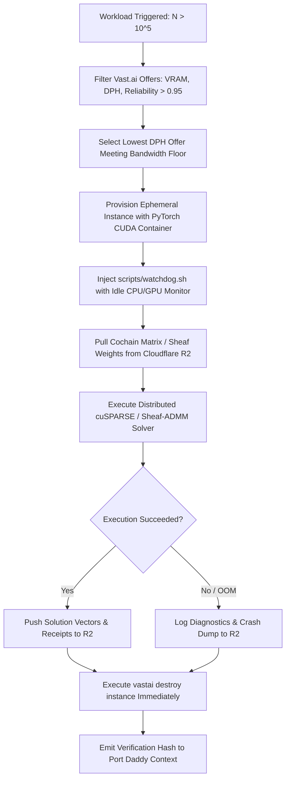

# Vast.ai & Rent-a-Cluster GPU Orchestration: High-Throughput Compute Fabric

Provision, secure, monitor, and tear down ephemeral GPU clusters for high-performance tensor computing, neural sheaf diffusion, and large-scale sparse spectral solvers.

## Philosophy

**Compute is an ephemeral, risk-managed utility.** In heavy algebraic topology and multi-agent complex simulations ($N > 10^5$ vertices, $|F| > 10^6$ faces), local workstation memory and compute are rapidly exhausted. Rent-a-cluster marketplaces (Vast.ai, RunPod, Lambda) provide orders-of-magnitude cheaper FLOPS ($0.20–$1.80/hr) than hyperscalers, but carry strict operational requirements:
1. **Zero Idle Leakage**: Automated watchdogs must enforce self-destruction when utilization drops.
2. **Stateless Ephemerality**: Local disks are transient scratch space; checkpoints must continuously stream to object storage (Cloudflare R2 / S3).
3. **Hard Spend Caps**: Pre-funded budgets and strict time-to-live (TTL) bounds prevent runaway credit depletion.

---

## When to Use

✅ **Use for**:
- Scaling up large-scale simplicial complex Hodge solvers ($N > 10^5$ nodes, $|F| > 10^6$ triangles) where CPU RAM exhausts.
- Training Neural Sheaf Diffusion models (Bodnar et al. 2022) with learned Stiefel manifold restriction maps $P_e(\theta)$.
- Running unrolled Sheaf-ADMM optimization (Seely et al. 2026) requiring batched tensor SVDs.
- Automated cost-fenced batch runs with mandatory idle watchdog termination.

❌ **NOT for**:
- Local fleet monitoring ($10^2$ to $10^4$ agents) where standard CPU solve time is $< 2$ms.
- Running persistent web applications or relational database servers.
- Unmonitored, long-running exploratory sessions without automated spend-cap watchdogs.
- Non-GPU batch jobs (CPU-only data processing, standard shell automation).

---

## Decision Points

### Action Branch Selection

```
Query analysis:
├─ Contains "search" OR "offers" OR "find gpu" → SEARCH path
├─ Contains "rent" OR "provision" OR "create instance" → PROVISION path
├─ Contains "watchdog" OR "auto-teardown" OR "cost" → COST-FENCE path
├─ Contains "cuda" OR "sheaf diffusion" OR "cusparse" → WORKLOAD path
└─ Contains "stop" OR "destroy" OR "terminate" → TEARDOWN path
```

### GPU Architecture Selection Tree

```
Workload characteristics:
├─ VRAM <= 24GB & Float32/Float16 matrix ops → Single RTX 4090 ($0.25 - $0.40/hr)
├─ 24GB < VRAM <= 80GB & Dense double precision (Float64) → NVIDIA A100-SXM4 80GB ($1.20 - $1.80/hr)
├─ Batched Sparse Hodge Laplacian (>10M non-zeros) → A100/H100 NVLink cluster
└─ Interrupted-tolerant iterative training → Spot bidding (50-70% discount + R2 sync)
```

### Provisioning & Lifecycle State Machine



---

## Core Process & Automation

### 1. Market Search with Hard Reliability Filters
Never rent unverified hosts or high-latency machines. Filter for reliability $> 0.95$, download speed $> 200$ Mbps, and max price:
```bash
vastai search offers 'gpu_name = RTX_4090 inet_down > 200 reliability > 0.95 dph < 0.40' -o 'dph'
```

### 2. Ephemeral Container Deployment
Deploy official, validated PyTorch images with persistent disk allocated strictly for local scratch:
```bash
vastai create instance OFFER_ID \
  --image pytorch/pytorch:2.3.0-cuda12.1-cudnn8-runtime \
  --disk 40 \
  --ssh
```

### 3. Deploy Mandatory Idle Watchdog
Immediately inject and background `scripts/watchdog.sh`. If GPU utilization falls below 5% for $> 10$ minutes, the script triggers instance destruction:
```bash
scp -P SSH_PORT scripts/watchdog.sh root@HOST:/root/watchdog.sh
ssh -p SSH_PORT root@HOST "chmod +x /root/watchdog.sh && nohup /root/watchdog.sh > /root/watchdog.log 2>&1 &"
```

### 4. Zero-Rent Immediate Teardown
Never leave an instance in the `stopped` state. Always destroy:
```bash
vastai destroy instance INSTANCE_ID
```

---

## Failure Modes

### Paused Instance Storage Rent Bleed
- **Detection**: Account credit drains continuously while no computations are running.
- **Symptoms**: Surprise charges; instance status shows `stopped` instead of `destroyed`.
- **Fix**: Replace `vastai stop` with `vastai destroy instance`. Store states in remote object storage, not on local root disks.
- **Timeline**: Chronic trap across all community GPU marketplaces (Vast.ai, RunPod) since 2019.

### Spot Instance Eviction Without Checkpoints
- **Detection**: Job fails abruptly with status `terminated by host`; no output files found.
- **Symptoms**: Complete loss of multiple hours of iterative neural sheaf training.
- **Fix**: Implement periodic checkpointing to Cloudflare R2 every $K$ epochs ($K \le 10$) and auto-resume from the last valid checkpoint.
- **Timeline**: Fundamental characteristic of spot/preemptible markets.

### Zombie Idle GPU Compute Runaway
- **Detection**: GPU processes exit or hang on deadlock, but the container remains running at $100\%$ hourly rent.
- **Symptoms**: Entire team budget depleted over a weekend due to an unmonitored failed batch.
- **Fix**: Embed `scripts/watchdog.sh` into container startup; hook heartbeats to Port Daddy Quartermaster spend caps.
- **Timeline**: Codified in ADR-0050 Coast Guard Compulsion Rent.

### Ingestion Bandwidth Choke
- **Detection**: GPU compute utilization reads 0% for the first 45 minutes of a job.
- **Symptoms**: High spend on an expensive A100 GPU while it waits for a slow residential host link to download training data.
- **Fix**: Filter offers with `inet_down > 500` and stream pre-packaged compressed LMDB or NumPy shards.
- **Timeline**: Known host disparity on decentralized rental markets.

---

## Shibboleths / Anti-Patterns

### Paused Instance Billing Leak
- **Novice**: Uses `vastai stop` thinking stopped instances are completely free, incurring ongoing disk storage fees that drain the account.
- **Expert**: Paused instances continue to accrue storage disk rent every hour. Always harvests artifacts to remote S3/R2 and executes `vastai destroy instance` immediately.
- **Timeline**: Standard cloud pricing model across Vast.ai, RunPod, and Lambda.

### Unbounded Spot GPU Loss
- **Novice**: Runs a 12-hour continuous job on an interruptible spot instance without checkpointing or state synchronization.
- **Expert**: Saves model weights and solver states every 10 epochs to persistent R2 storage, enabling instant resume if outbid.
- **Timeline**: Established distributed training best practice.

### Over-Provisioning Interconnects for Embarrassingly Parallel Batches
- **Novice**: Rents an 8x H100 SXM5 cluster ($25/hr) to run parameter grid searches that have zero inter-GPU communication.
- **Expert**: Distributes individual runs across 8 independent single RTX 4090 instances ($0.35/hr each = $2.80/hr total), saving 89% of compute costs with zero NVLink contention.
- **Timeline**: Cluster sizing economics formalized in 2023.

---

## Worked Examples

### Example 1: Automated Spot RTX 4090 Provisioning with Watchdog

**User request**: "Rent the cheapest reliable RTX 4090, run our neural sheaf diffusion benchmark, and shut down automatically."

**Step 1 - Search Offers**:
```bash
vastai search offers 'gpu_name = RTX_4090 inet_down > 300 reliability > 0.98 dph < 0.35' -o 'dph' > offers.json
OFFER_ID=$(jq -r '.[0].id' offers.json)
```

**Step 2 - Launch Instance**:
```bash
INSTANCE_ID=$(vastai create instance $OFFER_ID --image pytorch/pytorch:2.3.0-cuda12.1-cudnn8-runtime --disk 30 --raw | jq -r '.new_contract')
```

**Step 3 - Background Watchdog & Launch Workload**:
SSH into instance, launch background watchdog monitoring PID:
```bash
ssh -p $PORT root@$HOST "nohup python3 run_sheaf_diffusion.py --epochs 50 --r2-sync > output.log 2>&1 &"
```

**Step 4 - Immediate Destruction Upon Completion**:
Remote script uploads artifacts to R2, then triggers:
```bash
vastai destroy instance $INSTANCE_ID
```

- **What novice would miss**: Leaving instance running after job completion; renting from host with low download speed causing 2-hour container pull.
- **What expert catches**: Script-controlled termination, strict host reliability filtering ($>0.98$), direct R2 artifact synchronization.

### Example 2: Distributed Hodge Laplacian cuSPARSE Batch

**User request**: "Solve the Hodge 1-Laplacian for a simplicial complex with 200,000 vertices and 1,500,000 edges."

**Step 1 - Hardware Sizing**:
- Matrix dimension: $1,500,000 \times 1,500,000$.
- Non-zeros: $\approx 9,000,000$ Float64 entries $\approx 144$ MB raw CSR, but Krylov subspace solver (Conjugate Gradient) requires 32GB+ working VRAM.
- Target hardware: NVIDIA A100 80GB PCIe or SXM.

**Step 2 - Provision Offer**:
```bash
vastai search offers 'gpu_name = A100_80GB inet_down > 500 reliability > 0.98 dph < 1.60' -o 'dph'
```

**Step 3 - Run PyTorch cuSPARSE Solver**:
Leverage `torch.sparse` with CUDA accelerated SpMV (Sparse Matrix-Vector product) to compute harmonic projection $\Pi_K g_K$.

**Step 4 - Harvest & Teardown**:
Write harmonic and curl norm summaries to local receipt JSON, transfer to host, and destroy instance in under 12 minutes total run time ($< $0.35 total spend).

- **What novice would miss**: Running Float64 operations on consumer RTX cards where FP64 rate is 1/64th of FP32.
- **What expert catches**: Selecting A100 with full-rate FP64 tensor cores for numerical precision on ill-conditioned Laplacians.

### Example 3: Emergency Idle Auto-Teardown on 402 Spend Cap Breach

**User request**: "Ensure no GPU job ever exceeds a strict $5.00 spend cap or stays idle for more than 10 minutes."

**Step 1 - Watchdog Configuration**:
Configure `scripts/watchdog.sh` with `MAX_HOURS=3.0` and `IDLE_THRESHOLD_MIN=10`.

**Step 2 - Process Supervision**:
Watchdog checks `nvidia-smi --query-gpu=utilization.gpu --format=csv,noheader,nounits` every 60 seconds.

**Step 3 - Hard Destruction**:
If utilization $< 5$ for 10 consecutive ticks, watchdog executes:
```bash
echo "Idle threshold exceeded. Initiating self-destruction."
vastai destroy instance $VAST_CONTAINERLABEL
```

- **What novice would miss**: Depending on human operator to remember to check terminal and stop server.
- **What expert catches**: Completely autonomous server-side kill switch that functions even if client workstation loses power or internet connectivity.

---

## Quality Gates

- [ ] `SKILL.md` exists and is under 500 lines.
- [ ] Frontmatter contains required `name` and `description` fields adhering to `[What][When to use] NOT [Exclusions]`.
- [ ] At least 3 temporal anti-patterns using Novice/Expert/Timeline template.
- [ ] All file references in `SKILL.md` actually exist on disk in the skill directory.
- [ ] Workflow diagram uses valid Mermaid syntax.
- [ ] Watchdog script `scripts/watchdog.sh` is executable and syntax checked.
- [ ] 5 positive trigger test queries pass.
- [ ] 5 negative trigger test queries pass.

### Activation Test Suite

**Positive Queries (Must Activate)**:
1. "Search for an available RTX 4090 GPU on Vast.ai with download speed over 300 Mbps."
2. "Provision an on-demand A100 80GB instance for neural sheaf diffusion training."
3. "How do I set up an automated idle watchdog to prevent runaway cloud GPU costs?"
4. "Rent a high-VRAM spot instance and configure PyTorch CUDA 12.1 environment."
5. "Execute batched sparse Hodge linear solver across a rented GPU cluster."

**Negative Queries (Must NOT Activate)**:
1. "Run a local bash script to list active docker containers." (Use local shell)
2. "Build a Next.js web application on localhost." (Use `modern-web-guidance`)
3. "Solve a 50-node graph shortest path problem." (Use local algorithm)
4. "Set up an AWS S3 bucket with Terraform." (Use `terraform-iac-expert`)
5. "Explain the mathematical definition of a chain complex." (Use `algebraic-topology-for-agents`)

---

## References & Progressive Disclosure

Read these reference files only when the specific domain context demands deep technical execution:

| File | Load When | Why |
|---|---|---|
| `references/vastai-cli-cheatsheet.md` | Searching, renting, connecting, or destroying instances | Comprehensive Vast.ai CLI flags, filtering syntax, and offer scoring |
| `references/unrolled-sheaf-diffusion-setup.md` | Setting up PyTorch CUDA environments for sheaf diffusion | Stiefel manifold parameterization, Cayley transforms, and batch recipes |
| `scripts/watchdog.sh` | Deploying inside rented containers | Automated background script that enforces auto-teardown when idle |

---

## NOT-FOR Boundaries

**This skill should NOT be used for**:
- Local fleet coordination or low-overhead agent routines on CPU.
- Persistent production infrastructure (long-term database hosting, public API gateways).
- Non-GPU batch workloads or basic CPU data engineering.
- Unmonitored, open-ended instances without automated spend caps.

**Delegate to these skills instead**:
- For mathematical derivations of Hodge Laplacians and cellular sheaves → `algebraic-topology-for-agents`
- For local multi-agent fleet spend metering and token budgets → `context-economics-for-agent-swarms`
- For persistent containerization & Dockerfile optimization → `docker-multi-stage-optimizer`
- For cloud infrastructure-as-code management → `terraform-iac-expert`
