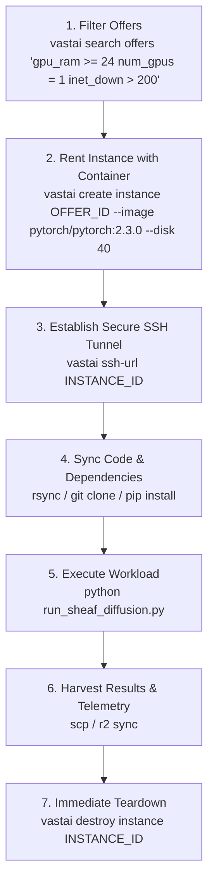

# Vast.ai & Rent-a-Cluster GPU Orchestration

## Core Principles

1. **Ephemeral Compute, Durable Evidence**: Never treat rented GPU instances as pets. All code, datasets, and execution artifacts must be cloned from Git or synced from S3/R2 at boot, and all results committed or streamed back before termination.
2. **Hard Spend Cap Fencing (`402 Spend Cap Exceeded`)**: Compute cost accrues per second. Always set an absolute maximum duration (`--duration`) and budget limit. If an instance exceeds its allocated task budget (e.g. $5.00), an automated watchdog terminates it immediately.
3. **Interruptible Spot vs. On-Demand**: Use cheap unverified spot instances for embarrassingly parallel Monte Carlo or hyperparameter sweeps with checkpointing; use verified on-demand instances with guaranteed bandwidth for long-running unrolled optimization.

---

## The Vast.ai Lifecycle Pipeline



---

## Step-by-Step Command Playbook

### 1. Search for Cost-Optimal Compute
Find high-bandwidth RTX 4090 or A100 instances with at least 24GB VRAM and > 200 Mbps connection:
```bash
vastai search offers 'gpu_name = RTX_4090 inet_down > 200 reliability > 0.95 dph < 0.40' -o 'dph'
```

### 2. Launching with Pre-configured PyTorch & CUDA
```bash
vastai create instance 123456 \
  --image pytorch/pytorch:2.3.0-cuda12.1-cudnn8-runtime \
  --disk 30 \
  --label "sheaf-diffusion-run-01"
```

### 3. Automated Watchdog Script (Auto-Teardown on Idle)
To prevent accidental overnight runaway spend, deploy an automated watchdog inside the container:
```bash
cat << 'EOF' > /tmp/watchdog.sh
#!/bin/bash
# Checks GPU utilization every 60s; if idle < 5% for 10 minutes, destroys instance.
IDLE_COUNT=0
while true; do
  UTIL=$(nvidia-smi --query-gpu=utilization.gpu --format=csv,noheader,nounits | head -n 1)
  if [ "$UTIL" -lt 5 ]; then
    IDLE_COUNT=$((IDLE_COUNT + 1))
  else
    IDLE_COUNT=0
  fi
  if [ "$IDLE_COUNT" -ge 10 ]; then
    echo "GPU idle for 10 minutes. Destroying instance to cap spend."
    vastai destroy instance $VAST_CONTAINERLABEL
    exit 0
  fi
  sleep 60
done
EOF
chmod +x /tmp/watchdog.sh && /tmp/watchdog.sh &
```

---

## Anti-Patterns

| Anti-Pattern | Why It Breaks | The Fix |
|---|---|---|
| **Leaving Instances Paused (`vastai stop`)** | Paused instances continue to accrue storage disk charges per hour. | When work is complete, harvest artifacts and run `vastai destroy instance` immediately. |
| **Manual SCP of Giant Datasets** | Slow home uplink throttles execution; GPU sits idle burning cash. | Stage datasets on Cloudflare R2 or S3; download inside the instance at 1 Gbps. |
| **Unbounded Training Loops** | An unconverged gradient descent loop can run for 48 hours costing hundreds. | Pass explicit `max_epochs`, early stopping criteria, and runtime timeout flags (`timeout 1800 python ...`). |
