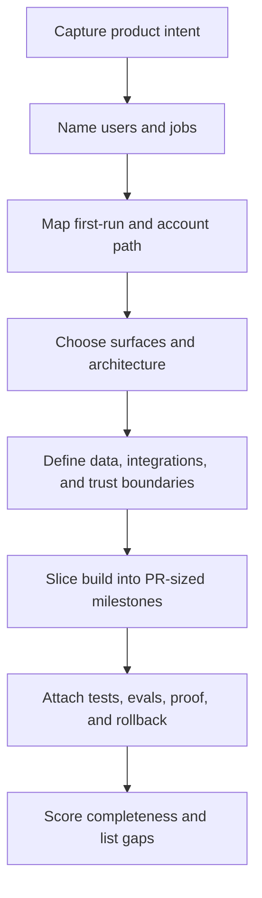

# Vibe Project Master Plan

Create a project plan that survives fast AI-assisted building: clear enough for agents to execute, skeptical enough to
catch missing product assumptions, and concrete enough to turn into PR-sized slices.

## Use This For

- Planning a new app, tool, integration, SDK, or agent workflow before a vibe-coding sprint.
- Hardening an existing loose plan into a buildable sequence with acceptance gates.
- Converting "I want to build X" into user journeys, architecture, data contracts, tests, release steps, and rollback.
- Making Port Daddy or other multi-agent work legible before agents start cutting code.

## Do Not Use This For

- Pure brainstorming with no intent to build.
- Code review after implementation; use a code review or product reality skill instead.
- Design polish, copywriting, or visual QA without a plan artifact.

## Process

1. State the product promise in one sentence, then name the non-goals.
2. Define primary users, their jobs, and the first three moments after they arrive cold.
3. Specify account creation, auth, secrets, model/provider readiness, and what happens if the user lacks paid AI plans.
4. Choose the product surfaces: GUI, CLI, SDK, MCP, background agents, webhooks, docs, support, and telemetry.
5. Define data objects, trust boundaries, permissions, privacy, retention, and cost controls.
6. Break the work into PR-sized slices with acceptance tests, visual or transcript proof, and rollback.
7. Run `scripts/plan_score.mjs` on a JSON manifest and add its gaps to the plan.

## Output Contract

Produce a plan with these sections:

- `Product Promise`: target user, job, payoff, and explicit non-goals.
- `Cold Start`: first-run path, account path, empty states, provider readiness, and fallback mode.
- `User Journeys`: happy path, failed path, recovery path, and repeat-use loop.
- `Architecture`: surfaces, data model, integrations, auth, permissions, hosting, and observability.
- `Agent Plan`: which agents run, what they can touch, how they communicate, and how humans interrupt them.
- `Build Slices`: ordered milestones with acceptance gates, tests, proof artifacts, and rollback.
- `Launch Readiness`: docs, onboarding, pricing/cost, support, security, telemetry, and post-launch review.

Use `scripts/plan_score.mjs` to produce a machine-checkable `plan-scorecard`.

## Anti-Patterns

### Feature List Masquerading As A Plan

**Novice**: "We have ten features, so the plan is complete."
**Expert**: A complete plan explains who arrives, how they start, what must be true before they trust the product, what fails, and how work is proven.
**Timeline**: July 2026 AI-built products fail less from missing features and more from missing trust, onboarding, provider, and rollback paths.
**Detection**: The plan has features but no first-run state, account path, fallback mode, or acceptance artifacts.

### Paid-Plan Assumption

**Novice**: "Users will have Claude Max, OpenAI Pro, or the same local setup I have."
**Expert**: Cold start must work for users with no paid model account, missing tokens, disabled MCP, or enterprise restrictions.
**Timeline**: By 2026, model/provider access is fragmented across consumer, team, enterprise, local, and routed-provider accounts.
**Detection**: The plan says "connect your AI" but omits degraded mode, token UX, provider deeplinks, or mock/demo data.

### Agent Magic Without Proof

**Novice**: "An agent will do it."
**Expert**: Every agent action needs scope, trigger, input, permission, progress, receipt, test, and undo.
**Timeline**: Multi-agent systems in 2026 need operator control surfaces and transcripted proof, not only chat promises.
**Detection**: Agents appear in the plan without claims, event logs, human gates, or rollback.

## References

| File | Load When |
| --- | --- |
| `references/complete-plan.md` | Need the required sections and examples of what "complete" means. |
| `references/bulletproofing-gates.md` | Need review gates for cold start, account setup, provider fallback, tests, and launch readiness. |
| `examples/expected-output.md` | Need a finished example plan and scorecard shape. |
| `templates/output-template.md` | Need a reusable project-plan template. |
| `schemas/project-plan.schema.json` | Need the JSON input contract for the scorer. |
| `scripts/plan_score.mjs` | Need deterministic plan completeness scoring. |
| `agents/openai.yaml` | Need a subagent descriptor for delegated planning. |

<!-- BEGIN BUNDLE INDEX (manual) -->

## Skill Bundle Index

**root**
- [`CHANGELOG.md`](CHANGELOG.md) - Changelog for this skill.
- [`README.md`](README.md) - Quick start and purpose.

**`agents/`**
- [`agents/openai.yaml`](agents/openai.yaml) - OpenAI/Codex-style agent descriptor for delegated planning.

**`examples/`**
- [`examples/expected-output.md`](examples/expected-output.md) - Example plan output and scorecard.

**`references/`**
- [`references/complete-plan.md`](references/complete-plan.md) - Complete plan anatomy and concrete section guidance.
- [`references/bulletproofing-gates.md`](references/bulletproofing-gates.md) - Failure-mode gates that make the plan hard to fool.

**`schemas/`**
- [`schemas/project-plan.schema.json`](schemas/project-plan.schema.json) - JSON contract for `plan_score.mjs`.

**`scripts/`**
- [`scripts/plan_score.mjs`](scripts/plan_score.mjs) - Scores a plan manifest and reports missing gates.

**`templates/`**
- [`templates/output-template.md`](templates/output-template.md) - Copyable plan template.

<!-- END BUNDLE INDEX -->
