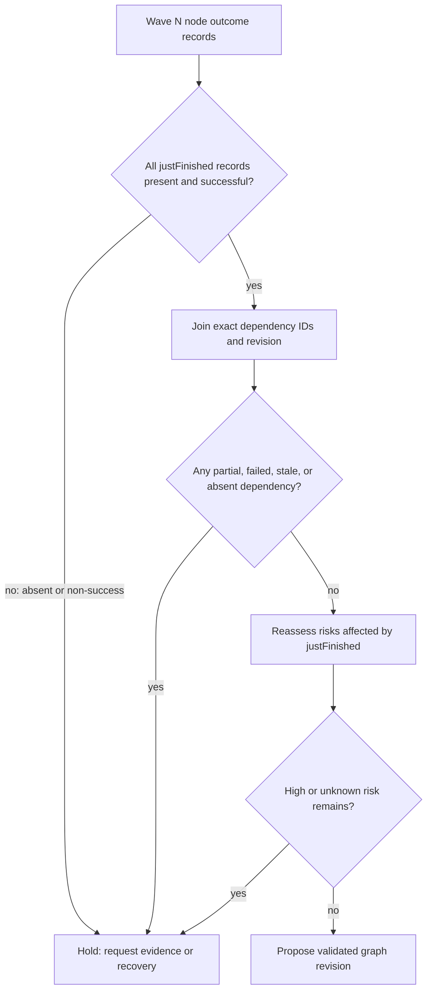
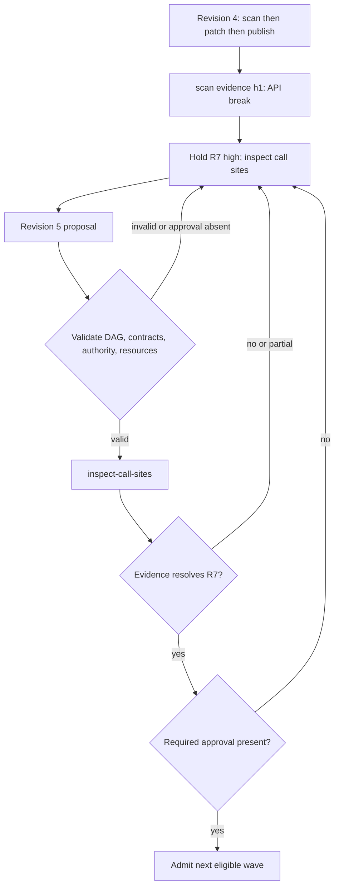

# Wave-by-Wave Parley

A parley is a checkpoint between completed wave N and proposed wave N+1. It
does not establish that a plan is correct; it makes the evidence, risk decision,
approval and graph revision inspectable before a later side effect is admitted.

## Method 1 — distinguish the two evidence sets

Let allCompleted be every node output returned before the checkpoint and
justFinished be only the IDs in wave N. Do not substitute one for the other.

1. Require an outcome record for every justFinished node: success, partial,
   failed, missing, or untrusted. Missing and partial are non-success outcomes.
2. For each upcoming node, join every declared dependency to an evidence record
   by exact node ID and graph revision. Never use a truthiness filter that turns
   absent output into a shorter successful list.
3. Reassess only a risk whose affectedNodes intersects justFinished. Retain the
   evidence hash, provenance, and previous severity.
4. Hold when any dependency lacks valid evidence, a high or unknown risk remains,
   a stale record is used, or a required approval is absent.

## Method 2 — supersede rather than rewrite history

A prior decision is immutable historical evidence. New information can change a
future action only by creating a graph revision with: parent revision, changed
node/edge/contract list, evidence references, decision rationale, and validator
result. The old decision remains visible as superseded; no field is silently
demoted from committed to exploratory.

For a prune, find every descendant that consumes the removed output. Either
revalidate a replacement contract for each successor or prune/hold that
successor too. Removing a predecessor from an input list is not valid evidence
that the successor still has its required input.

## Method 3 — preserve approvals and assignment gates

Risk policy is local. A high or unknown risk holds until the named policy or
human decision resolves it; ACCEPT_WITH_MONITORING is not an automatic waiver.
A required approval branch remains present even when no high risk is found.

Before assignment, separately validate the current graph, task contract,
authority/capability, and available resource/capacity. A valid plan mutation
does not assign a task and a successful evidence check does not authorize a
side effect.

## Constructed checkpoint trace

Wave 1 returns scan with evidence h1: package X has a major-version API break.
Patch-X is tentative and publish also requires approval. Revision 4 records
R7 high and holds. Revision 5 adds inspect-call-sites after scan. If its evidence
is partial or fails, retain hold. If it proves the break isolated and the tests
cover it, a policy or human decision may revise patch-X. Publish still cannot
run until its explicit approval is present. This is a constructed state trace,
not a measured risk model.

## Custom protocol boundary

RCP-3 actions such as broadcast, CFP, proposal/refusal, award/reject and prune
are a local protocol sketch. FIPA-like performative names do not make it FIPA
Contract Net conformant. Smith and FIPA do not require selection by a
self-reported confidence estimate or make such a report truthful. A renewed CFP
after scope change belongs conceptually nearer Iterated Contract Net; base FIPA
CNP leaves cancellation and several abnormal paths unaddressed. Count actual
calls in a concrete implementation; do not promise a fixed call budget.

## Verify the supplied checkpoint

Run node scripts/parley_checkpoint_audit.mjs --input examples/checkpoint-valid.json.
The audit compiles its Draft 2020 schema before domain checks. `pass` and
`declarationValid` mean the supplied graph/evidence declaration is coherent;
`eligibleToAdmit` additionally requires approval, authority, resources, and no
unresolved high/unknown risk; the CLI exits nonzero unless it is true. It does not run agents, verify an external receipt,
allocate resources, or prove FIPA conformance. See
[Schema enforcement](references/schema-enforcement.md).

## References

- [Smith, Contract Net Protocol (1980)](https://cse-robotics.engr.tamu.edu/dshell/cs631/papers/smith80contract.pdf)
- [FIPA Contract Net SC00029H (2002)](https://citeseerx.ist.psu.edu/document?doi=e560bbf29d1af433792fb5419845db1ab29bf7fc&repid=rep1&type=pdf)
- [FIPA Iterated Contract Net SC00030](https://citeseerx.ist.psu.edu/document?doi=549b7fcda2d0b05ced04776ae38ba4f835921f6a&repid=rep1&type=pdf)
- [Method boundaries](references/method-boundaries.md)

A reported partial, failed, missing, or untrusted outcome is still an outcome record. If it is in `justFinished`, the local checkpoint policy holds admission for recovery review even when the next proposed branch is independent. This alone does not make the declaration malformed. A claimed successful descendant with an absent or failed prerequisite remains inconsistent, and a proposed next wave whose prerequisites are not successful remains invalid.

## Bundle navigation

[diagrams index](diagrams/INDEX.md), [schemas index](schemas/INDEX.md), [tests index](tests/INDEX.md).
