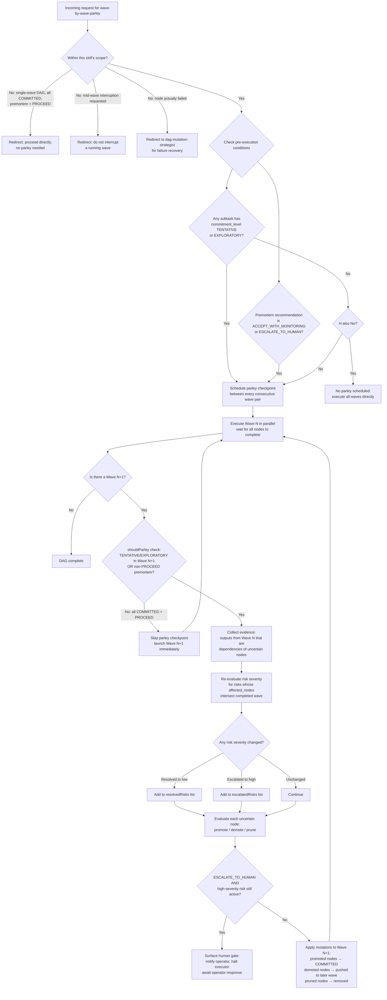

# Diagram 1: flowchart

```mermaid
flowchart TD
  A[Incoming request for wave-by-wave-parley] --> B{Within this skill's scope?}
  B -->|No: single-wave DAG, all COMMITTED,\npremortem = PROCEED| C[Redirect: proceed directly,\nno parley needed]
  B -->|No: mid-wave interruption requested| D[Redirect: do not interrupt\na running wave]
  B -->|No: node actually failed| E[Redirect to dag-mutation-strategist\nfor failure recovery]
  B -->|Yes| F{Check pre-execution conditions}

  F --> G{Any subtask has\ncommitment_level TENTATIVE\nor EXPLORATORY?}
  F --> H{Premortem recommendation\nis ACCEPT_WITH_MONITORING\nor ESCALATE_TO_HUMAN?}

  G -->|Yes| I[Schedule parley checkpoint\nbetween every consecutive wave pair]
  H -->|Yes| I
  G -->|No| J{H also No?}
  J -->|Yes| K[No parley scheduled:\nexecute all waves directly]
  J -->|No| I

  I --> L[Execute Wave N in parallel\nwait for all nodes to complete]
  L --> M{Is there a Wave N+1?}
  M -->|No| N[DAG complete]
  M -->|Yes| O{shouldParley check:\nTENTATIVE/EXPLORATORY in Wave N+1\nOR non-PROCEED premortem?}

  O -->|No: all COMMITTED + PROCEED| P[Skip parley checkpoint\nlaunch Wave N+1 immediately]
  P --> L

  O -->|Yes| Q[Collect evidence:\noutputs from Wave N that are\ndependencies of uncertain nodes]
  Q --> R[Re-evaluate risk severity\nfor risks whose affected_nodes\nintersect completed wave]
  R --> S{Any risk severity changed?}
  S -->|Resolved to low| T[Add to resolvedRisks list]
  S -->|Escalated to high| U[Add to escalatedRisks list]
  S -->|Unchanged| V[Continue]
  T --> W[Evaluate each uncertain node:\npromote / demote / prune]
  U --> W
  V --> W

  W --> X{ESCALATE_TO_HUMAN AND\nhigh-severity risk still active?}
  X -->|Yes| Y[Surface human gate:\nnotify operator, halt executor\nawait operator response]
  X -->|No| Z[Apply mutations to Wave N+1:\npromoted nodes → COMMITTED\ndemoted nodes → pushed to later wave\npruned nodes → removed]
  Z --> L
```
