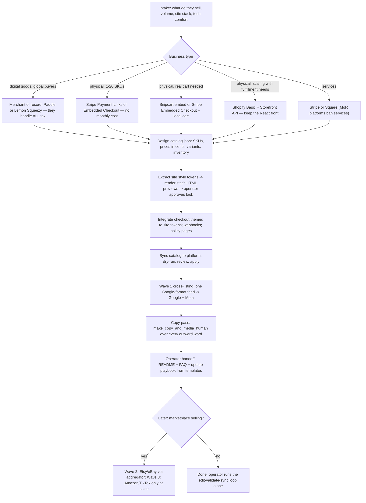

# Web Storefront Creator

Take a small business from "I want to sell things on my site" to a working, brand-matched storefront with money flowing to their bank, a one-file catalog they can update themselves, cross-listing to Google/Meta/marketplaces, and operator docs that make the whole thing legible to a non-developer. Facts herein verified July 2026 — this domain decays fast; re-verify fees and thresholds when it matters.

## When to Use

Use for: adding a shop/checkout to an existing site (especially React/Tailwind/Radix), choosing between Stripe/Snipcart/Shopify/Lemon Squeezy/Paddle, SKU and catalog design, price/inventory update workflows, Stripe Products & Prices sync, Google/Meta product feeds, Etsy/eBay cross-listing, storefront design previews, operator handoff docs.

NOT for: enterprise replatforming, marketplace-only sellers (no owned site), iOS/Android in-app purchases, crypto/web3 payments, restaurant POS.

## Core Process



### Step 1 — Intake and route choice
Ask (or infer from the repo): physical/digital/services, SKU count, expected volume, international buyers, operator's tech comfort, existing site stack, whether payouts go to personal or business banking. Then consult `references/platform-landscape.md` and give ONE recommendation with real fee math on their actual price point (e.g. "$24 candle on Stripe: you keep $22.94"). Fees stack — cart/MoR percentages sit on top of processing unless explicitly all-inclusive.

### Step 2 — Catalog before code
Copy `templates/catalog.example.json`, adapt, validate. SKUs are permanent, human-readable, `CATEGORY-PRODUCT-VARIANT`. Prices are integer cents, always. The catalog is the single source of truth for the site, Stripe, and every feed — see `references/catalog-inventory.md`.

```bash
python3 scripts/validate_catalog.py catalog.json --images-root ./public
```

### Step 3 — Previews in the site's own style
Extract the operator's real design tokens, render static HTML mockups, get approval BEFORE integration work:

```bash
python3 scripts/extract_site_style.py https://their-site.com --out style-tokens.json
# review/correct the heuristic picks, then:
python3 scripts/render_storefront_preview.py catalog.json --style style-tokens.json --out preview/
```

The previews are self-contained HTML (grid + product pages), ≥16px body text, inline SVG icons — never emoji, never Inter-on-indigo defaults.

### Step 4 — Integration
Follow `references/react-integration.md`. Key moves: Stripe Embedded Checkout for custom sites (SAQ-A, on-domain); bridge Tailwind/Radix tokens to the Appearance API by resolving CSS variables to hex at runtime; `useSyncExternalStore` for cart hydration; webhooks read the raw body, run on Node runtime, and dedupe on `event.id`.

### Step 5 — Sync and feeds
```bash
export STRIPE_API_KEY=sk_test_...        # test key FIRST, always
python3 scripts/sync_stripe.py catalog.json            # dry run — read the diff
python3 scripts/sync_stripe.py catalog.json --apply
python3 scripts/build_feed.py catalog.json --out public/feed.xml
```
Host `feed.xml`; point Google Merchant Center AND Meta Commerce Manager at the same URL (Meta accepts Google format). Marketplace selling comes later via aggregator — `references/marketplace-crosslisting.md`.

### Step 6 — Words
Every description, FAQ answer, and policy page goes through the `make_copy_and_media_human` skill. Craft guidance (provenance beats adjectives, one honest limitation per page) in `references/copywriting-product-pages.md`.

### Step 7 — Operator handoff
Fill all three templates (`OPERATOR-README`, `FAQ`, `update-playbook`) completely — every `{{PLACEHOLDER}}` resolved with real URLs, real fee math, real commands. Standard in `references/operator-handoff.md`. A build without these docs is not done.

## Anti-Patterns

### The Custom Card Form
**Novice**: "I'll build a nice card input with shadcn components so it matches the site."
**Expert**: Card fields must live in the processor's iframes (Stripe Elements/Checkout). A DIY form moves you from PCI SAQ-A (~nothing) to SAQ-D (a compliance project) and makes you a breach liability. Match the site via the Appearance API instead.
**Detection**: any `<input>` whose value is a PAN/CVC in your own JSX.

### Editing Prices In Place
**Novice**: "Just PATCH the Stripe price to the new amount."
**Expert**: Stripe Prices are immutable — amount/currency can never change. Create a new Price with `transfer_lookup_key=true`, archive the old. Corollary: archiving a price kills its Payment Links; regenerate them after any reprice.
**Timeline**: always true in Stripe; the 2025-07-30 API added inline `price_data` for links as mitigation.

### Platform Dashboard as Source of Truth
**Novice**: edits products in the Stripe/Shopify dashboard, then the website, then Etsy, by hand.
**Expert**: one catalog file in git; idempotent scripts fan outward. Hand-edits in three dashboards WILL diverge, and the operator inherits the mess. The dashboard is a read surface and refund tool, not an editor.

### The $600 Ghost (stale tax advice)
**Novice**: "You'll get a 1099-K over $600, plan for that."
**Expert**: OBBBA (July 2025) reverted the threshold to $20,000 AND 200 transactions, retroactively. Meanwhile tax is owed on profit regardless of forms. LLM training data is saturated with the dead $600 rule.
**Detection**: any 1099-K number other than $20k/200 in fresh advice.

### Building for Meta In-App Checkout
**Novice**: "Instagram Shops means people check out inside Instagram."
**Expert**: Meta killed native checkout Aug–Sep 2025. Shops are link-out galleries to YOUR site; catalog items need checkout URLs on your verified domain. Same era: Shopify's Checkout API died Apr 1 2025 (use Cart API → `checkoutUrl`), Google's Content API dies Aug 18 2026 (feeds unaffected — another reason to prefer feeds).

### Non-Idempotent Webhook Stock Decrement
**Novice**: `quantity -= 1` in the webhook handler.
**Expert**: Stripe retries webhooks for ~48h; duplicates are guaranteed eventually. Store processed `event.id`s and decrement inside that guard, at order placement (not fulfillment), and reconcile on a schedule to the LOWER count.

### Potemkin Storefront
**Novice**: ships a beautiful product grid where Buy buttons don't charge, inventory is decorative, and no policy pages exist.
**Expert**: previews are explicitly labeled mockups; the shipped thing charges real money, decrements real stock, and has Shipping/Refund/Terms/Privacy pages (FTC 30-day rule applies). Be transparently hollow in previews, never in production.

## Shibboleths

- **"Prices in cents, `lookup_key` as the handle"** — floats and hardcoded `price_xxx` IDs are the two tells of a first-time Stripe integration.
- **"Refund fast; a chargeback costs $15 even when you win"** (Stripe's two-tier dispute fees, June 2025). The refund button is the cheapest fraud tool.
- **"MoR or Stripe is a tax question, not a payments question."** Digital + international → merchant of record (Paddle bans physical goods AND services; Lemon Squeezy is Stripe-owned now). Physical + mostly-domestic → Stripe + home-state sales tax permit; marketplaces remit their own.
- **"One Google-format feed, two channels"** — Meta accepts Google Shopping XML; build_feed.py output serves both. Feed-based beats API-based at solo scale.
- **"The operator loop is: edit catalog → validate → dry-run → apply → verify."** If a change requires touching two systems by hand, fix the automation, not the docs.
- **"eBay Inventory-API listings are API-locked"** — uneditable in Seller Hub, forever. Aggregators (Sellbrite/LitCommerce) exist so solo sellers don't marry marketplace APIs.
- **"Sole props can use personal checking (name must match), and Mercury won't take them"** — Novo/Bluevine will.

## Bundle Contents

| Path | What it is |
|---|---|
| `scripts/validate_catalog.py` | Catalog linter: SKU/slug uniqueness, integer cents, variants, image existence. Run before every sync |
| `scripts/sync_stripe.py` | Idempotent catalog→Stripe sync (dry-run default, archive-and-create repricing, deterministic idempotency keys) |
| `scripts/build_feed.py` | Google Shopping XML feed from catalog — feeds Google Merchant Center + Meta |
| `scripts/extract_site_style.py` | Heuristic font/color/radius extraction from a URL or local CSS → style-tokens.json |
| `scripts/render_storefront_preview.py` | Static HTML grid + product-page mockups styled with the site's tokens |
| `templates/catalog.schema.json` | JSON Schema for catalog.json |
| `templates/catalog.example.json` | Worked 3-product example (physical + variants + digital) |
| `templates/OPERATOR-README.template.md` | Owner's manual skeleton — fill every placeholder |
| `templates/FAQ.template.md` | Deep operator FAQ skeleton (money, taxes, disputes, disasters) |
| `templates/update-playbook.template.md` | Step recipes: reprice, add product, sale, sold-out, retire |
| `examples/style-tokens.example.json` | Sample extractor output (fonts/colors/radius) |
| `examples/preview/index.html` | Rendered preview of the example catalog — what the Step 3 artifact looks like |

All scripts are stdlib-only Python 3.10+; no pip installs. `sync_stripe.py` needs `STRIPE_API_KEY`.

## References (load on demand)

| File | Consult when |
|---|---|
| `references/platform-landscape.md` | Choosing the route: full decision matrix, fees, MoR vs DIY, temporal traps |
| `references/react-integration.md` | Wiring checkout into React/Tailwind/Radix: Stripe/Shopify/Snipcart patterns, theming bridge, webhooks, CSP |
| `references/payments-banking-tax.md` | Bank linkage, sole-prop onboarding, 1099-K/SE tax numbers, sales tax posture, chargebacks, FTC rules |
| `references/catalog-inventory.md` | SKU schemes, Stripe price immutability mechanics, sync pattern, inventory webhooks |
| `references/marketplace-crosslisting.md` | Per-channel API reality, three-wave rollout, aggregator table, feed spec |
| `references/copywriting-product-pages.md` | Writing product copy + the make_copy_and_media_human handoff |
| `references/operator-handoff.md` | Standards for the README/FAQ/playbook deliverables and the update-system contract |

## Success Criteria

- The operator can change a price and see it live, alone, in under five minutes.
- A test purchase lands in the bank account (minus predicted fees, to the cent).
- Previews and the shipped store pass make_copy_and_media_human's visual and copy review.
- `validate_catalog.py` returns 0 errors; `sync_stripe.py` dry-run returns "unchanged" right after an apply.
- All three operator docs exist with zero unresolved placeholders.
