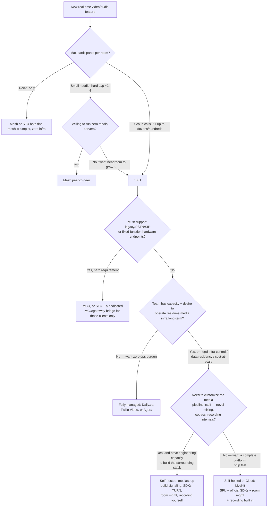

# WebRTC Ad-Hoc Video Chat

Architects real-time video/audio calling — 1:1, group, and shareable
"party link" rooms — by picking the right topology, the right platform
(self-hosted vs managed), and the security/scaling patterns that keep a
group call and its join flow from falling over.

## When to Use

✅ **Use for**:
- Designing 1:1 or group WebRTC video/audio calling for a web or mobile app
- Building a "join by link" / "party link" spontaneous room feature (dating,
  social, hangout apps) where anyone with the URL can join without a prior
  friend/account relationship
- Choosing between mesh, SFU, and MCU topologies, or between LiveKit,
  mediasoup, and fully-managed platforms (Daily.co, Twilio Video, Agora)
- Diagnosing why a group call degrades past ~4-8 participants
- Designing room-token/access-scoping for guest joins, or live moderation
  and kill-switch controls for a live-video feature

❌ **NOT for**:
- One-way live streaming or broadcast to viewers who never publish their own
  media (webinars-to-thousands, live shopping, sports broadcast) — see
  `managed-video-streaming-pipeline` for upload → transcode → CDN delivery
- Text chat / DM backend architecture — see `realtime-messaging-backend-architecture`
- Generic WebSocket connection handling or reconnection logic — see
  `websocket-realtime-expert`
- CRDT-based collaborative text/document editing — see `real-time-collaboration-engine`
- Building the ML classifiers behind automated moderation signals — see
  `ml-trust-safety-signal-detection`; or the human review-queue tooling — see
  `moderation-triage-routing`

---

## Core Decision: Topology and Platform



**One-line summary of each leaf**:
- **Mesh** (P2P, no server): only viable up to ~4 participants — bandwidth
  is O(N²), each peer uploads N-1 copies of its stream.
- **SFU** (server relays, no transcode): the 2026 default for group calls —
  scales to dozens per room, server absorbs the O(N²) fan-out.
- **MCU** (server mixes/transcodes): O(1) client bandwidth but heavy server
  CPU/GPU cost — reach for it only for legacy/PSTN/hardware interop, not as
  a general default.
- **LiveKit** over **mediasoup** as the default self-hosted choice for a
  small team shipping fast: LiveKit ships signaling, SDKs, room management,
  and recording built in; mediasoup is a lower-level library where you build
  all of that yourself. Choose mediasoup only when you need to customize the
  media pipeline itself and have the capacity to build the surrounding stack.
- **Managed** (Daily.co, Twilio Video, Agora) when no one wants to own
  real-time media infra at all — trades cost-per-minute and infra control
  for zero ops burden and fastest time-to-market.

Full trade-off tables and the LiveKit-vs-mediasoup comparison in depth:
`references/sfu-selection-guide.md`.

Run `python3 scripts/topology_bandwidth_calculator.py --participants 4 8 20
--bitrate-kbps 1500` to put real numbers behind the mesh-collapse claim for
your target bitrate and room sizes.

---

## TURN/STUN/ICE and Group-Call Scaling — the short version

- **STUN** discovers a peer's public IP for NAT traversal (cheap, no media
  in the path). **TURN** relays media when direct connectivity fails
  (symmetric NATs, corporate firewalls) — TURN sits *in* the media path and
  costs real, sustained bandwidth. **ICE** is the framework that gathers
  candidates from both and negotiates a working connection.
- Budget TURN relay bandwidth as its own infrastructure line item — a
  commonly cited figure is that **10-20% of real-world connections need
  TURN relay**, and that traffic is not free.
- Past roughly **6-8 visible tiles**, stop rendering every remote track
  unconditionally. Use **simulcast** (publisher sends multiple resolution
  layers, SFU forwards the layer matching each subscriber's bandwidth/tile
  size) plus **active-speaker detection** (only fully decode the 1-4
  participants actually talking) to keep client CPU/battery/bandwidth sane
  as room size grows.

Full mechanics, TURN budgeting math, and the simulcast/active-speaker
implementation pattern: `references/turn-stun-ice-and-scaling.md`.

---

## Party Links: Shareable Join-by-URL Rooms

A party link is a URL where **possession of the link is the access
credential** — there's no separate login backing up a guest join. The
pattern:

1. **Create room**: mint an unguessable room ID (16+ bytes CSPRNG entropy,
   never sequential/guessable), an expiry, and a max-participant cap. Persist
   as a room record.
2. **Join request**: server validates the room record (exists, not expired,
   under capacity) — **then, and only then**, mints a client access token
   scoped to that exact room ID + role + short expiry.
3. **Never let the client mint its own room-access token.** The join
   endpoint is the sole source of valid tokens.
4. **Verify on every connect**: signature valid, not expired, token's room ID
   matches the room being joined.

Run the runnable, dependency-free walkthrough of this exact flow (create →
mint → verify → tamper → reject):

```bash
python3 scripts/party_link_token.py demo
```

Full pattern details plus **live moderation** (in-call reporting/kill-switch,
post-hoc recording review, behavior-based abuse signals) and recording
data-handling discipline: `references/party-link-and-moderation.md`.

---

## Anti-Patterns

### Anti-Pattern: Mesh Topology Past 4 Participants

**Novice**: "WebRTC is peer-to-peer, so scaling a group call is just adding
more `RTCPeerConnection`s — no server needed."

**Expert**: Mesh bandwidth is O(N²): at 4 participants each peer already
uploads 3x its stream bitrate; at 8 that's 7x. Home upload bandwidth runs out
long before a server would. The bottleneck moves to the worst-connected
participant's home link — strictly less scalable than a data-center SFU.

**Timeline**: Mesh was a reasonable default circa 2013-2016 before SFU
tooling matured; by the late 2010s SFU became the default for anything past
a 1:1 or tiny huddle, and remains so in 2026.

### Anti-Pattern: Guessable Room IDs for Party Links

**Novice**: "We use `app.com/join/room-1042` — simple, human-readable in
logs, and 'private' since we don't publish the room list."

**Expert**: A sequential or low-entropy room ID is enumerable by an attacker
or scanner iterating the ID space — "we don't publish it" is obscurity, not
access control. Use cryptographically random IDs (128 bits of entropy is a
safe default) plus server-side join-rate-limiting.

**Detection**: grep room-ID generation for auto-increment, time-based UUID
v1 used as the credential itself, or any ID derivable from a username/
timestamp.

### Anti-Pattern: Rendering All Video Tiles Unconditionally

**Novice**: "We subscribe to and render every participant's track at full
resolution — simpler code, and the SFU handles the relay so client cost
isn't our problem."

**Expert**: Client decode/render cost and battery drain are not absorbed by
the SFU. Past ~6-8 visible tiles, unconditional full-resolution rendering
degrades the experience for everyone, often invisibly (dropped frames, fan
spin-up). Fix: simulcast for off-screen/small tiles, full resolution
reserved for the active speaker / pinned view.

**Timeline**: Simulcast + active-speaker prioritization matured into a
checkbox SDK feature (Janus, mediasoup, LiveKit) by the early 2020s; shipping
without it above small-huddle scale is a known scaling gap in 2026, not a
stylistic choice.

---

## References

Consult these for deep dives — they are NOT loaded by default:

| File | Consult When |
|------|-------------|
| `references/sfu-selection-guide.md` | Choosing topology (mesh/SFU/MCU) or platform (LiveKit vs mediasoup vs managed); need the full trade-off tables |
| `references/turn-stun-ice-and-scaling.md` | Need STUN/TURN/ICE mechanics in depth, TURN bandwidth budgeting math, or the simulcast/active-speaker implementation pattern |
| `references/party-link-and-moderation.md` | Designing the join-by-URL room-token flow, or live moderation / recording data-handling controls |

## Scripts

| File | Run When |
|------|----------|
| `scripts/topology_bandwidth_calculator.py` | Need concrete kbps/Mbps numbers for mesh vs SFU vs MCU at a given room size and bitrate |
| `scripts/party_link_token.py` | Need a runnable reference implementation of room-scoped, server-minted, tamper-evident access tokens (`demo` subcommand runs the full flow end to end) |
