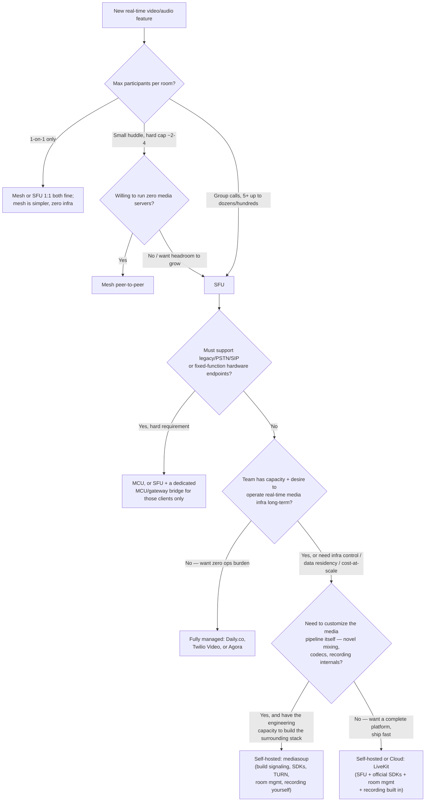

# Topology and Vendor Selection: Mesh vs SFU vs MCU, LiveKit vs mediasoup vs Managed

Read this when the question is "what should our real-time media architecture
actually be" — not when you already know it's SFU and just need the party-link
token pattern (see `references/party-link-and-moderation.md`) or the TURN/ICE
mechanics (see `references/turn-stun-ice-and-scaling.md`).

## The three topologies, precisely

**Mesh (full mesh peer-to-peer)**: every participant opens a direct
`RTCPeerConnection` to every other participant. No media server in the path.

- Each peer uploads its own stream N-1 times (once per remote peer) and
  downloads N-1 incoming streams.
- Total network egress across the whole call grows **O(N^2)**.
- Ceiling in practice: **~4 participants**. A 5th participant on an
  already-modest connection (e.g. residential upload of 5-10 Mbps) usually
  can't sustain 4 simultaneous outbound video streams at a usable bitrate —
  quality degrades for everyone, not just the new joiner.
- Only upside: zero server infrastructure, lowest latency (no relay hop when
  P2P succeeds), no per-minute media-server cost.
- Legitimate use: two-party 1:1 calls, or tiny (2-4 person) ad-hoc huddles
  where you deliberately do not want to run any media infrastructure.

**SFU (Selective Forwarding Unit)**: each participant uploads one stream to a
server; the server forwards (relays) copies to every other participant
**without decoding or re-encoding** the media.

- Client upload is O(1) (one stream) regardless of room size; client download
  is O(N) (one stream per other participant, though simulcast + active-speaker
  logic reduces what's actually decoded — see the scaling reference).
- The server absorbs the O(N^2) fan-out cost, not the clients. This is *why*
  SFU is the standard choice for group calls in 2026: it moves the quadratic
  cost to infrastructure you can scale server-side (add SFU capacity) instead
  of infrastructure you don't control (participants' home upload bandwidth).
- Scales to dozens of participants per room with per-participant tile limits
  and simulcast; scales further (hundreds) if you cap how many streams are
  actively decoded on each client (large-room / webinar patterns).

**MCU (Multipoint Control Unit)**: the server decodes every incoming stream,
composites/mixes them (e.g. into a single grid-view video and a mixed audio
track), and re-encodes one outgoing stream per participant (or one shared
stream for everyone).

- Client bandwidth is O(1) both directions — cheapest possible client cost,
  which is why MCU existed: for very low-bandwidth or legacy clients (old
  video conferencing hardware, PSTN/SIP gateways, some legacy mobile SDKs)
  that cannot handle receiving and decoding N independent streams.
- Server cost is the opposite of cheap: N-way decode + composite + N-way (or
  1-way, if everyone gets the same mixed view) encode is real, sustained
  CPU/GPU load per active room. This is a materially more expensive server
  bill than SFU relay at the same participant count.
- **In 2026, MCU is rarely the right default.** Modern client devices and
  networks can handle SFU's O(N) download with simulcast; the bandwidth
  savings MCU offers rarely justifies its transcoding cost. Reach for MCU
  only when you have a hard legacy-interop requirement (SIP/PSTN bridging,
  fixed-function hardware endpoints) — not as a general group-call default.

## Decision tree

## LiveKit vs mediasoup: the real difference

Both are open-source and free to self-host. The difference is **how much you
have to build yourself**:

| | mediasoup | LiveKit OSS |
|---|---|---|
| What it is | A low-level Node.js/C++ media-routing **library** | A complete **platform**: Go-based SFU + client SDKs + server APIs |
| Signaling protocol | You design and implement it | Built in (LiveKit's own protocol, versioned, documented) |
| Client SDKs | You build them (or use community ones of varying quality) | Official SDKs: Web, iOS, Android, Flutter, React Native, Unity |
| Room/participant management | You build it (who's in the room, permissions, state) | Built in (Room service API, webhooks, server SDKs) |
| Recording / egress | You build it (or bolt on FFmpeg yourself) | Built in (Egress service: room composite, track, or per-participant) |
| TURN server | You deploy and operate it yourself | Bundled deployment story (or bring your own) |
| Managed cloud escape hatch | No official one | Yes — LiveKit Cloud, same client code, if you later want to stop operating it |
| When it's the right choice | You need to customize the media pipeline itself: novel mixing logic, custom codec handling, deep integration with an existing C++ media stack, or you're building a platform *for other people* to build on | You're a small-to-mid team that wants group video/audio shipped in weeks, not quarters, and doesn't want to own real-time media plumbing as a full-time job |

**Default recommendation for a small team shipping fast: LiveKit (self-hosted
or Cloud), not mediasoup.** mediasoup is the right choice specifically when a
team needs to customize the media pipeline itself and already has (or is
willing to build) the engineering capacity for signaling, SDKs, TURN infra,
and room/recording logic as first-class ongoing work. Choosing mediasoup
without that capacity is the most common self-hosted-SFU regret: teams
discover 3-6 months in that they've built half of what LiveKit already ships.

## Fully managed alternatives (Daily.co, Twilio Video, Agora)

All three offer: hosted SFU, client SDKs, dashboards, and (usually) built-in
recording and analytics. The trade is **cost-per-minute and reduced infra
control, in exchange for zero ops burden and the fastest time-to-market.**

Good default when:
- No one on the team wants to own real-time media infrastructure, full stop.
- Time-to-first-working-call matters more than long-run per-minute cost.
- Compliance/data-residency requirements don't force self-hosting.

Reconsider (move to self-hosted LiveKit) when:
- Per-minute costs at your actual usage volume exceed what self-hosting
  would cost (do this math explicitly before committing — managed pricing
  is attractive at prototype scale and can become the dominant line item
  at real scale).
- You need data residency, on-prem deployment, or deep customization that
  the managed vendor's API surface doesn't expose.

## Anti-Pattern: Mesh Topology Past 4 Participants

**Novice**: "WebRTC is peer-to-peer, so scaling a group call is just adding
more `RTCPeerConnection`s — no server needed, and it's actually *more*
scalable because there's no central bottleneck."

**Expert**: Mesh bandwidth is O(N^2), not O(N). At 4 participants each peer
already uploads 3x its stream bitrate; at 8 participants that's 7x. Home
upload bandwidth (often 5-20 Mbps) runs out well before the server ever
would. The "no central bottleneck" framing is backwards — mesh moves the
bottleneck to the worst-connected participant's home upload link, which is
categorically less scalable than a data-center SFU. Run
`scripts/topology_bandwidth_calculator.py --participants 4 8 20` to see the
numbers for your target bitrate.

**Timeline**: Mesh was a reasonable default circa 2013-2016 when WebRTC group
calling was rare, SFU tooling was immature, and typical calls were 2-3
people. By the late 2010s, SFU tooling (Janus, Jitsi, mediasoup, then LiveKit)
matured to the point that SFU is the default for anything beyond a 1:1 or
tiny huddle, and remains so in 2026.
