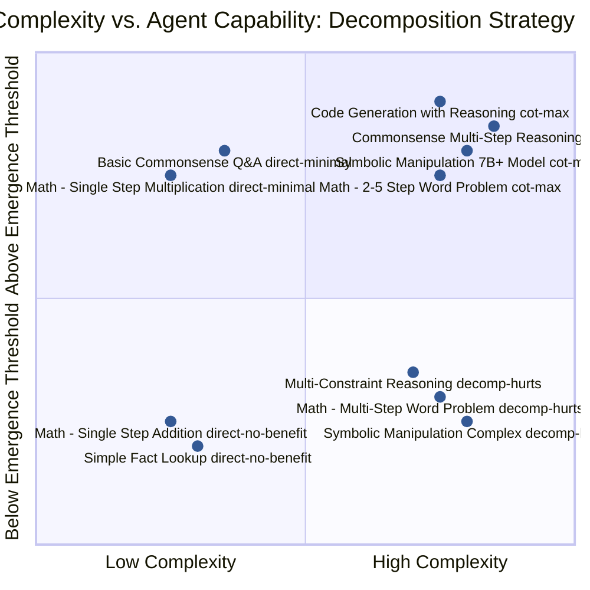

# Task Complexity vs. Agent Capability: Decomposition Strategy Matrix

```mermaid
quadrantChart
%%{init: {"themeVariables": {"quadrantPointFill": "#345995"}}}%%
    title Task Complexity vs. Agent Capability: Decomposition Strategy Matrix
    x-axis Low Complexity --> High Complexity
    y-axis Below Emergence Threshold --> Above Emergence Threshold
    
    %% Quadrant 1: Low complexity + below threshold
    %%DIRECT PROMPTING (No Benefit)
    Math - Single Step Addition direct-no-benefit: [0.25, 0.25]
    Simple Fact Lookup direct-no-benefit: [0.3, 0.2]
    
    %% Quadrant 2: Low complexity + above threshold
    %% DIRECT PROMPTING (Minimal Gains)
    Math - Single Step Multiplication direct-minimal: [0.25, 0.75]
    Basic Commonsense Q&A direct-minimal: [0.35, 0.8]
    
    %% Quadrant 3: High complexity + below threshold
    %% DIRECT PROMPTING (Decomposition Hurts)
    Math - Multi-Step Word Problem decomp-hurts: [0.75, 0.3]
    Symbolic Manipulation Complex decomp-hurts: [0.8, 0.25]
    Multi-Constraint Reasoning decomp-hurts: [0.7, 0.35]
    
    %% Quadrant 4: High complexity + above threshold
    %% CHAIN-OF-THOUGHT (Maximum Gains)
    Math - 2-5 Step Word Problem cot-max: [0.75, 0.75]
    Commonsense Multi-Step Reasoning cot-max: [0.85, 0.85]
    Symbolic Manipulation 7B+ Model cot-max: [0.8, 0.8]
    Code Generation with Reasoning cot-max: [0.75, 0.9]
    
    %% Emergence threshold marker at ~100B parameters
    %% Represented as the transition line between low and high capability zones
```
