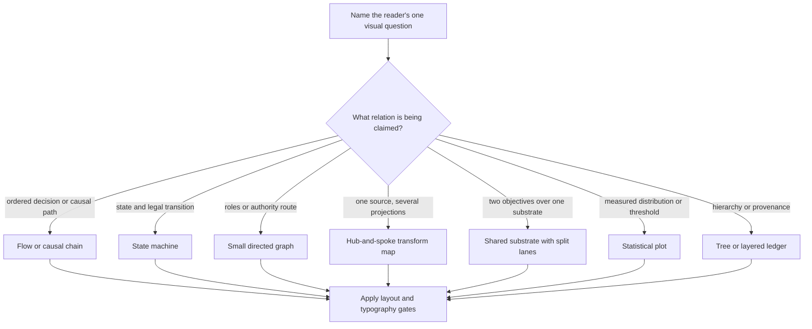

# Whitepaper Figure System

Use a figure to expose a relationship that prose makes expensive to hold in memory.
The figure is not a paragraph in boxes, not an atmospheric image with labels pasted over it,
and not a miniature cover.  Cover art may establish the volume's emotional register; the figure
must make one checkable claim quickly.

## Core decision

### Pick the mark before the metaphor

Use position on a common scale for quantities; use a real curve and axes for distributions;
use an ordered path for temporal or causal succession; use a directed link only for an actual
relation; use a ring only for reciprocal membership.  A pictogram earns its place when it
discriminates the role before the label is read: lens (review), shield (guard), gate (completion),
fork (landing), beacon (escalation), ledger (roadmap).

Do not use ship, anchor, tide, current, map, voyage, crew, captain, port, or nautical-pirate
imagery as an explanatory substrate.  These papers may retain a *Harbor* proper noun in their
subject matter, but figures should use civic/technical systems language: ledger, gate, witness,
ring, lattice, archive, relay, threshold, and provenance.

## Non-negotiable figure contract

1. State the one visual question in a sentence before drawing.
2. Keep analytical geometry and all labels source-owned (TikZ, SVG, or Mermaid rendered from
   committed source). A generated asset may only be a wholly nonsemantic, text-free background,
   and normally should be omitted.
3. Give a reader one primary reading path. A figure with competing start points is a layout bug.
4. Keep labels outside data fields and connector paths. Do not put explanatory text inside a plot.
5. Let the caption state the conclusion; do not repeat the caption inside the diagram.
6. Render at final print size, inspect the page and its greyscale version, then revise.

## Layout rules

| Element | Rule |
|---|---|
| Text inside a shape | At least 2.5pt inner separation; at least 4pt from a node edge at print size. |
| Label near an edge | Put it in a dedicated clear band or outside the route; never straddle a line. |
| Nodes | Align to an explicit grid or baseline. Equal roles get equal geometry. |
| Connectors | Prefer straight, orthogonal, or one controlled curve; no accidental crossings. |
| Diagram density | One title, one hierarchy, one focal accent. Move explanation to the caption. |
| Type | Use the body serif and one size family. No dashboard sans, fake lettering, or raster text. |
| Colour | Ink plus muted structural tones; reserve one accent for the decision, hazard, or selected path. |
| Contrast | Normal labels need at least 4.5:1; graphical marks need 3:1; colour cannot be the only code. |

## Visual grammar for this volume

The cover reference points to **editorial systems science fiction**, not literal illustration:
dark ink, warm paper, restrained teal/cobalt/amber, monumental geometry, rings, lattices,
witnessing, lenses, gates, ledgers, and paired sovereign structures.  Translate that grammar into
simple vector marks.  Do not copy cover typography, distressed texture, body horror, weapons,
fake runes, or generated words into a scholarly figure.

## Failure modes

### The illustrated wireframe

**Novice:** Generate a scenic image, paste labels over it, then add arrows wherever there is room.

**Expert:** The art is removed or reduced to a nonsemantic texture; source-owned geometry does
the explanatory work, and labels occupy reserved bands.

**Why:** Generated imagery has no reliable semantic coordinates, so labels drift, collide, and
become unreviewable at final print size.

### The box paragraph

**Novice:** Put every sentence in a rounded rectangle and connect the rectangles.

**Expert:** Draw the actual relation first (threshold, chain, graph, state, ledger, or transform),
then give each element only the minimum label needed to identify it.

**Why:** A relationship diagram should reduce working-memory load, not require the reader to
reconstruct a paragraph from text islands.

### The decorative metaphor

**Novice:** Use a ship, tide, or fantasy map because the paper uses the word "harbor."

**Expert:** Use a metaphor only when its structure maps to a claimed inference. Otherwise use a
neutral systems pictogram or no illustration.

**Why:** Surface similarity is not an explanation. The metaphor must reveal the relation.

## Review gates

- [ ] The figure answers one named visual question.
- [ ] Its chosen form matches the relation in the decision tree.
- [ ] Every label, value, line, and arrow is generated from source under review.
- [ ] No text overlaps a plot, shape border, arrow, or another label.
- [ ] Equal roles align; connectors do not cross without a semantic reason.
- [ ] The caption gives the takeaway without duplicating the diagram's prose.
- [ ] The figure passes colour and greyscale inspection at final PDF size.
- [ ] It matches its siblings in font, stroke, palette, spacing, and restraint.

## References

- `references/semantic-figure-atlas.md` — Read when choosing or redesigning a particular
  figure. Includes the per-figure relationship type, recommended pictogram, and research basis.
- `references/nano-banana-cover-brief.md` — Read when deriving a nonliteral visual language from
  the supplied Nano Banana chapter-art prompts. It collates each suggestion and separates
  transferable grammar from material that must stay out of figures.

## Activation checks

Should activate:

1. “Replace the rounded-box prose figure in this whitepaper.”
2. “Choose the right diagram type for a shared data source with two rankings.”
3. “Fix overlapping labels in a TikZ plot.”
4. “Make the chapter diagrams cohesive without making them decorative.”
5. “Turn this generated-image diagram into a source-controlled figure.”

Should not activate:

1. “Paint a chapter cover.”
2. “Choose a regression model.”
3. “Build a product onboarding flow.”
4. “Make a marketing hero illustration.”
5. “Explain the data analysis in prose.”

<!-- BEGIN BUNDLE INDEX (auto: index_references.py) -->

## Skill Bundle Index

*Every file in this skill, and when to open it.*

**root**
- [`CHANGELOG.md`](CHANGELOG.md) — Changelog — - Added a relation-first figure selection tree and print-layout contract.

**`references/`**
- [`references/nano-banana-cover-brief.md`](references/nano-banana-cover-brief.md) — Nano Banana Cover-Brief Collation — Source reviewed: the user-supplied Google AI Studio export, *Visionary Art for The Harbor*.
- [`references/semantic-figure-atlas.md`](references/semantic-figure-atlas.md) — Semantic Figure Atlas — This atlas translates the whitepaper figure inventory into the smallest truthful visual form.

<!-- END BUNDLE INDEX -->
