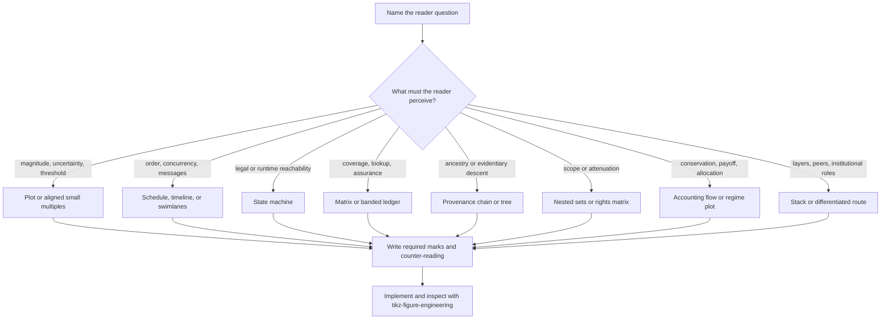

# Whitepaper Figure System

Choose the right *kind* of figure before drawing it. A figure earns its page by making one
relationship faster to understand than the surrounding prose. It is not a paragraph in boxes,
an atmospheric image with labels, or a small chapter cover.

For the Port Daddy corpus, read `references/semantic-figure-atlas.md` before redesigning a
specific figure. The atlas covers every canonical `figure` environment in Volumes I--VII and
gives each one a stable, source-derived identifier, reader question, first-choice grammar,
required evidence, and rejected forms.

After selecting the semantic form, use the `tikz-figure-engineering` skill for implementation,
final-size rendering, page-fit checks, and contact sheets. This skill decides *what the figure
must be*; that skill makes it survive publication.

If a six-line brief and atlas prescription are already approved and the remaining problem is
TikZ source, spacing, type, rendering, page fit, or contact-sheet inspection, stop using this
skill and activate `tikz-figure-engineering` directly.

## The figure brief

Write these six lines before opening TikZ:

1. **Stable atlas ID:** for example, `IV/fig:he-cold-start`.
2. **Reader question:** the single question the figure answers in five seconds.
3. **Claim:** the conclusion encoded by geometry, not by a paragraph inside the figure.
4. **Relation:** quantitative, temporal, stateful, causal, provenance, containment, allocation,
   comparison, institutional, or layered architecture.
5. **Required evidence:** the marks, values, actors, states, or boundaries without which the
   claim becomes decorative.
6. **Counter-reading:** the most likely false inference; design explicitly against it.

If the claim cannot be stated in one sentence, split the figure or return the explanation to
prose. If the figure's conclusion exists only in its caption, the geometry is not doing its job.

## Representation cascade

Choose the first matching family. Do not default to a node-link graph.



| Reader task | First-choice visual grammar | Avoid |
|---|---|---|
| Compare measured magnitude, rate, or uncertainty | common-axis position, line, dot, interval, band, or small multiple | areas, decorative gauges, unscaled pictograms |
| Locate a threshold, regime, or error region | source-owned plot with explicit axes, boundary, and shaded regions | threshold prose floating over a curve |
| Understand concurrency or ordering | aligned timeline, schedule, or swimlanes | a membership graph pretending to show time |
| Understand legal or runtime state | compact state machine with typed transitions and terminal states | a generic process flow with ambiguous arrows |
| Follow a protocol between actors | swimlane sequence with messages on a shared time axis | twisty free-form arrows between prose boxes |
| See scope, attenuation, or containment | nested sets, interval bands, or a rights matrix | concentric circles when size has no meaning |
| Trace evidence or identity | provenance chain, ledger, tree, or evidence matrix | a hub-and-spoke graph that erases ancestry |
| Compare two mechanisms | aligned paired panels with identical scales and fields | two unrelated mini-diagrams |
| Understand allocation or conservation | accounting flow, balance, Sankey-like bands with conserved width, or payoff/regime plot | decorative circles or seesaws with no encoded quantity |
| Understand layered architecture | stratified stack or cross-section with one reading direction | radial organs around a central node |
| Understand roles and authority | differentiated institutional route with typed edges and explicit grant/revocation directions | homogeneous nodes, sand-dollar rings, ornamental hierarchy |
| See one source produce several views | source ledger feeding aligned reader-specific projections | an illustrated book, map, ship's log, lens, or other scenic metaphor |

## Marks before metaphor

- Use position on a common scale for quantity.
- Use length only when the baseline is shared and visible.
- Use a real time axis for temporal succession.
- Use a directed edge only for a named relation whose direction matters.
- Use adjacency or containment only when it is the claim.
- Use shape to distinguish actor, state, artifact, boundary, and decision; equal roles receive
  equal geometry.
- Use one semantic accent plus one warning accent at most. Colour is redundant with line style,
  shape, labels, or texture; no separate grayscale deliverable is required.
- Pictograms may identify a role, but they must never carry the quantitative or logical claim.

## Absolute exclusions

Do not use pirate, nautical, maritime, voyage, ship, sail, anchor, compass, map, tide, current,
crew, captain, port, parchment, antique-book, fantasy, or generated scenic imagery as the
explanatory substrate. `Harbor` may remain a proper noun in labels. The visual language is
technical and institutional: ledger, gate, witness, boundary, schedule, state, lattice,
threshold, evidence, and provenance.

Do not:

- paste labels over generated art;
- put prose paragraphs inside nodes;
- route text across plots, borders, arrows, or data marks;
- make all nodes look equivalent when their roles differ;
- use blue as a default decoration or as the only semantic code;
- crop or alter the operator's cover and chapter art;
- replace a quantitative relation with an attractive metaphor;
- keep a figure merely because it compiles.

## Expert anti-patterns

### Harbor-as-maritime illustration

**Novice:** The paper says Harbor, so a ship, chart, parchment, compass, or antique logbook will
make the concept memorable.

**Expert:** The metaphor has no trustworthy semantic coordinates. Remove it and encode the
actual schedule, evidence path, state transition, accounting relation, or institutional grant.

**Timeline:** In the 2026 figure pass, generated maritime art repeatedly created label drift,
weak information density, and unreviewable overlaps; source-owned analytical geometry is now the
corpus rule.

### Node-link graph by default

**Novice:** Every mechanism can be expressed as labeled nodes connected by arrows.

**Expert:** First identify the task. Order becomes a sequence, concurrency a schedule, lookup a
matrix, reachability a state machine, ancestry a provenance tree, and quantity a plot. Node-link
is reserved for small path questions whose edges are the claim.

**Timeline:** The all-volume audit replaced homogeneous node diagrams after they repeatedly hid
time, scale, role, and evidence semantics that other grammars expose directly.

## Layout and typography contract

The semantic choice and the layout choice are coupled:

- one primary reading direction and one focal mark;
- labels in reserved bands, never on connector paths;
- 5--8 pt visual moats between text and borders/marks at final print size;
- aligned baselines and equal geometry for equal roles;
- straight, orthogonal, or one controlled curve; crossings require semantic meaning;
- body type family, restrained hierarchy, no raster text;
- caption states the conclusion and limitations rather than narrating every mark;
- final-size page render must be inspected, not just the standalone figure.

## Iteration loop

1. Extract the claim and complete the six-line brief.
2. Look up the stable ID in the atlas; challenge the prescribed grammar only with a written
   reason tied to the reader task.
3. Sketch the smallest truthful mark system with dummy labels.
4. Implement through `tikz-figure-engineering` and render in colour at final size.
5. Inspect the full page and the batch contact sheet: hierarchy, diversity, density, and rhythm
   are corpus-level properties. Record the accepted color contact sheet, tour, and proof
   manifest under `whitepaper/proof/current/`; transient renders stay in the build cache.
6. Check the figure at 100% and thumbnail scale. No overlaps, clipped text, stranded labels,
   accidental paths, or colour-only distinctions are acceptable.
7. Remove one element. If the claim survives, leave it removed.
8. Repeat until both the individual page and the suite read cleanly.

## Output contract

When this skill is used by an agent or subagent, return:

1. the six-line figure brief;
2. the selected representation family and why it fits the reader task;
3. one rejected alternative and the false inference it would invite;
4. the exact atlas row or cross-volume contract applied;
5. final-size PDF and contact-sheet inspection findings after implementation, including the
   exact accepted evidence paths under `whitepaper/proof/current/`.

## Corpus coverage gate

Run from the repository root:

```bash
python3 skills/whitepaper-figure-system/scripts/check_atlas_coverage.py
python3 -m unittest discover -s skills/whitepaper-figure-system/tests -p 'test_*.py'
```

The first command recursively follows the seven canonical TeX roots, extracts labeled figure
environments, and fails on missing, stale, or duplicate atlas IDs. New paper figures therefore
cannot silently escape semantic review. The supported source subset is deliberately narrow:
`figure`/`figure*` environments and recursive `\input`/`\include` directives. The checker fails
closed if a canonical paper introduces another figure-like environment or inclusion directive;
extend and test the scanner before adopting that construct.

Canonical roots and cross-volume reuse memberships are read directly from the atlas. Membership
drift is machine-checkable; visual semantic equivalence is not. Inspect every member of a reuse
contract together on one contact sheet before accepting a shared-figure change.

## Review gate

- [ ] The figure answers one named reader question.
- [ ] Its grammar matches the relation, not the paper's metaphor or title.
- [ ] The geometry exposes the claim without requiring the caption.
- [ ] Required evidence is present and the counter-reading is blocked.
- [ ] No maritime, pirate, parchment, antique-book, or generated scenic substrate remains.
- [ ] No text overlaps a mark, path, plot, shape, or another label.
- [ ] Equal roles align; different roles are visually differentiated.
- [ ] Colour is restrained, meaningful, and redundant with a non-colour cue.
- [ ] The caption states the takeaway and material assumptions.
- [ ] The final PDF page and the multi-figure contact sheet have been inspected.

## References

- `references/semantic-figure-atlas.md` -- exhaustive Volumes I--VII prescriptions,
  cross-volume reuse contracts, representation families, and research basis. Read it when
  redesigning or auditing a canonical Port Daddy whitepaper figure.

## Activation checks

Should activate:

1. "Every figure in the seven-volume whitepaper set needs a professional redesign."
2. "This node diagram communicates only set membership; choose a better form."
3. "Remove all maritime art and replace it with source-owned analytical graphics."
4. "Audit every figure for semantic fit before touching TikZ."
5. "Make the whole book visually coherent without making every figure the same."

Should not activate:

1. "Paint a chapter cover."
2. "Crop this cover image."
3. "Choose a regression model."
4. "Design a dashboard."
5. "Rewrite the paper's prose."
6. "The semantic form is approved; render this TikZ at final size and fix page fit."

<!-- BEGIN BUNDLE INDEX (auto: index_references.py) -->

## Skill Bundle Index

*Every file in this skill, and when to open it. Generated during skill validation.*

**root**
- [`CHANGELOG.md`](CHANGELOG.md) — Changelog — - Expanded the semantic atlas from selected examples to every canonical figure and algorithm exhibit in all seven Port Daddy whitepapers.

**`references/`**
- [`references/semantic-figure-atlas.md`](references/semantic-figure-atlas.md) — Semantic Figure Atlas: Volumes I--VII — This atlas is the semantic source of truth for every canonical figure environment in the seven Port Daddy whitepapers.

**`scripts/`**
- [`scripts/check_atlas_coverage.py`](scripts/check_atlas_coverage.py) — Fail when the seven whitepaper TeX sources and semantic atlas drift.

**`tests/`**
- [`tests/test_check_atlas_coverage.py`](tests/test_check_atlas_coverage.py) — script

<!-- END BUNDLE INDEX -->
