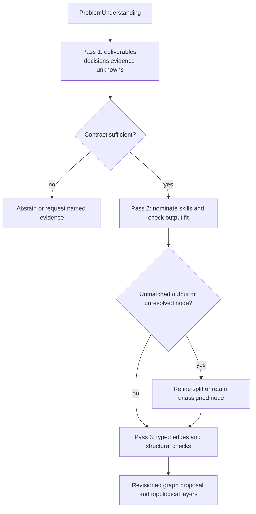

# Three-pass decomposition proposal

```mermaid
flowchart TD
  I[ProblemUnderstanding] --> P1[Pass 1: deliverables decisions evidence unknowns]
  P1 --> U{Contract sufficient?}
  U -->|no| A[Abstain or request named evidence]
  U -->|yes| P2[Pass 2: nominate skills and check output fit]
  P2 --> M{Unmatched output or unresolved node?}
  M -->|yes| R[Refine split or retain unassigned node]
  M -->|no| P3[Pass 3: typed edges and structural checks]
  R --> P3
  P3 --> G[Revisioned graph proposal and topological layers]
```
