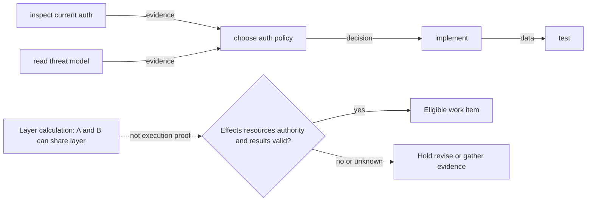

# Graph layers are not execution admission

```mermaid
flowchart LR
  A[inspect current auth] -->|evidence| C[choose auth policy]
  B[read threat model] -->|evidence| C
  C -->|decision| D[implement]
  D -->|data| E[test]
  L[Layer calculation: A and B can share layer] -. not execution proof .-> Q{Effects resources authority and results valid?}
  Q -->|yes| W[Eligible work item]
  Q -->|no or unknown| H[Hold revise or gather evidence]
```
