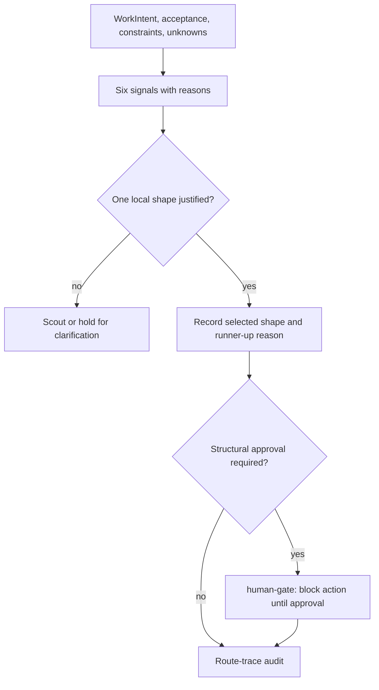
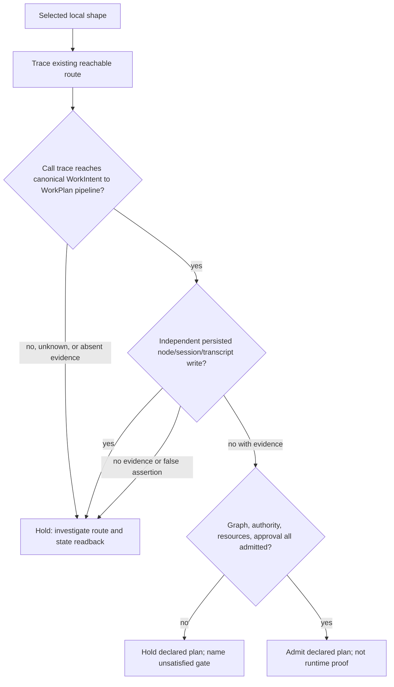

# Work Intake Node Shaping

The seven labels are a local planning policy, not a universal taxonomy. The
planner records coupling, context pressure, skill boundary, review independence,
budget and operator burden with reasons. A human or policy chooses exactly one
shape; the script validates the supplied declaration and route evidence, it
does not calculate a score or prove a call path.

## Method 1 — capture judgment before materialization

1. Capture one WorkIntent and its acceptance artifact, constraints, authority and
   unknowns.
2. Select values from the six enumerated signals and give a reason for each.
3. Compare nearest shapes using the local archetype table. Record why the runner
   up lost; if that cannot be stated, use scout or hold for clarification.
4. Select exactly one of node, scout, chain, dag-workgroup, tournament,
   ambient-watcher or human-gate. A human-gate is structural: its action remains
   blocked until explicit approval, even if all other signals are favorable.

## Method 2 — audit the current canonical pipeline

The current desired pipeline is WorkIntent → WorkPlan → governed materialization.
When auditing an existing legacy entrypoint, record an actual call trace reference
and persisted-state readback reference for every reachable route. A false boolean
is only a supplied assertion until that evidence exists. Unknown/legacy route
identity or missing trace blocks this supplied-data audit; it must not score 90
and pass.

This is an audit of existing routes, not an instruction to create or preserve a
compatibility shim. Under supplant-not-migrate, new work uses the canonical
pipeline; retaining an old route needs separate authorization.

## Method 3 — use the shapes as contrasts

- node: one coherent, bounded change.
- scout: reduce an unknown that prevents a safe shape decision.
- chain: ordered handoff where each output is the next required input.
- dag-workgroup: distinct branches with explicit interfaces and independent
  validation; a shared input alone is not proof of parallel safety.
- tournament: independent attempts at the same task with a declared evaluator.
- ambient-watcher: recurring/event-driven work, not merely a lengthy task.
- human-gate: explicit approval before a specified action.

Use the five disambiguation recipes in [Seven local archetypes](references/seven-archetypes.md): node/scout, chain/DAG, DAG/tournament, watcher/other, and human-gate/node. A release needing external approval is human-gate even if implementation resembles a node; a vague request with unknown files and acceptance condition is scout. These are local judgments, not deterministic scores, generic invariants, or validator output.

## Verify a supplied record

Run node scripts/node_shaping_audit.mjs --input examples/sample-input.json.
The audit compiles its Draft 2020 schema before cross-field checks. `pass` and
`declarationValid` mean the supplied record is coherent; `eligibleToAdmit`
additionally requires any declared approval plus authority and resources. A
valid-but-blocked human gate must not be treated as admitted, and the CLI exits
nonzero unless `eligibleToAdmit` is true. It does not prove
the trace exists, the readback is authentic, or any daemon/runtime behavior.
See [Schema enforcement](references/schema-enforcement.md).

## References

- [First-party method boundary](references/method-boundaries.md)
- [Seven local archetypes](references/seven-archetypes.md)
- [Existing-route audit](references/legacy-verb-compatibility.md)
