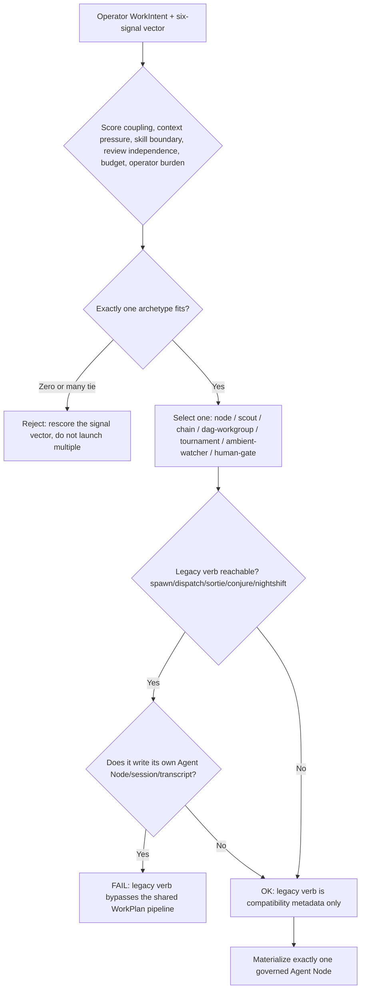

# Work Intake Node Shaping

Route one operator WorkIntent to exactly one topology archetype, and keep legacy launch verbs as compatibility metadata instead of a second, ungoverned path to an Agent Node.

## Use This For

- Classifying a new WorkIntent's signal vector into exactly one of the seven topology archetypes before any Agent Node is materialized.
- Auditing a `spawn`/`dispatch`/`sortie`/`conjure`/`nightshift` compatibility shim to confirm it routes into the shared WorkIntent -> WorkPlan pipeline instead of writing its own session/transcript state.
- Reviewing a control-plane PR that adds a new launch entrypoint, to catch a second, independent archetype decision hiding behind a different verb.
- Deciding whether ambiguous work (a "quick fix" vs. a "long research chain" vs. a "recurring watcher") should be a node, scout, or ambient-watcher before committing budget and skills to it.
- Grading a proposed WorkIntent-to-archetype mapping against the "exactly one archetype" invariant before it reaches the daemon.

## Do Not Use This For

- Inter-agent protocol/IPC mechanics once a workgroup or tournament is actually summoned (`swarm-invocation-designer`).
- Decomposing the work into sub-tasks or building/scheduling the DAG graph after a DAG-workgroup archetype is chosen (`task-decomposer`, `next-move`).
- Picking which specific skill or subagent fills a chosen node, or designing a chosen human-gate's approval mechanics (`skillful-subagent-creator`, `human-gate-designer`).

## Decision Model

1. **Capture the WorkIntent's six-signal vector** — coupling, context pressure, skill boundary, review independence, budget, operator burden. See `references/seven-archetypes.md` for what each signal measures.
2. **Map the signal vector to exactly one of the seven canonical archetypes** using the disambiguation heuristics in `references/seven-archetypes.md`. If two archetypes seem to fit, that is a scoring bug, not a tie to break by picking both.
3. **Record `selectedArchetypes` as a single-element array.** A WorkIntent that produces zero or multiple archetypes must be rejected before any Agent Node is materialized.
4. **Enumerate every legacy launch verb** (`spawn`, `dispatch`, `sortie`, `conjure`, `nightshift`) reachable from this WorkIntent's entrypoint and trace whether each one independently opens its own Agent Node, session id, or transcript instead of routing through the shared WorkIntent -> WorkPlan -> Agent Node pipeline. See `references/legacy-verb-compatibility.md`.
5. **Flag any legacy route that writes independent state.** It means an old code path is quietly bypassing the daemon's governance predicates (session, worktree, transcript chain, cost cap) that the Official-Agent Definition requires.
6. **Run `scripts/node_shaping_audit.mjs`** against the assembled spec and fail closed: unresolved cardinality or a leaking legacy route blocks materializing the Agent Node.
7. **Only after `pass: true`** does the daemon proceed to attach a Body, open a transcript, and persist a Work Receipt path for the single archetype selected.

## Output Contract

`scripts/node_shaping_audit.mjs` reads a spec with: `workIntent.id`, `workIntent.signals` (`coupling`, `contextPressure`, `skillBoundary`, `reviewIndependence`, `budget`, `operatorBurden`), `selectedArchetypes[]`, and `legacyRoutes[]` (`{ verb, writesIndependentState }`). It is safe only when `selectedArchetypes` has exactly one entry drawn from the seven canonical archetypes **and** every `legacyRoutes[].writesIndependentState` is `false` — an empty `legacyRoutes` array is safe (vacuously true), but any route proven to write independent state is never safe regardless of how many other routes are clean.

Use `scripts/node_shaping_audit.mjs` to audit a work-intake spec JSON and return `{ pass, score, findings, recommendations }`.

## Anti-Patterns

### Zero or Many Archetypes

**Novice**: Leaves `selectedArchetypes` empty ("still deciding, will figure it out at runtime") or lists both `node` and `chain` to hedge because the signal vector felt ambiguous.
**Expert**: Forces a single call before any Agent Node materializes. Ambiguity gets resolved in the signal vector, before governance state exists — never by launching more than one archetype and letting them race.
**Detection**: `node_shaping_audit.mjs` fires `no-archetype-selected` (critical) when `selectedArchetypes` is empty, and `multiple-archetypes-selected` (critical) when it has more than one entry.

### Legacy Verb Smuggles Independent State

**Novice**: A `sortie`/`spawn`/`nightshift` compatibility shim quietly opens its own session id or starts its own transcript instead of routing through the shared WorkPlan pipeline, producing a second, ungoverned Agent Node for the same WorkIntent.
**Expert**: Legacy verbs are compatibility metadata only — they annotate provenance (`{ sourceVerb: "sortie" }`) and then every one of them terminates in the same materialize-one-Agent-Node path.
**Detection**: `node_shaping_audit.mjs` fires `legacy-route-writes-independent-state` (critical) when any `legacyRoutes[].writesIndependentState` is `true`.

### Invented Archetype

**Novice**: Introduces an eighth topology ("swarm", "batch", "pipeline") because none of the seven canonical ones felt like a perfect fit, quietly fragmenting a taxonomy the operator was never supposed to see.
**Expert**: The seven archetypes (node, scout, chain, dag-workgroup, tournament, ambient-watcher, human-gate) are exhaustive by design. A WorkIntent that doesn't fit needs its signal vector rescored against `references/seven-archetypes.md`, not a new archetype invented.
**Detection**: `node_shaping_audit.mjs` fires `unknown-archetype` (critical) whenever a selected archetype isn't one of the seven canonical names.

## References

| File | Load When |
| --- | --- |
| `references/seven-archetypes.md` | Need the six-signal definitions or the disambiguation heuristics for picking one of the seven archetypes. |
| `references/legacy-verb-compatibility.md` | Need to trace whether a `spawn`/`dispatch`/`sortie`/`conjure`/`nightshift` route writes independent state, or need the Official-Agent Definition citation grounding why that matters. |
| `examples/expected-output.md` | Need to see a bad intake spec audited, then the same intake fixed and passing. |
| `examples/sample-input.json` | Need a complete, already-passing spec to copy as a starting point. |
| `templates/output-template.md` | Need a reusable template for the signal vector, archetype decision, and legacy route audit. |
| `schemas/work-intake-spec.schema.json` | Need to validate a work-intake JSON payload's structure before auditing it. |
| `scripts/node_shaping_audit.mjs` | Need deterministic, fail-closed scoring of a WorkIntent's archetype cardinality and legacy-route safety. |
| `agents/openai.yaml` | Need a subagent descriptor for delegated work-intake shaping. |

<!-- BEGIN BUNDLE INDEX (auto: index_references.py) -->

## Skill Bundle Index

*Every file in this skill, and when to open it. Auto-generated; run `scripts/index_references.py --fix`.*

**root**
- [`CHANGELOG.md`](CHANGELOG.md) — Work Intake Node Shaping — Changelog — - Initial skill creation - Core process defined: signal-vector-to-archetype mapping plus legacy-verb compatibility audit - Reference files a
- [`README.md`](README.md) — Work Intake Node Shaping — Route one operator WorkIntent to exactly one topology archetype (node, scout, chain, dag-workgroup, tournament, ambient-watcher, human-gate)

**`agents/`**
- [`agents/openai.yaml`](agents/openai.yaml) — openai (data/schema)

**`examples/`**
- [`examples/expected-output.md`](examples/expected-output.md) — Example Output: Work Intake Node Shaping — Scenario: a `nightshift` compatibility shim resolves one WorkIntent to two archetypes at once ("dag-workgroup" and an invented "swarm") beca
- [`examples/sample-input.json`](examples/sample-input.json) — sample input (data/schema)

**`references/`**
- [`references/legacy-verb-compatibility.md`](references/legacy-verb-compatibility.md) — Legacy Verb Compatibility — Use this when auditing a `spawn`/`dispatch`/`sortie`/`conjure`/`nightshift` code path, or when reviewing a control-plane PR that adds a new 
- [`references/seven-archetypes.md`](references/seven-archetypes.md) — The Seven Topology Archetypes — Use this when scoring a WorkIntent's signal vector and you're not sure which of the seven canonical archetypes it resolves to, or when a pro

**`schemas/`**
- [`schemas/work-intake-spec.schema.json`](schemas/work-intake-spec.schema.json) — work intake spec.schema (data/schema)

**`scripts/`**
- [`scripts/node_shaping_audit.mjs`](scripts/node_shaping_audit.mjs)

**`templates/`**
- [`templates/output-template.md`](templates/output-template.md) — Work Intake Decision Template — Fill in every section before materializing an Agent Node.

<!-- END BUNDLE INDEX -->
