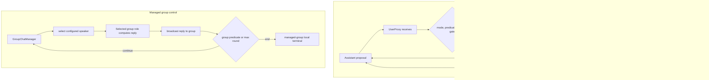

# AutoGen conversation design

## Source boundary

Wu et al., [AutoGen](https://arxiv.org/html/2308.08155v2) (arXiv:2308.08155v2; COLM 2024) supplies the conversation/computation/control model. Official AutoGen 0.2 documentation supplies `GroupChatManager`, `UserProxyAgent` modes, auto-reply controls, and executor configuration. Neither makes a conversation transcript complete system state or guarantees safety/correctness.

## When the conversation pattern fits

Use a conversation pattern when the participants combine an LLM, tool/code result, or human input and the next reply or speaker is part of the work. For a known stage order, write the participant sequence and terminal predicate first. Use a manager-selected group only when intermediate content actually decides which role should speak next. A deterministic batch or a one-step action may need neither pattern. This is a fit decision, not a claim that conversation replaces ordinary control flow.

## Choose topology, computation, and control

1. State what each participant computes: for example, an Assistant proposes code, a UserProxy executes it, and a human may supply input.
2. State who controls the next turn: direct auto-reply uses a receiving agent's `generate_reply` or a registered reply function; a fixed sequence names the next participant; a managed group gives `GroupChatManager` speaker selection and broadcast responsibility.
3. State independently what ends the exchange. A content predicate, a consecutive-auto-reply cap, and a group `max_round` are different controls. A successful-looking message is not an external acceptance decision.
4. Preserve received message, selected reply function/speaker, tool or external result, and terminal reason. Conversation history helps diagnosis but does not include every tool effect, external resource, hidden state, or omitted context.

**Diagram scope.** The direct lane abstracts the synchronous receiving-agent path with a positive `max_consecutive_auto_reply` (the constructed configuration below uses `4`) and no custom reply function registered ahead of the built-in human/termination guard. It does not depict the source's `max_consecutive_auto_reply == 0` special case, where empty human input is returned as a final user response rather than entering the normal auto-reply chain.



## Direct two-agent repair trace

This is a constructed illustrative AutoGen 0.2 trace; it does not launch the framework or report a paper result. Assistant deliberately sends `print(sp.sqrt(4))` to UserProxy without an import. After the receiving-agent gate permits auto-reply, the configured executor returns a concrete message such as `exitcode: 1; NameError: name 'sp' is not defined`. Assistant's next message identifies the changed artifact, for example `import sympy as sp; print(sp.sqrt(4))`, before UserProxy receives and checks it again. Record the exact tool output separately from the transcript and end with either the configured terminal predicate/cap or external acceptance.

The paper's Appendix E Table 9 is a different, successful A1 math trace: it imports `sqrt, Rational` from `sympy`, reports `exitcode: 0` and `5*sqrt(42)/27`, then returns `TERMINATE`. Use that paper trace to distinguish observed success/termination from this constructed failure repair.

An illustrative, non-executed AutoGen **0.2** configuration makes the controls visible:

```python
def termination(message):
    content = message.get("content") if isinstance(message, dict) else None
    return isinstance(content, str) and content.rstrip().endswith("TERMINATE")
user_proxy = UserProxyAgent(
    "executor",
    is_termination_msg=termination,
    max_consecutive_auto_reply=4,
    human_input_mode="NEVER",
    code_execution_config={
        "work_dir": "./autogen-fixture-work",
        "use_docker": True,
        "timeout": 20,
        "last_n_messages": 1,
    },
)
group = GroupChat(
    agents=[planner, writer, reviewer], messages=[], max_round=6,
    speaker_selection_method="round_robin",
)
manager = GroupChatManager(group)
```

The displayed `4`, `20`, `1`, and `6` are constructed local-policy values, not paper results or recommended defaults. The predicate treats absent, null, non-string, and ordinary content as non-terminal; only a string ending in `TERMINATE` is terminal. A real group may also configure allowed speaker transitions; the group has its own `max_round` and does not share the direct reply cap.

The same paper A1 math topology is shown with autonomous participation and with `human_input_mode="ALWAYS"`. In 0.2.35, the receiving agent checks before auto-reply: `NEVER` does not request human input and stops locally on its termination predicate or cap; `ALWAYS` prompts on every receive and ignores the auto-reply cap; `TERMINATE` prompts at a termination condition or reply limit. A nonempty human response other than `exit` is returned directly as a user reply, without invoking an executor. `exit`, and empty input at a terminal message, resolve to a local `None` stop; an empty nonterminal skip follows the documented auto-reply path. Human presence is not an approval protocol.

## Diagnostics and quality gates

- For a direct failure, inspect the received message, reply function invoked, executor side effect, changed repair, and terminal reason; a transcript alone is insufficient evidence of the side effect.
- For a managed group, compare configured participants/transitions and `max_round` with the actual selected-speaker sequence and broadcasts. An irrelevant selection is a diagnostic outcome, not a proof dynamic routing failed generally.
- Check direct reply cap and group-round limit separately. Check a human mode by observing its prompt behavior, including an unanswered prompt according to the documented mode.
- Treat an LLM critic or a `TERMINATE` token as advisory until an independently enforced policy controls execution or release.

## Read next

- [Auto-reply and custom reply functions](references/conversation-as-coordination-mechanism.md)
- [Topology](references/dynamic-vs-static-conversation-topology.md)
- [Computation and control](references/computation-vs-control-separation.md)
- [Iteration](references/failure-recovery-through-conversation-iteration.md)
- [Topology diagram](diagrams/01-topology.md)
- [Input/execution boundary](diagrams/02-control-boundary.md)
