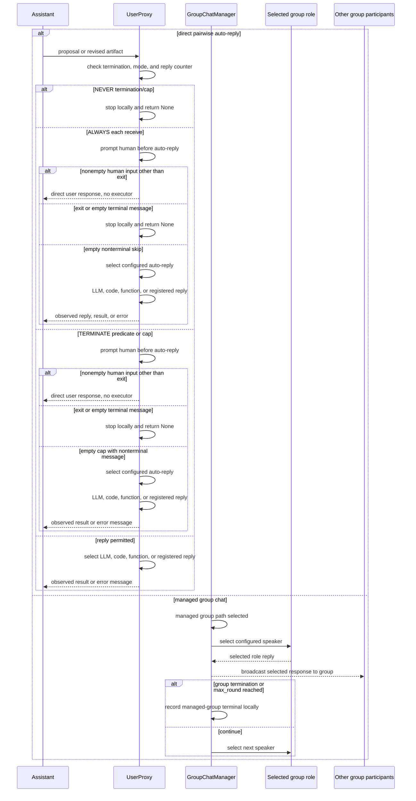

# Direct and managed conversation topologies

**Direct-lane scope.** This is the synchronous receiving-agent path with a positive `max_consecutive_auto_reply` and no custom early reply override. It excludes the v0.2.35 zero-cap special case, where empty human input can return a final user response instead of normal auto-reply.

