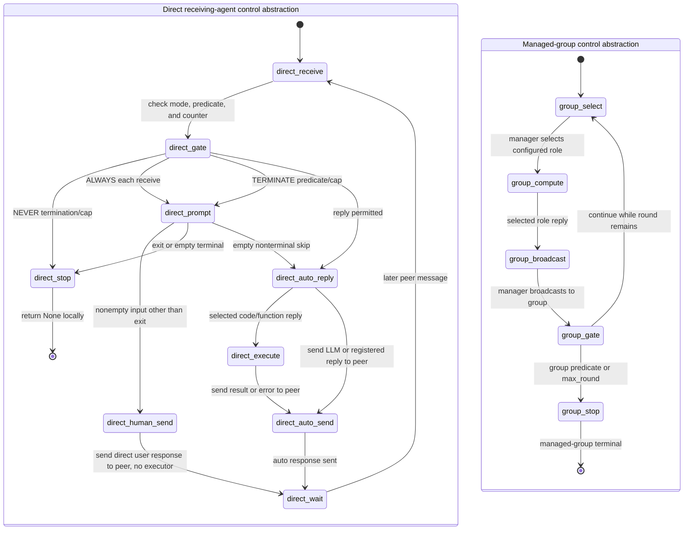

# Receiving-agent control abstraction and managed-group control

**Direct-lane scope.** This abstraction assumes a synchronous receiving agent, a positive `max_consecutive_auto_reply`, and no custom reply handler preceding the built-in guard. It excludes the v0.2.35 zero-cap special case for empty human input.

