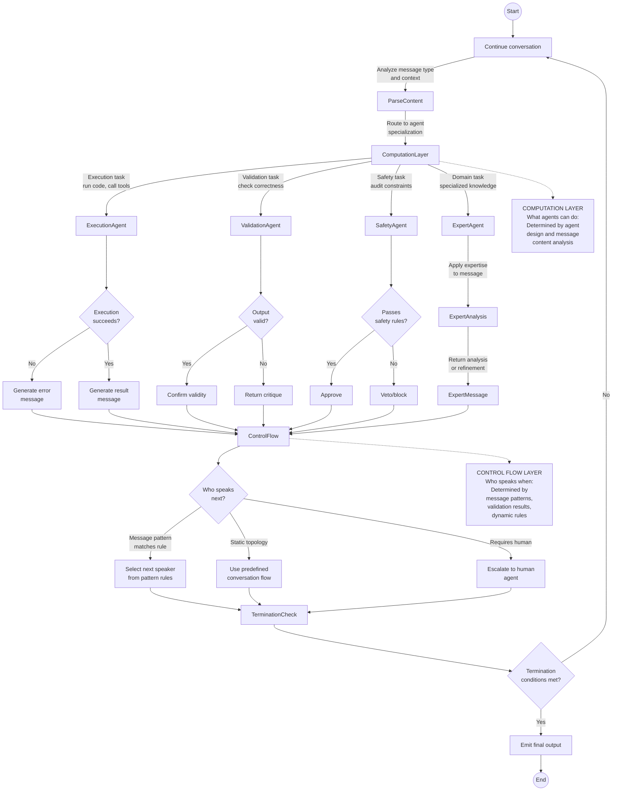

# Agent Computation vs Control Flow Separation

```mermaid
flowchart TD
    Start((Start)) --> MessageReceived

    MessageReceived -->|Analyze message type<br/>and context| ParseContent

    ParseContent -->|Route to agent<br/>specialization| ComputationLayer

    ComputationLayer -->|Execution task<br/> run code, call tools| ExecutionAgent
    ComputationLayer -->|Validation task<br/> check correctness| ValidationAgent
    ComputationLayer -->|Safety task<br/> audit constraints| SafetyAgent
    ComputationLayer -->|Domain task<br/> specialized knowledge| ExpertAgent

    ExecutionAgent --> ExecutionResult{"Execution<br/>succeeds?"}
    ExecutionResult -->|Yes| ResultMessage["Generate result<br/>message"]
    ExecutionResult -->|No| ErrorMessage["Generate error<br/>message"]

    ValidationAgent --> ValidationCheck{"Output<br/>valid?"}
    ValidationCheck -->|Yes| ValidMessage["Confirm validity"]
    ValidationCheck -->|No| CritiqueMessage["Return critique"]

    SafetyAgent --> SafetyCheck{"Passes<br/>safety rules?"}
    SafetyCheck -->|Yes| SafeMessage["Approve"]
    SafetyCheck -->|No| BlockMessage["Veto/block"]

    ExpertAgent -->|Apply expertise<br/>to message| ExpertAnalysis
    ExpertAnalysis -->|Return analysis<br/>or refinement| ExpertMessage

    ErrorMessage --> ControlFlow
    ResultMessage --> ControlFlow
    ValidMessage --> ControlFlow
    CritiqueMessage --> ControlFlow
    SafeMessage --> ControlFlow
    BlockMessage --> ControlFlow
    ExpertMessage --> ControlFlow

    ControlFlow --> SpeakerSelection{"Who speaks<br/>next?"}

    SpeakerSelection -->|Message pattern<br/>matches rule| DynamicSpeaker["Select next speaker<br/>from pattern rules"]
    SpeakerSelection -->|Static topology| StaticSpeaker["Use predefined<br/>conversation flow"]
    SpeakerSelection -->|Requires human| HumanSpeaker["Escalate to human<br/>agent"]

    DynamicSpeaker --> TerminationCheck
    StaticSpeaker --> TerminationCheck
    HumanSpeaker --> TerminationCheck

    TerminationCheck --> ShouldTerminate{"Termination<br/>conditions met?"}

    ShouldTerminate -->|No| MessageReceived["Continue conversation"]
    ShouldTerminate -->|Yes| FinalOutput["Emit final output"]

    FinalOutput --> End((End))

Annotation1["COMPUTATION LAYER<br/>What agents can do:<br/>Determined by agent<br/>design and message<br/>content analysis"]
ComputationLayer -.-> Annotation1

Annotation2["CONTROL FLOW LAYER<br/>Who speaks when:<br/>Determined by<br/>message patterns,<br/>validation results,<br/>dynamic rules"]
ControlFlow -.-> Annotation2
```
