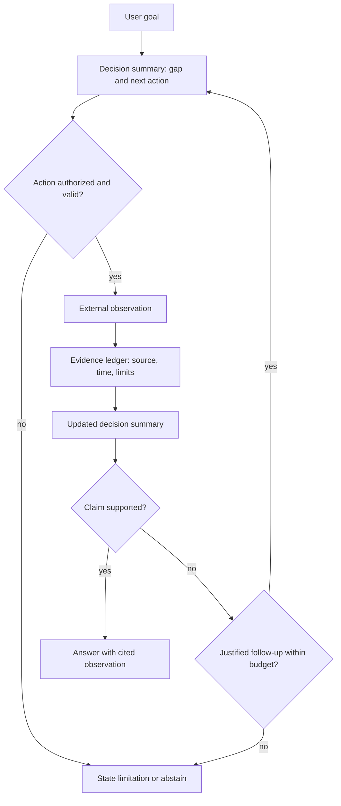
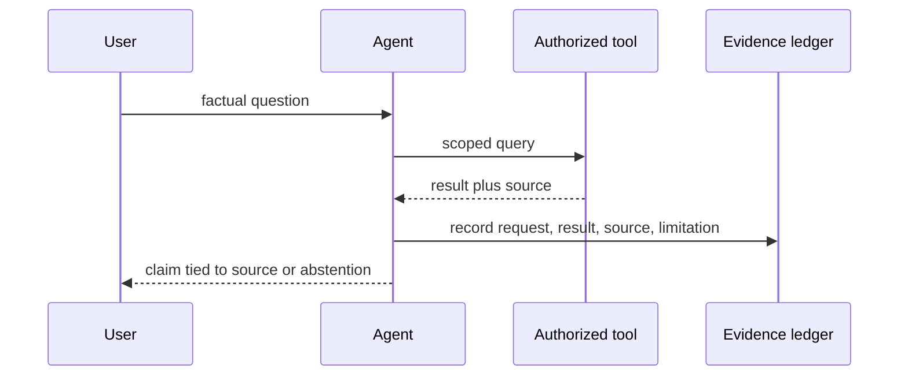

# ReAct: decisions grounded by tool observations

Yao et al.'s [ReAct paper](https://arxiv.org/html/2210.03629v3) interleaves generated reasoning, actions, and observations in question answering and interactive environments. Treat its trace as a control pattern: model text proposes the next action, while a tool result supplies external evidence. It does not prove that generated rationale is faithful, that a tool call is authorized, or that grounding guarantees correctness.

Use short decision summaries: goal, uncertainty, chosen action, and what observation would resolve it. Do not require a model to expose private chain-of-thought; retain the tool request, tool result, citations, and a concise user-safe explanation sufficient to audit a result.

## Evidence-carrying loop





## Compact trace fixture

```text
goal: identify whether a claim is supported
decision: source A is incomplete; query source B for the missing fact
action: search({query: "...", scope: "approved corpus"})
observation: {source: "B", excerpt_id: "B-17", result: "conflicts with A"}
next: do not assert the claim; seek a primary source or say evidence conflicts
```

The decision is not evidence. The observation's source and retrieval context are. If a result is empty, malformed, or outside the authorized corpus, record that limitation and either reformulate a bounded query or abstain.

## Design rules

- Validate action schemas and authorization outside the language model. Tool availability is not permission.
- Carry raw tool receipts or stable excerpts into the evidence ledger; a later summary must not be the only provenance.
- Use a state-derived loop guard (repeated action, unchanged observation, or budget selected by the application), then stop or escalate through an existing policy.
- Human correction may change a decision or final assertion; retain the correction and supporting evidence. It must not silently rewrite historical tool results.
- Benchmark figures in the paper apply to named datasets, prompts, and models; do not convert them to universal error or hallucination rates.

## Source-grounded navigation

- [Reasoning/action trace and limits](references/reasoning-action-synergy-in-agent-systems.md)
- [Evidence versus generated text](references/bridging-knowledge-and-action-gap.md)
- [Failure propagation and recovery](references/failure-modes-and-error-propagation.md)
- [Uncertainty as a query or abstention trigger](references/uncertainty-and-confidence-in-agent-decisions.md)
- [Interpretable operational traces](references/human-interpretability-and-controllability.md)
- [Source evaluation and controller contract](references/source-evaluation-and-controller-contract.md)

## Boundaries

ReAct is a prompting and interaction pattern, not a substitute for authorization, source validation, privacy review, or effect confirmation.
