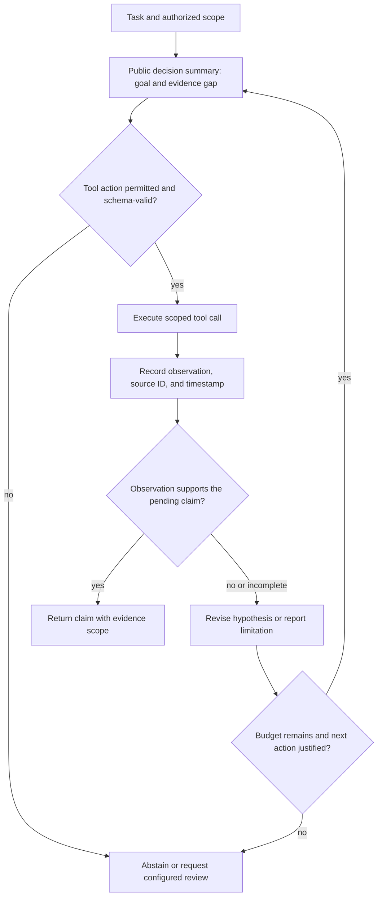

# Evidence-bounded ReAct loop

```mermaid
flowchart TD
  G[Task and authorized scope] --> S[Public decision summary: goal and evidence gap]
  S --> P{Tool action permitted and schema-valid?}
  P -- no --> A[Abstain or request configured review]
  P -- yes --> T[Execute scoped tool call]
  T --> O[Record observation, source ID, and timestamp]
  O --> C{Observation supports the pending claim?}
  C -- yes --> R[Return claim with evidence scope]
  C -- no or incomplete --> N[Revise hypothesis or report limitation]
  N --> B{Budget remains and next action justified?}
  B -- yes --> S
  B -- no --> A
```
