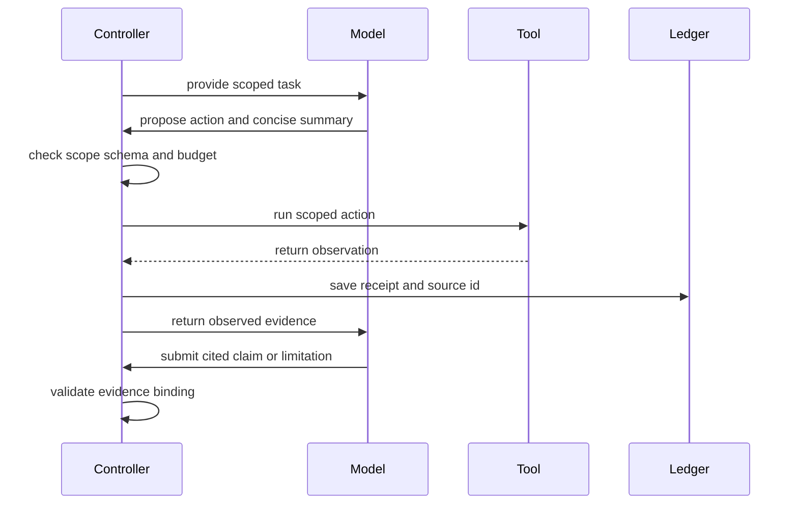

# ReAct evidence and recovery trace

```mermaid
sequenceDiagram
  participant C as Controller
  participant M as Model
  participant T as Tool
  participant L as Ledger
  C->>M: provide scoped task
  M->>C: propose action and concise summary
  C->>C: check scope schema and budget
  C->>T: run scoped action
  T-->>C: return observation
  C->>L: save receipt and source id
  C->>M: return observed evidence
  M->>C: submit cited claim or limitation
  C->>C: validate evidence binding
```
