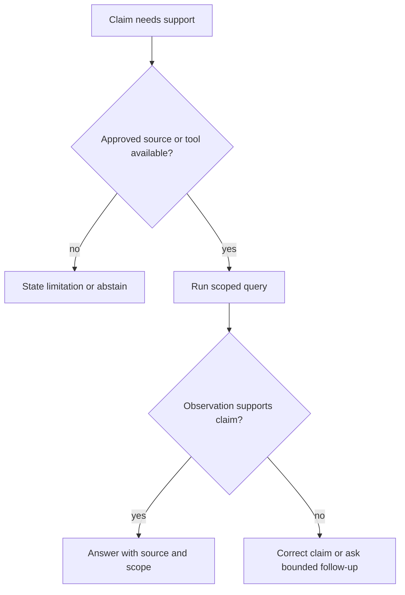

# Evidence-sensitive action choice

```mermaid
flowchart TB
  C[Claim needs support] --> R{Approved source or tool available?}
  R -- no --> A[State limitation or abstain]
  R -- yes --> Q[Run scoped query]
  Q --> E{Observation supports claim?}
  E -- yes --> S[Answer with source and scope]
  E -- no --> M[Correct claim or ask bounded follow-up]
```
