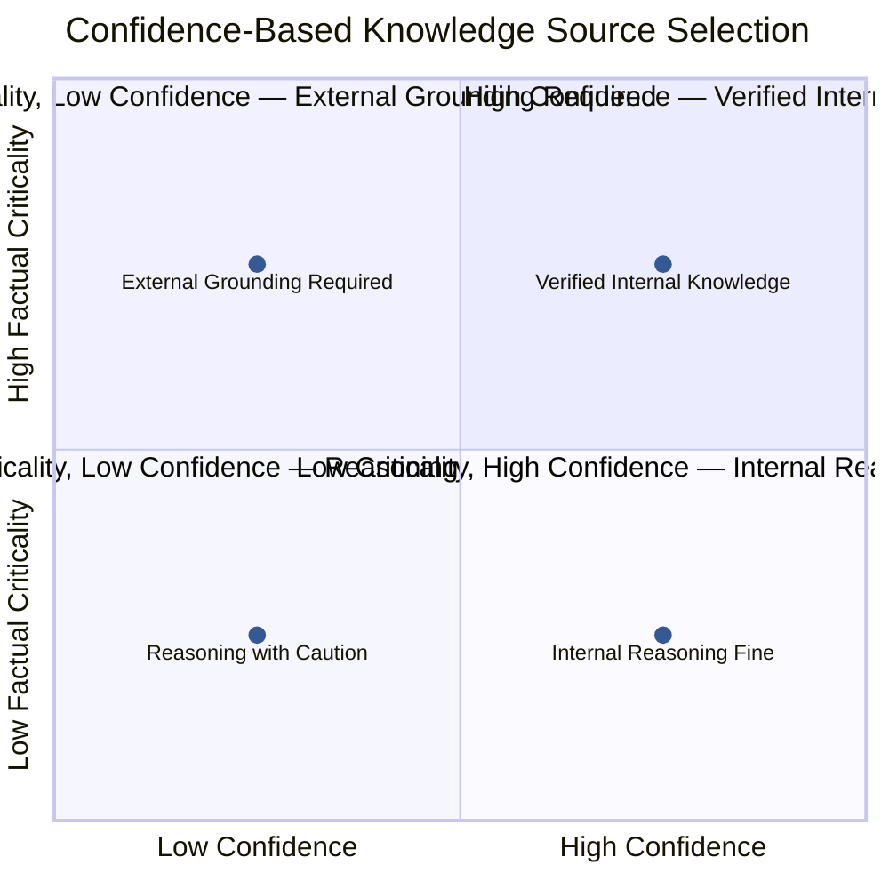

# Confidence-Based Knowledge Source Selection

```mermaid
quadrantChart
%%{init: {"themeVariables": {"quadrantPointFill": "#345995"}}}%%
    title Confidence-Based Knowledge Source Selection
    x-axis Low Confidence --> High Confidence
    y-axis Low Factual Criticality --> High Factual Criticality
    
    quadrant-1 High Criticality, High Confidence — Verified Internal Knowledge
    quadrant-2 High Criticality, Low Confidence — External Grounding Required
    quadrant-3 Low Criticality, Low Confidence — Reasoning with Caution
    quadrant-4 Low Criticality, High Confidence — Internal Reasoning Fine
    
    Verified Internal Knowledge: [0.75, 0.75]
    External Grounding Required: [0.25, 0.75]
    Reasoning with Caution: [0.25, 0.25]
    Internal Reasoning Fine: [0.75, 0.25]
```
