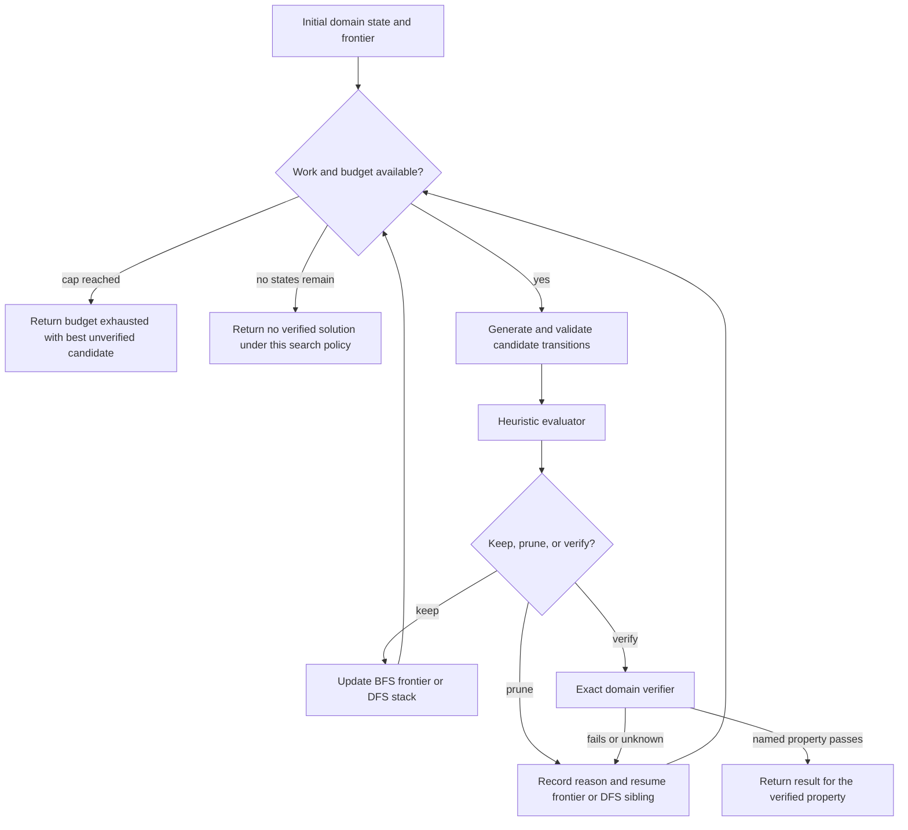
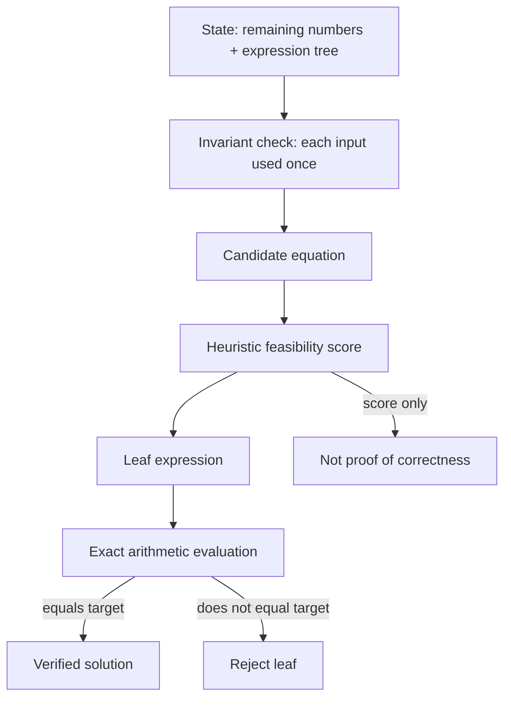

# Tree of Thoughts: explicit domain-state search

Yao et al.'s [Tree of Thoughts paper](https://arxiv.org/html/2305.10601v2) separates four controller choices: thought-state decomposition, candidate generation, state evaluation, and search. Their experiments use different choices for Game of 24, constrained creative writing, and mini crosswords; none establishes a universal setup. The [paper-method reference](references/paper-method-and-worked-examples.md) restores the algorithms, prompts, worked states, budgets, and scoped results.

Represent a “thought” as an explicit domain state and proposed transition, not as a claim about hidden cognition. LM values and votes are heuristic records. A domain verifier establishes only a property it actually checks. Label results as verified, unverified, budget-exhausted, no-candidate, or error rather than turning an unverified score into a solution claim.

## Search controller

## Worked Game-of-24 fixture

For inputs `4, 4, 6, 8`, define each state as remaining numbers plus an expression tree. A candidate can combine two currently remaining values using permitted arithmetic, remove exactly those two values, and append the result. A leaf is acceptable only when it uses all four inputs once and exact arithmetic evaluates to 24. The evaluator may rank a partial state, but it can prune a viable path; therefore preserve its score and reason, and do not call a selected leaf verified until the arithmetic checker runs.

## Configuration questions

1. What fields define a state, and what invariants must every transition preserve?
2. Should the generator independently sample rich alternatives or propose constrained alternatives sequentially?
3. Should the evaluator value each state or compare candidates? Which part is an exact check, and which remains a heuristic?
4. Which controller policy fits the state graph, and how will discarded states, duplicates, and backtracking be recorded?
5. What budgets apply to generation requests, candidate states, evaluator samples, exact checks, wall time, and money?
6. What typed result is returned if there is no verified answer at the stop boundary?

These are application choices. The paper's branching, depth, prompts, and stopping rules are experiment settings, not universal defaults. Additional prompts and task walkthroughs are linked in [the reference index](references/INDEX.md); three explanatory figures are linked from [the diagram index](diagrams/INDEX.md).

## Source-grounded navigation

- [Thought-state decomposition](references/thought-decomposition-and-problem-structure.md)
- [Search choice and state management](references/search-algorithm-modularity-and-problem-structure.md)
- [Evaluator limitations](references/llm-self-evaluation-as-search-heuristic.md)
- [Failure and backtracking](references/failure-modes-in-deliberate-search.md)
- [Knowledge/application distinction](references/knowing-vs-doing-gap-in-llms.md)

## Boundaries

This pattern adds generation and evaluation work and can preserve a bad heuristic or prune a valid branch. It is not a proof of optimality, a general account of human cognition, or a universal replacement for direct generation. The paper itself reports task-specific results; measure cost and verified outcomes on the intended workload before adopting a policy.
