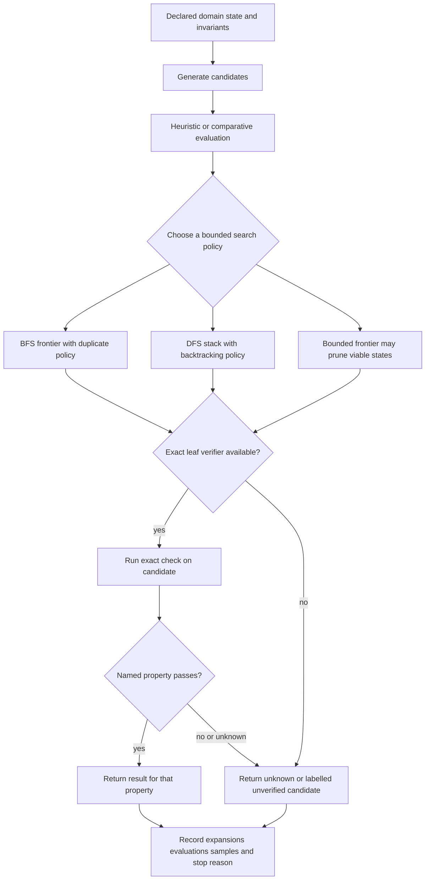

# Tree of Thoughts search-controller choices

```mermaid
flowchart TD
  P[Declared domain state and invariants] --> G[Generate candidates]
  G --> E[Heuristic or comparative evaluation]
  E --> S{Choose a bounded search policy}
  S --> B[BFS frontier with duplicate policy]
  S --> D[DFS stack with backtracking policy]
  S --> M[Bounded frontier may prune viable states]
  B --> V{Exact leaf verifier available?}
  D --> V
  M --> V
  V -- yes --> Q[Run exact check on candidate]
  Q --> T{Named property passes?}
  T -- yes --> X[Return result for that property]
  T -- no or unknown --> U
  V -- no --> U[Return unknown or labelled unverified candidate]
  X --> R[Record expansions evaluations samples and stop reason]
  U --> R
```
