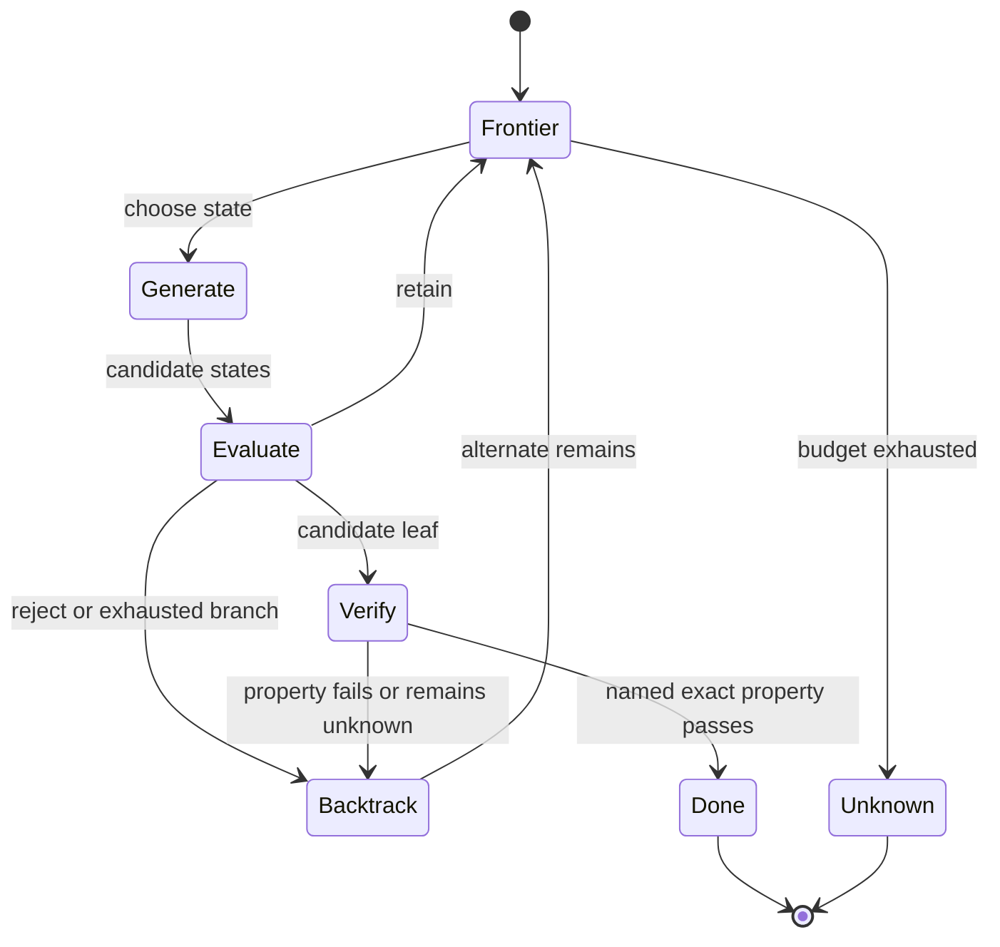

# Bounded search-state lifecycle

```mermaid
stateDiagram-v2
  [*] --> Frontier
  Frontier --> Generate: choose state
  Generate --> Evaluate: candidate states
  Evaluate --> Frontier: retain
  Evaluate --> Backtrack: reject or exhausted branch
  Backtrack --> Frontier: alternate remains
  Evaluate --> Verify: candidate leaf
  Verify --> Done: named exact property passes
  Verify --> Backtrack: property fails or remains unknown
  Frontier --> Unknown: budget exhausted
  Done --> [*]
  Unknown --> [*]
```
