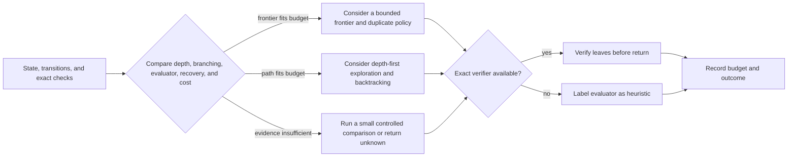

# Search-policy design questions

```mermaid
flowchart LR
  T[State, transitions, and exact checks] --> B{Compare depth, branching, evaluator, recovery, and cost}
  B -- frontier fits budget --> W[Consider a bounded frontier and duplicate policy]
  B -- path fits budget --> D[Consider depth-first exploration and backtracking]
  B -- evidence insufficient --> U[Run a small controlled comparison or return unknown]
  W --> V{Exact verifier available?}
  D --> V
  U --> V
  V -- yes --> X[Verify leaves before return]
  V -- no --> H[Label evaluator as heuristic]
  X --> L[Record budget and outcome]
  H --> L
```
