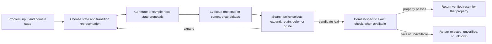
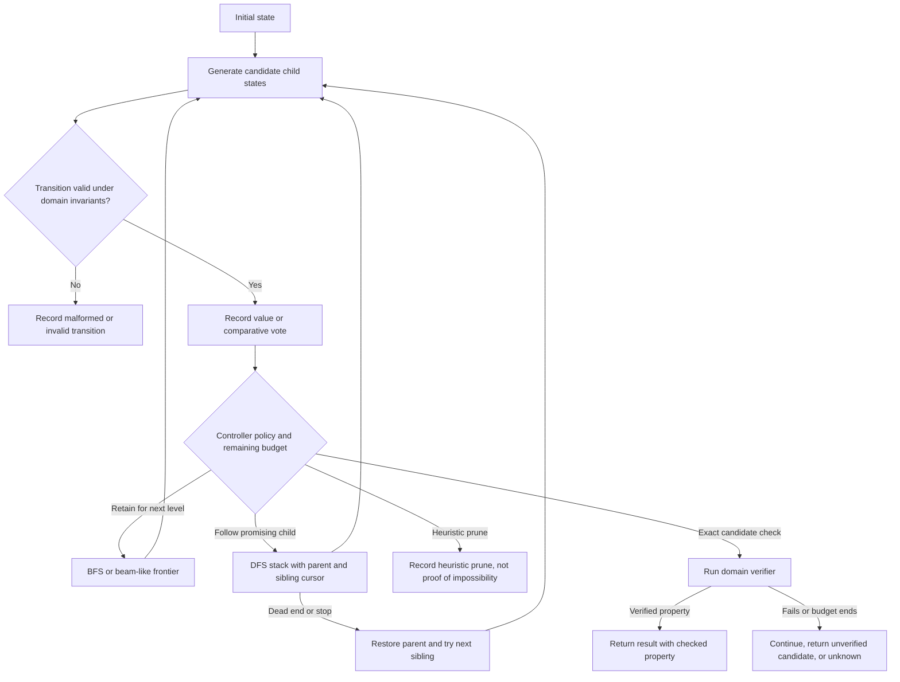

# Tree of Thoughts: method, interfaces, and worked examples

## Source and scope

The primary source is Yao et al., [“Tree of Thoughts: Deliberate Problem Solving with Large Language Models,” arXiv:2305.10601v2](https://arxiv.org/html/2305.10601v2), dated 2023-12-03. Methods §§2–3 define the framework; experiments §§4.1–4.3 cover Game of 24, creative writing, and 5×5 mini crosswords; Appendix B reports additional tasks, models, and cost measurements. The authors' [official code repository](https://github.com/princeton-nlp/tree-of-thought-llm) provides task prompts and a modular implementation. Its mutable default branch was inspected on 2026-09-24; no immutable commit was resolved in this review, so implementation observations below are access-date scoped. The paper's reported experiments used the model and setup named there. They are evidence about those configurations, not general guarantees about current models, arbitrary tasks, or application quality.

This skill uses “thought” as the paper's name for an intermediate unit in a search over partial solutions. The practical object is a domain state plus a proposed transition. It is not a claim that the text reveals a model's hidden cognition.

## The four controller decisions

For a problem input `x`, a state can be represented as `s = (x, z₁…zᵢ)`, where `z₁…zᵢ` is the sequence of domain-relevant partial steps so far. A useful implementation separates four choices:

| Component | Interface question | Example contract |
|---|---|---|
| Decomposition | What is one state and one transition? | A state stores remaining arithmetic values and expression nodes; one transition consumes two values and adds their result. |
| Generation | How are candidate next states proposed? | Given a parent state and generation limit, return candidate actions/states with provenance. |
| Evaluation | What property is estimated, and on what evidence? | Return a heuristic value or a comparison among candidates; explicitly distinguish exact checks. |
| Search/controller | Which states are expanded next, under what budget and stop rule? | Maintain a frontier or recursion stack, record backtracking, and return a typed stop outcome. |

Keep terminal verification separate. A controller can use an LM value or vote to choose what to expand, but a final verifier should check the property it claims to check: for example, parse an arithmetic expression, confirm every input occurs once, and evaluate it exactly.



The interfaces are intentionally modular. Changing one does not validate the others: a good state encoding can be paired with a weak evaluator; an accurate evaluator can be used with a poor transition generator; and a correct terminal checker cannot recover a viable state that was pruned earlier.

## Generation: propose versus sample

The paper describes two ways to create the next thought unit:

- **Independent sampling.** Draw candidate continuations from a prompt without feeding earlier candidates into each draw. The paper uses this for its richer creative-writing plan space, where paragraph plans can differ substantially.
- **Sequential proposal.** Ask for distinct candidate moves in one context. The paper uses this for more constrained Game-of-24 equations and crossword word placements, where seeing earlier proposals can reduce duplication.

These are design alternatives, not intrinsic properties of a domain. Compare candidate diversity and validity under the same prompt, state, model, and call budget. Deduplicate by a domain-appropriate canonical key while retaining distinct actions when order or provenance matters. If refinement is appropriate, store it as a separate generation mode: the paper's creative-writing section also compares iterative refinement, and reports that refinement improves its own evaluated coherency scores. That does not establish refinement as universally superior to search.

A generator's response should be parsed into candidate actions. Reject malformed candidates before evaluation, but retain rejection counts so generation failures are distinguishable from evaluator pruning. Do not count one API request as one candidate when it yields multiple proposals; record requests and candidates separately.

## Evaluation: value versus comparative vote

Yao et al. describe two evaluation shapes:

1. **State valuation:** assess each state individually. Their Game-of-24 prompt uses labels such as `sure`, `maybe`, or `impossible`; the labels are heuristic judgments, not calibrated probabilities. The paper's examples mix limited lookahead with domain knowledge.
2. **Comparative voting:** compare a set of candidate states and select a promising one. Their creative-writing experiment uses votes to choose among candidate plans and later candidate passages, where coherence is hard to reduce to an exact local value.

A value answers “how promising is this state under this prompt?” A vote answers “which candidate is preferred in this set?” Neither alone answers “is this state valid?” or “is it the best possible solution?” Vote results are relative to the presented candidate set, prompt, model, sample procedure, and tie policy.

Example state-value prompt, adapted to a local task:

```text
Given the current state and target, return one label: promising, uncertain, or unlikely.
Then give one sentence naming the domain evidence used. This is only a search heuristic.
State: [state]
Target and constraints: [target, exact invariants]
```

Example comparative prompt, adapted to a local task:

```text
Compare candidates A, B, and C against the stated criteria and current state.
Return a ranked preference and one short, criterion-linked reason per candidate.
Mark a tie or insufficient evidence when appropriate. Preference is not verification.
```

If an application samples several values or votes, declare the aggregation rule in advance (for example, median for numeric ratings, plurality with a stated tie route for categorical labels). This is an application policy. Repeated samples cost more and can share correlated errors; the paper's suggestion that aggregation can trade resources for more faithful heuristics is not a universal reliability law. Never silently convert majority “impossible” into a sound prune.

## Search policies in the paper

The paper's BFS algorithm generates children from the current level, evaluates them, and retains a bounded set of the top states for the next level. This is breadth-limited selection, so it can discard a state that later proves useful. The paper applies it to its relatively shallow Game-of-24 and creative-writing experiments. The author-chosen breadth and depth are reported settings, not requirements.

The paper's DFS algorithm orders proposed children, tests them using a value threshold, recursively explores promising ones, and returns to the parent to try remaining siblings. Its mini-crossword example uses constraints from filled words to judge remaining clues and backtracks when a branch is deemed unpromising. A wrong prune can remove a valid completion. The paper constrains later word placements not to modify earlier filled words and caps its experiment at 100 search steps; both are task-specific controls, not general thresholds.

The paper explicitly leaves more advanced search such as A* and Monte Carlo tree search for future work. An LM score has no implied admissibility or consistency. Do not label a prompted evaluator “A*,” infer A* optimality, or claim generic completeness. See [Search algorithms](search-algorithm-modularity-and-problem-structure.md) for bounded pseudocode and state-management details.



This chart combines possible controller states for explanation; it does not assert that BFS and DFS run simultaneously. Choose the policy per task and log the choice.

## Worked example: Game of 24

The paper frames a state as the remaining values plus the expressions that produced them. For inputs `4, 9, 10, 13`, a valid path is:

| Step | State before | Proposed equation | State after |
|---|---|---|---|
| 1 | `[4, 9, 10, 13]` | `13 - 9 = 4` | `[4, 4, 10]` |
| 2 | `[4, 4, 10]` | `10 - 4 = 6` | `[4, 6]` |
| 3 | `[4, 6]` | `4 * 6 = 24` | `[24]` |

The exact verifier checks each transition and then checks the full expression `(10 - 4) * (13 - 9) = 24`. It confirms arithmetic validity for this input; it says nothing about why the LM selected that branch or whether the heuristic ranking was good.

The paper's Game-of-24 experiment uses a three-step decomposition and a breadth-limited search. Its Table 2 reports 74% success for ToT with breadth `b=5` on a subset of 100 hard puzzles (indices 901–1,000 in a set sorted by human solving time), compared with 4.0% for CoT under its stated prompts and model setup. Those figures describe the paper's 2023 GPT-4 experiment, not a predicted success rate for this skill or a comparison with current systems. The appendix also reports that ToT used about 5.5k completion tokens per case in that setup, while 100 CoT samples used about 6.7k; cost and performance were not identical resource budgets. Do not reuse historical dollar prices as current cost estimates.

A bounded arithmetic checker can also test a disputed prune. The rule “all inputs below 5 implies impossible to reach 24” is false: `4 * 4 + 4 + 4 = 24`. This counterexample is a reason not to use that rule as an exact prune; it does not provide a general heuristic calibration method.

## Worked example: creative writing

The paper's task gives four input sentences and asks for a coherent four-paragraph passage that ends the corresponding paragraphs with those sentences. The ToT setup first samples candidate plans, votes on a plan, then generates and votes on passages conditioned on the selected plan. The experiment reports its own metrics: GPT-4 ratings averaged 7.56 for ToT, 6.19 for input-output prompting, and 6.93 for chain-of-thought prompting over 100 tasks; in a human comparison of ToT vs CoT passages, evaluators preferred ToT in 41 pairs, CoT in 21, and judged 38 similarly coherent. It is a constructed task and evaluation design from the paper, not evidence that voting yields factual correctness or that plans improve arbitrary writing.

A local version should identify the output constraints that can be checked mechanically (for example, required last sentences) separately from subjective qualities (coherence, tone). A vote may help choose a candidate for further work; a parser can check required sentence placement; neither substitutes for the other.

## Worked example: mini crosswords

A crossword state stores filled clue/word placements and the letter patterns they impose on remaining entries. One transition selects a clue and a candidate word. A cheap exact crossing check can reject a word that conflicts with letters already fixed. A separate lexical or model-based evaluation may estimate whether remaining clues are fillable; that is heuristic unless backed by a complete dictionary and a formal constraint solver for the exact puzzle.

The paper uses DFS for its 5×5 mini-crossword experiment, proposes several word placements, orders them by model confidence, and uses a model judgment over remaining clue patterns to prune. It limits modifications so later steps cannot rewrite already filled words, bounds the search to 100 steps, and backtracks to the parent when a branch is rejected. On 20 selected test games, it reports 60% word-level success and solves 4 games; an oracle-best-state output raises completed games to 7/20. Its no-pruning and no-backtracking ablations report lower word-level success (41.5% and 20%, respectively) in this setup. The paper also describes a valid rare word being marked impossible by the model, illustrating a false prune. These results motivate retaining recovery and separating candidate output selection from state evaluation; they do not prove that DFS or the stated limit is best for other puzzles.

## Controller and result contract

A practical controller needs at least these task-supplied operations:

| Operation | Input | Output | Important limit |
|---|---|---|---|
| `canonicalize` | candidate state | stable state key | Include every field that affects future transitions or evaluation. |
| `generate` | parent state, limit, mode | candidate actions/states | Report parse failures, duplicates, and generation requests separately. |
| `transition` | parent, action | child state or explicit rejection | Check invariants before storing the child. |
| `evaluate` | state or candidate set | typed heuristic record | Preserve prompt/version, score or vote, rationale summary, and evidence. |
| `verify` | candidate leaf | pass/fail/unknown for named property | A pass means only the tested property passed. |
| `select` | available states, budget | states to expand/defer/prune | Selection is a policy; retain its reasons and dropped states. |
| `stop` | controller state, budget | typed stop reason | Distinguish solution, verified solution, no candidates, budget, and error. |

Return a structured result such as `verified_solution`, `unverified_candidate`, `budget_exhausted`, `no_candidate_generated`, or `evaluation_error`. Do not return “impossible” unless an exact, complete search actually established infeasibility under the stated domain and completed without excluded moves.

## Companion implementation snapshot

The official [README](https://github.com/princeton-nlp/tree-of-thought-llm/blob/master/README.md), [BFS implementation](https://github.com/princeton-nlp/tree-of-thought-llm/blob/master/src/tot/methods/bfs.py), and [crossword DFS notebook](https://github.com/princeton-nlp/tree-of-thought-llm/blob/master/scripts/crosswords/search_crosswords-dfs.ipynb) were inspected on 2026-09-24 at mutable `master`. The README quick-start sets one generation sample, three evaluation samples, five selected states, and greedy selection. The notebook invokes `dfs(..., time_limit=100, max_per_state=3)`, proposes five candidates per state, and restores copied board/status/step snapshots before exploring a sibling. These are implementation-specific settings in that accessed snapshot, not universal defaults or a measured recommendation for a new task. Pin an immutable commit and record prompts/dependencies before a reproduction. This bundle has not executed that upstream code or reproduced its benchmarks.

## Primary source references

- Yao et al., [pinned arXiv v2 HTML](https://arxiv.org/html/2305.10601v2): framework and algorithms §§2–3; experiments §§4.1–4.3; additional-task, model, and cost results Appendix B.
- Princeton NLP, [official ToT implementation](https://github.com/princeton-nlp/tree-of-thought-llm): paper prompts and reference code. Its quick-start notes that the example is nondeterministic and can be wrong; its run configuration exposes generation method, evaluation method, selection method, and sample counts. Treat the repository as a companion implementation, not as proof that every configuration is sound.

These sources support the described components, paper examples, and scoped results. They do not establish universal cognitive equivalences, A* properties for LM scores, or quality guarantees for an application that reuses the architecture.
