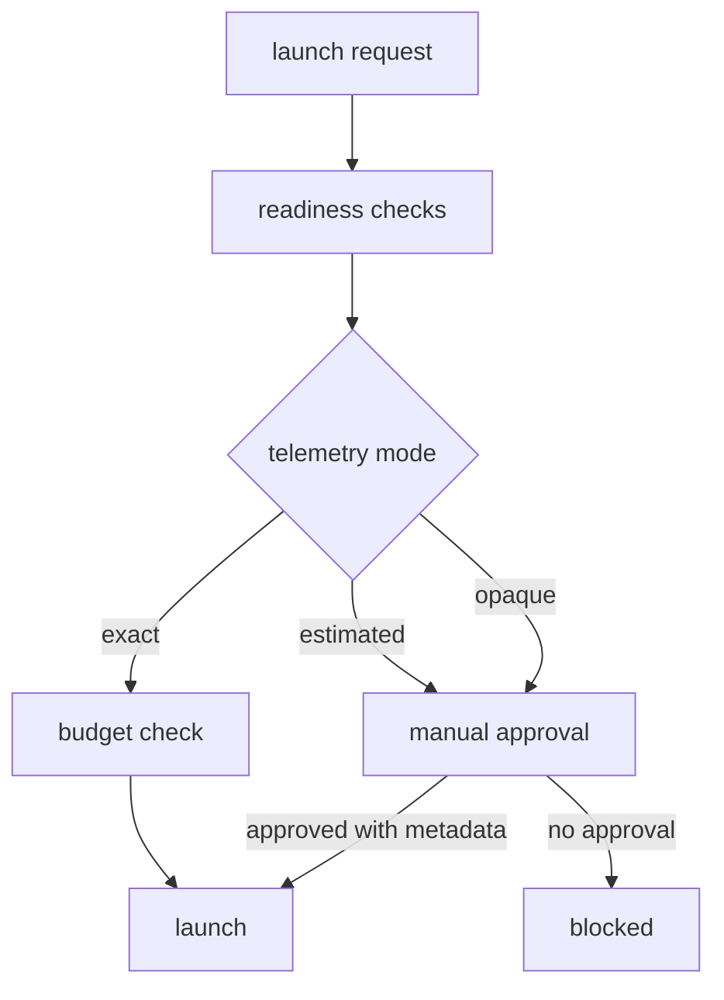

# Backend Readiness Is Dependency Truth

The dashboard showed a green dot next to the backend, so you launched. The agent spun up, picked the high tier, and died on the first call: the SDK it needed was installed in your shell, not in the daemon that actually spawns agents. The green dot was never lying about much — it only ever meant "an environment variable exists somewhere." You read it as "this will work." Those are not the same sentence, and the gap between them is where the afternoon went.

That green dot is the problem in miniature. A model backend is not ready because one key is present. It is ready when credentials, packages, CLI auth, model catalog, pricing, telemetry, and project policy all agree — and a status light that collapses seven different facts into one color trains you to click through the uncertainty instead of seeing it. Port Daddy treats that agreement as dependency truth, the same way a build treats a dependency graph: green means every edge resolved, not that you got lucky on one of them.


## The False Green Check

Most agent launch failures are not mysterious. They come from one of a few boring causes:

- the API key is missing from the environment the daemon actually uses;
- the SDK package is not installed in the runtime that launches agents;
- the CLI backend is not logged in;
- the requested model tier resolves to nothing;
- the backend returns text but no exact usage;
- model pricing is unknown;
- the project budget policy blocks the run.

If the UI collapses all of that into "backend unavailable," it gives the operator nothing to fix. If it says "ready" because one key exists, it is lying.

## Readiness Dimensions

Port Daddy's backend readiness model should be multi-dimensional:

| Dimension | Ready means | Blocked example |
| --- | --- | --- |
| Credentials | daemon can load the required secret | key exists in shell but not daemon environment |
| Dependency | SDK or CLI executable is installed | `@anthropic-ai/sdk` missing |
| Auth state | CLI backend is logged in | Codex CLI not authenticated |
| Model catalog | low/mid/high tier resolves | `high` tier points at unknown model |
| Pricing | model has exact rate | custom backend has no rate metadata |
| Telemetry | launch path returns exact usage | backend returns text only |
| Policy | repo allows this kind of launch | daily budget exhausted |


This is not paperwork. It prevents three common classes of failed launch: missing runtime dependency, silent spend ambiguity, and wrong-model execution.

## A Useful Readiness Shape

Software engineers do not need a magic status. They need a structured one.

```typescript
type ReadinessState = 'ready' | 'blocked' | 'manual-only'

interface BackendReadiness {
  backend: 'claude-sdk' | 'claude-cli' | 'codex' | 'gemini' | 'ollama' | 'aider' | 'custom'
  state: ReadinessState
  modelTiers: {
    low?: string
    mid?: string
    high?: string
  }
  checks: Array<{
    id: string
    label: string
    state: 'pass' | 'fail' | 'warn'
    detail: string
    fix?: string
  }>
  telemetry: 'exact' | 'estimated' | 'opaque'
  pricing: 'known' | 'missing' | 'not-applicable'
}
```

That shape lets a UI and CLI tell the same story. The Fleet Control Center can show readiness cards. The terminal can print the same blocked reason. A launch preflight can make the same decision.

## CLI And UI Should Agree

The operator should be able to run:

<!-- terminal -->
```bash
$ pd fleet models --json
{
  "backends": [
    {
      "backend": "codex",
      "state": "ready",
      "telemetry": "exact",
      "pricing": "known",
      "modelTiers": {
        "low": "gpt-5.4-mini",
        "mid": "gpt-5.3-codex",
        "high": "gpt-5.4"
      }
    },
    {
      "backend": "claude-sdk",
      "state": "blocked",
      "telemetry": "exact",
      "pricing": "known",
      "checks": [
        {
          "id": "dependency",
          "state": "fail",
          "detail": "@anthropic-ai/sdk is not installed in the daemon runtime",
          "fix": "Install the package and restart the daemon"
        }
      ]
    }
  ]
}
```

The UI should not translate that into a vague red dot. It should show the failed check and the fix.


## Readiness Belongs To The Daemon Runtime

One subtle bug class comes from checking readiness in [the wrong process](/blog/running-is-not-current). A developer shell may have an API key and a package installed, while the daemon that actually launches agents does not. The UI should not mark a backend ready because the browser, shell, or build script can see something. It should ask the runtime that will perform the launch.

```ts
async function readBackendReadiness(backend: string) {
  const response = await fetch(`/fleet/models/${backend}/readiness`)
  const readiness = await response.json()

  return {
    state: readiness.state,
    checks: readiness.checks.map((check: BackendCheck) => ({
      label: check.label,
      state: check.state,
      fix: check.fix
    }))
  }
}
```

That boundary keeps the product honest. The readiness panel is not a setup checklist in disguise. It is a report from the runtime that will accept or reject the launch.

## Fix Messages Are API Design

Blocked states should be specific enough that a UI, CLI, or MCP client can display the same next step.

```json
{
  "id": "dependency",
  "state": "fail",
  "label": "Claude SDK package",
  "detail": "@anthropic-ai/sdk is not installed in the daemon runtime",
  "fix": {
    "kind": "command",
    "command": "npm install @anthropic-ai/sdk",
    "requiresRestart": true
  }
}
```

That is better than a sentence because it is actionable. The Fleet Control Center can render a fix button. The CLI can print the command. A future setup flow can group fixes by whether they require a restart, a login, or a billing decision.

## Local Models Are Different, Not Lesser

Readiness should not assume cloud-first. A local Ollama backend may be the correct choice for repetitive or sensitive work. Its readiness shape is different:

- no API key;
- local service reachability;
- model pull status;
- no per-token cloud cost;
- possibly no exact token cost ledger;
- different concurrency limits.

That should produce a precise state, not a second-class label. For example:

```json
{
  "backend": "cloudflare",
  "state": "ready",
  "modelTiers": {
    "low": "@cf/zai-org/glm-4.7-flash",
    "mid": "@cf/qwen/qwen3-30b-a3b-fp8",
    "high": "@cf/moonshotai/kimi-k2.6"
  },
  "telemetry": "exact-rate",
  "checks": [
    { "id": "credentials", "state": "pass", "detail": "Cloudflare Workers AI credentials present" },
    { "id": "model", "state": "pass", "detail": "@cf/qwen/qwen3-30b-a3b-fp8 has exact rates" }
  ]
}
```

The key is honesty. Different backends can have different contracts as long as the operator sees the contract.

## Opaque Backends Need Boundaries

Some integrations can produce useful answers but cannot prove exact usage. That does not make them useless. It makes them inappropriate for unattended spend-sensitive automation unless a human explicitly accepts the boundary.

<!-- figure: How telemetry mode routes a launch — exact usage flows straight to a budget check, while estimated or opaque usage is forced through manual approval, so spend-blind backends can't run unattended. -->


This is where Port Daddy differs from most launch surfaces. It does not have to hide blocked states to look polished. A blocked state with a useful fix is a product feature.

## The Matrix Prevents Wrong-Model Work

Readiness also protects correctness. If a high-tier model alias points at an unknown model, the launcher should not silently fall back to some default. If a CLI backend is authenticated for one account and the project expects another, the operator should see that before launch. If a custom wrapper does not return token usage, it should stay manual-only unless policy says otherwise.

The readiness matrix is therefore part of engineering quality:

- it prevents a docs task from accidentally using an expensive model;
- it prevents a release task from running on an unauthenticated CLI;
- it prevents a background fleet from using a backend with no ledger;
- it helps local models participate without pretending they are cloud APIs;
- it gives [setup flows](/blog/fleet-designer-cold-start) a concrete list of missing work.

That is the bigger idea. Backend readiness is not a preferences page. It is the dependency graph for agent execution.

Engineers should be able to treat that dependency graph the way they treat any other preflight. If the graph is green, launch. If it is yellow, run manually with the boundary visible. If it is red, fix the missing dependency before asking an agent to do real work. The UI earns confidence by making those states impossible to confuse.

This also makes setup teach the product. A new engineer learns which backends exist, which tiers are safe, which local dependencies matter, and why some launches are blocked. The readiness matrix becomes documentation that can execute. When the checks pass, the operator has evidence. When they fail, the operator has a repair list instead of a mystery.

## What This Enables

Once readiness is real, higher-level workflows become safer:

- Shipwright can propose a fleet that uses only launchable backends.
- Fleet YAML can inherit project budget ceilings.
- A docs watcher can be limited to low-tier exact-telemetry models.
- High-tier runs can require manual approval.
- A local backend can be preferred for sensitive work.
- The control plane can explain why an agent did not launch.

This is the difference between "agent settings" and an operating model.

## Verification

Before trusting a backend in an unattended fleet, verify the full path:

<!-- terminal -->
```bash
$ pd fleet models
$ pd agent "Summarize the repo test command" --backend codex --model-tier low --dry-run
$ pd agent "Summarize the repo test command" --backend codex --model-tier low
$ pd activity --filter launch
```

The dry run should explain the selected backend, model, budget, and telemetry mode. The real run should leave a persisted launch record. The activity view should show what happened without scraping terminal output.

Backend readiness is dependency truth because "can call a model" is not enough. A serious control plane needs to know whether the whole launch contract can succeed.
