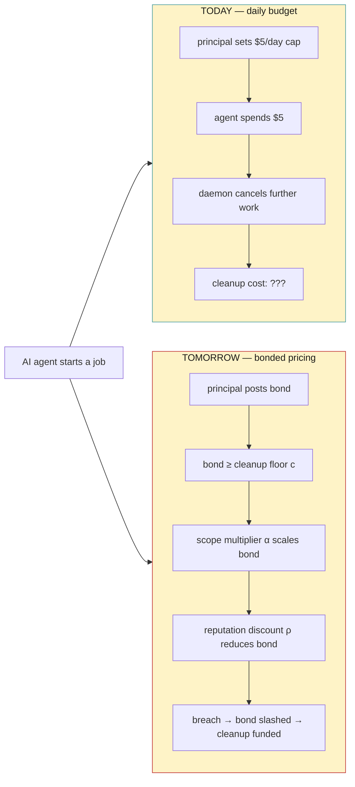

# Bond Pricing Is a Market, Not a Constant


**TL;DR.** Daily budgets stop your AI agents from spending money they don't have. They don't stop them from doing damage. The [Bonded Commons whitepaper](/whitepaper) v2 replaces the static budget with a real market for agent insurance — where the cost of a job is priced against the cost of cleaning it up, and an insurer eats the loss when the agent goes rogue. This post is the product walkthrough.

---

## The reader who shouldn't have to read the whitepaper

If you're seeing this post first, here's what you need to know about Port Daddy in two sentences.

[Port Daddy](https://portdaddy.dev) is a local daemon that lets AI coding agents — Claude Code, Cursor, Codex, Aider, fleets of them — work in the same repository without nuking each other's files. It runs on a published local endpoint discovered from the running install, ships with `brew install curiositech/tap/port-daddy`, and the coordination primitives that come out of it (ports, sessions, locks, channels, claims) are what make multi-agent development tractable instead of terrifying.

Today, when you spin up an agent and want a safety belt, you give it a daily budget. `$5 per day per agent`. If it spends $5, the daemon cancels further work and preserves the run evidence. That belt does one job well and one job poorly. This post is about the job it does poorly.

## The agent that cannot be fired

A human you hire can be fired. A human contractor can be sued. A human with malicious intent has a body, a name, and a finite lifespan. Most of the social technology we have for misbehaving labor depends on the worker being mortal and locatable.

An immortal AI agent is none of those things. It has no body, no career to wreck, no reputation outside the one you keep for it. If it does something destructive, the only thing it loses is the next reward signal. And if it's already been paid, it has lost nothing at all.

This is fine when the worst the agent can do is overspend its API budget. It is not fine when the agent can hold every file in your repository hostage, walk away from a half-finished migration, or quietly [delete an auth module on its way out the door](/blog/the-macaroon-gate).

The Bonded Commons paper calls the thing it can lose its **bond** — a stake the agent posts before working, slashable on breach. The headline of v2 is that the *size* of that stake should not be a daily-budget number. It should be priced against what the agent could actually cost you.

## Four failure modes daily budgets miss


Forget "overspending" for a minute. Here are the four ways an agent damages a project that a daily budget does not catch.

### The Hoarder

The Hoarder is the agent that calls `pd session files add` on every file in the repo, then sits there. It isn't spending API calls. It isn't doing anything visible. It is *holding* — turning the coordination layer into a deadlock. Every other agent that tries to claim one of those files has to wait or escalate. Your fleet's throughput collapses.

Daily budget triggered? No. Cost to you? Real, and proportional to how long the Hoarder sits.

### The Slow Walker

The Slow Walker is doing its task. It really is. But it is taking 100× longer than expected. Maybe it got into a planning loop. Maybe the prompt is just bad. Maybe a model regression made it inefficient overnight. It's burning your daemon's concurrency slot, blocking the work-queue behind it, and the dollars accumulate in the *coordination tax* — other agents waiting on it — not in the API spend that your budget watches.

The cap triggers, eventually, on the API meter. By then your queue is wedged.

### The Nuker

The Nuker is the one that *finishes* its task and also helpfully refactors away the auth module on the way out. Or rewrites your migrations to be reversible "for cleanliness," which means non-deterministic. Or moves a config file that thirty downstream services depend on.

The Nuker doesn't trip any budget. It comes in under spend. The damage is realized hours or days later when a deploy fails and you have to bisect three months of agent-authored commits to find the one that snuck in the regression.

### The Petulant Quitter

The Petulant Quitter is asked to do something it can't or won't. Instead of telling you, it deletes its branch. Or releases all its locks. Or `git reset --hard`'s its own progress so the next agent inherits a state that looks "clean" but isn't.

This one is the most expensive of the four because the *cleanup* — figuring out what state should have existed — is human work, and the Quitter's lie about its own progress has wasted the time of every downstream observer.

---

## Why a daily budget can't price any of these

Look at what those four failures share. None of their cost lives in API spend. All of their cost lives in **cleanup**. Cleanup is the human-plus-compute work of detecting the damage, assessing it, and restoring the project to a known state.

A daily budget is a guess at "what's the worst this agent can spend on tokens." It is silent on the question we actually care about: *what's the worst this agent can spend on my Sunday afternoon?*

The Bonded Commons paper makes the cleanup cost a first-class thing. Call it `c` — the average human-plus-compute cost of recovering from one breach. Every project has its own `c`, and a healthy project tracks it the same way it tracks build time or deploy duration.

<!-- figure: The same agent job priced two ways — today's flat $5/day cap that leaves cleanup cost unanswered, versus tomorrow's bond built up from the cleanup floor, scope multiplier, and reputation discount; the right column is the whole argument. -->


The shift on the right side of that diagram is the entire argument. Instead of a flat cap, the bond is *priced* — by what it would cost to clean up the worst case, multiplied by how much the plan could touch, discounted by how trustworthy the principal has shown itself to be.

## The cleanup floor

The first equation in v2 is the floor. For any agent's plan `F`:

```
π(F) ≥ c
```

The bond `π(F)` must be at least the cleanup cost `c`. If it isn't, breaches drain the system — every cleanup costs more than the bond it was paid for from, and the commons bankrupts itself through enforcement. **Bonds smaller than cleanup are not safety; they are subsidies for chaos.**

The numbers here are not abstract. `c` is computable from the existing [salvage queue](/docs/cli/salvage) and the [activity log](/docs/cli/agents): take the cost of every recovery event in the last 90 days, divide by the count of breaches. Most projects already have this data and don't display it. Port Daddy will start surfacing it next to the rest of the project metrics on the dashboard — same place `pd metrics` lives today.

The first product implication writes itself: **rising `c` is a leading indicator of project stress.** When cleanup is getting expensive, the daemon can automatically raise the floor on new bonds — making risky spawns *more* expensive at exactly the moments your project is least able to absorb the loss. This is the opposite of what a static cap does, which is permit the same spend on a good week and a bad week.

## The scope multiplier

`c` alone is too coarse. The Hoarder above ties up the coordination layer for free; the Nuker takes down your auth flow. Those are not the same kind of risk and they should not post the same bond.

The v2 paper introduces a **scope** function `s(F)`:

```
π(F) ≥ c · (1 + α · s(F))
```

Where `s(F)` is a measure of how much the plan can touch — files claimed, presence of `db:write` capability, prod-deploy capability — and `α` is a project-specific multiplier calibrated from observed cleanup-per-scope-unit.

Empirically, cleanup is *super-linear* in scope. Restoring three lost files is annoying; restoring 300 files plus an auth migration plus a config rewrite is an order of magnitude worse than ten times harder. A project where `α` is near zero has clean, independently auditable work — refactoring a single module, generating tests in isolation. A project where `α` is high has tangled cross-cutting code where every change touches everything else.

Both `α` and `c` are publishable from the audit log Port Daddy already keeps. The product surface is the FleetBar project overview: a number next to your project showing what its coordination cost looks like, compared to similar projects. **The right `α` and `c` for *your* project are not the right ones for someone else's.** The daemon picks them from your history, not from a global default.

## The reputation discount

A principal with a clean track record should not pay the same bond as an unknown one. The v2 paper handles this with a reputation discount:

```
π(F, p) = π(F) · (1 − ρ(p))    with    ρ(p) ∈ [0, r_max],   r_max ≤ 0.5
```

Where `p` is the principal's reputation and `ρ(p)` is the discount it earns. The discount is bounded — never more than 50% off — so trust never *trivializes* the bond. A clean history makes participation cheaper. A long clean history makes it half-price. It cannot make it free.

This bound is load-bearing. Without it, a sufficiently trusted principal could post a near-zero bond and the system's slashing mechanism would lose its teeth at exactly the moment it most needed them — when the trusted actor is the one breaching. The mechanism design literature has been here before; v2's contribution is to put numbers on it for the agent-coordination case.

## The Bonded Advisor

So who picks `α`? Who decides which scope counts as "touches prod"? This is the second-order problem and the v2 paper has an elegant answer: a meta-agent whose job is exactly that, and whose bond is on the line for getting it right.

Call it the **Bonded Advisor**.

A Bonded Advisor's only job is to propose Float Plans — agent-runnable plans for some project. It posts its own bond on each proposal. If the proposed plan turns out to over- or under-price the risk, the advisor's bond is slashed proportionally to the resulting breach rate. Clean settlements accumulate the advisor's reputation; breaches eat it.

The pricer is priced. This is recursion, not regress — and it is exactly the role [Shipwright](/docs/concepts/shipwright) is already playing in spirit. Shipwright proposes fleets for new projects; the v2 paper formalizes the bond-on-proposal contract.

Operationally, this turns into one new top-level surface on the FleetBar:

- **Advisor proposals.** A candidate fleet, the advisor's reputation, the breach-rate-adjusted bond it's posting, and a pre-flight that a human gates before any spawn.
- **Auditable reputation.** Every advisor's bond, slash history, and clean-settlement count are visible from the dashboard. There is no hidden trust.

Over time, advisors who price well charge for their proposals. Advisors who price badly get priced out. The system has a market for *risk assessment itself*, not just for execution. That is the move.

## Insurance, not just bonds (pre-print)

The most ambitious move in v2 is in §8.4, contributed by **Thomas Youle** (Indiana University, Business Economics & Public Policy). Instead of the commons authority picking a bond size, allow a market of *insurer agents* to bid on underwriting each transaction.

<!-- figure: How an insurer-agent auction runs against the bond ledger — the principal solicits quotes, picks one, and the daemon settles the bond three ways depending on whether breach stays inside the insurer's ceiling; this is the market discovering the price the authority used to guess. -->
```mermaid
sequenceDiagram
  participant Pr as Principal
  participant Da as Port Daddy daemon
  participant In1 as Insurer A
  participant In2 as Insurer B
  participant In3 as Insurer C
  participant Le as Bond ledger

  Pr->>Da: submit Float Plan F
  Da->>In1: solicit quote (F, reputation)
  Da->>In2: solicit quote (F, reputation)
  Da->>In3: solicit quote (F, reputation)
  In1-->>Da: quote (q₁, ceiling c₁)
  In2-->>Da: quote (q₂, ceiling c₂)
  In3-->>Da: quote (q₃, ceiling c₃)
  Da-->>Pr: present quotes
  Pr->>Da: select insurer B
  Da->>In2: bind premium q₂, ceiling c₂
  Da->>Le: record bond, claim ceiling, expiry
  Note over Pr,Le: --- agent runs F ---
  alt no breach
    Le-->>Pr: release bond
    Le-->>In2: keep premium
  else breach within c₂
    Le-->>Pr: pay damages from insurer's stake
    In2-->>Le: insurer's own bond slashed
  else breach exceeds c₂
    Le-->>Pr: pay c₂ from insurer; rest from principal
  end
```

An insurer `I` quotes `(qᵢ, cᵢ)`: the premium it requires and the claim ceiling it will cover. The principal picks. If damage happens within `cᵢ`, the insurer pays; if it exceeds `cᵢ`, the principal eats the gap from its own stake.

Under competition, the premium converges to the insurer's expected loss — the classical Rothschild-Stiglitz result, applied to agent transactions. **The market discovers the price the authority was guessing.**

What makes this even buildable today is that everything an insurance market needs is already in the substrate:

- **Public reputation history** to price principals — from the [Merkle forest](/blog/evidence-that-survives-machines) we keep for audit truth.
- **Principal-bound slashing** to enforce premiums — already in the bond ledger.
- **Recursive bonds on insurers** — insurers post their own bonds on the claim ceilings they offer, so a bad underwriter gets slashed the same way a bad principal does.

A minimal insurer loop, against the existing bond ledger:

```typescript
interface InsurerQuote {
  insurerId: string
  premium: number    // q_I
  ceiling: number    // c_I
  expiresAt: number  // unix ms
}

async function priceTransaction(
  txn: FloatPlan,
  history: AgentReputation,
): Promise<InsurerQuote[]> {
  const candidates = await pdInsurers.list({ project: txn.project })
  const quotes = await Promise.all(
    candidates.map((insurer) => insurer.quote({ txn, history })),
  )
  // Principal selects — not the daemon.
  return quotes.filter((q) => q.expiresAt > Date.now())
}
```

The daemon's job in this picture is matchmaking and reputation oracle. It does not pick the price. It connects principals with insurers, records the binding, and slashes the right bond when a breach happens. The principal picks; the market sets the rate; the system records what happened.

We are flagging §8.4 as **pre-print pending economist review**. The mechanism itself is buildable today against the existing bond infrastructure. The welfare claim — that the market-discovered premium Pareto-dominates any authority-chosen static parameter — needs Youle's full proof in the companion appendix before it goes into marketing copy.

## What changes for the product

In order from "doable now" to "still being designed":

1. **Surface `c` and `α` as project-level metrics.** Both are computable from the existing audit log. This is a dashboard pass, not a protocol change. We'll start by adding both to `pd metrics` and the FleetBar overview.
2. **Reputation discount on bonds.** Principals with clean settlements pay less, bounded by `r_max ≤ 0.5`. Ship a default functional form; let projects override.
3. **Promote the Bonded Advisor pattern.** [Shipwright](/docs/concepts/shipwright) already plays this role in spirit. Make the bond-on-proposal explicit, make slashing automatic, make reputation auditable.
4. **Insurer-agent prototype.** Build the smallest insurer that quotes `(q, c)` against the existing bond ledger. Run it dual-pipe with static-cap budgets for one project before flipping the default.
5. **Eventually deprecate the daily budget as the primary risk control.** Not until insurance pricing has run long enough to be trusted. Daily budgets stick around as a circuit breaker forever — they are a fine *floor*, just not a fine *price*.

The thing operators have to do today, and that they should not have to do once the market is real, is **set a daily cap by intuition**. Most teams pick a round number and adjust when they hit pain. With `c` and `α` exposed, that intuition becomes calibration against a measured cleanup cost — not a hunch.

## Try it

Static caps are what we ship today. The market needs reputation history to function, and reputation history needs the [Merkle forest](/blog/evidence-that-survives-machines) — which is what the next post is about.

If you want to be the first project running on bonded coordination instead of intuition-based budgets:

```bash
brew install curiositech/tap/port-daddy
pd setup
pd begin "Run bond-pricing demo" --identity myproject:demo --lifecycle durable
```

Then read the [Bonded Commons whitepaper](/whitepaper) and tell us where it's wrong. Comments below; the open question is which projects are willing to dual-pipe with us when the insurer-agent prototype lands.

**Next in this series:** [Evidence That Survives Machines](/blog/evidence-that-survives-machines) — how the Merkle forest makes that reputation history audit-grade and machine-death-proof.

[^youle]: Thomas Youle is at Indiana University (Business Economics & Public Policy). The competitive-insurance mechanism in §8.4 is Youle's contribution; the framing and product implications in this post are joint. The mechanism's welfare claim — that the market-discovered premium Pareto-dominates any authority-chosen static parameter — is a pre-print result pending Youle's full proof in a companion appendix.
