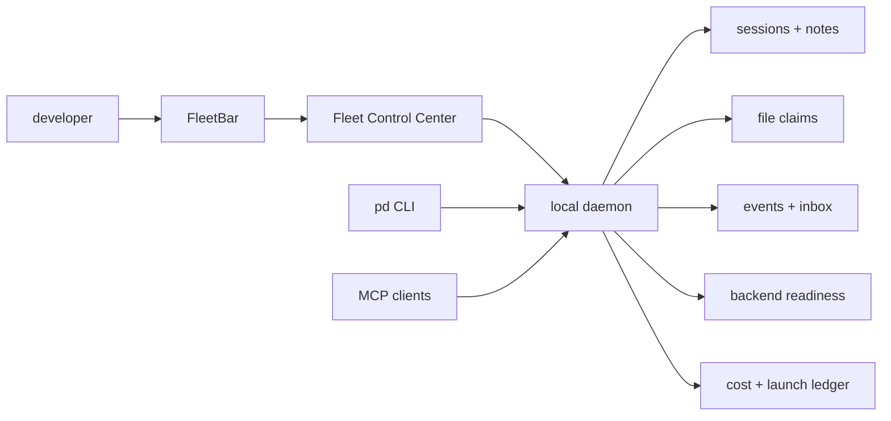
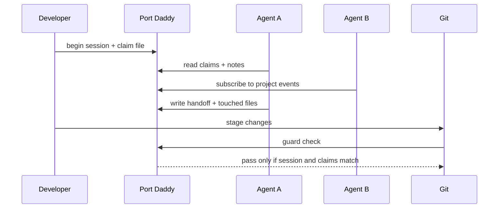

# The Control Plane Is the Product

Most agent tools still present themselves as either a chat box, a hosted runner, or a pile of prompts. That is fine for a demo. It breaks down the moment software work becomes concurrent, stateful, expensive, and local to a developer machine.

Port Daddy starts from a different premise: the hard part is not generating text. The hard part is operating a set of agents around a real repo without losing ownership, runtime truth, spend control, or the human's ability to intervene. The control plane is not decoration around the product. The control plane is the product.


The usual agent stack treats orchestration as something hidden behind the tool. You press a button, a remote process runs, and maybe a transcript arrives later. Port Daddy makes the orchestration itself inspectable: which project is active, which files are claimed, which agents are live, which events fired, which backend is ready, which launch was blocked, and what evidence exists for the next person or agent to resume.

That is a very different developer experience. It feels less like asking a chatbot for help and more like opening a local operating console for software work.

## Why Chat Is Not Enough

Chat is an excellent human interface for intent. It is a weak system of record.

A chat transcript can say "I fixed the auth flow." It cannot, by itself, prove which files were touched, whether another agent already claimed the same module, whether the local daemon that will serve the app is the daemon you think it is, or whether the selected model backend can account for spend.

Software teams solved this class of problem before. We do not use only Slack to deploy production. We use CI, logs, ownership, rollbacks, issue trackers, tracing, locks, and release gates. Agentic software work needs the same seriousness, but scaled down to the local machine where the work is actually happening.

Port Daddy's control plane answers operational questions that chat-centric tools avoid:

| Question | Why it matters |
| --- | --- |
| What project is this work attached to? | The same developer can have five repos open and several local services running. |
| Which agent or human owns this file right now? | Concurrent edits without ownership are how good work gets overwritten. |
| Is this backend actually launchable? | An API key is not the same as a working SDK, model catalog, and telemetry path. |
| What event caused this agent to wake up? | Background automation without provenance becomes spooky action at a distance. |
| What changed since I last looked? | Recovery depends on evidence, not a hopeful status label. |

The control plane exists because these are not edge cases. They are the normal shape of agent-assisted development in 2026.

## The Port Daddy Model

Port Daddy is a local coordination substrate. It runs near the repo, exposes CLI and MCP surfaces, and projects state into FleetBar and the Fleet Control Center. The pieces are deliberately boring in the way durable infrastructure should be boring:



The important move is that every interface talks to the same local substrate. The CLI does not invent a separate truth from the Mac app. The MCP server does not invent a separate truth from the dashboard. A background fleet agent, a terminal command, and a UI button should all be able to agree on the same project, channel, session, and file ownership.

That shared substrate is what makes Port Daddy different from a prompt pack or an agent launcher. The system does not just start work. It keeps the work legible after it starts.

## A Real Work Loop

Here is a minimal loop for a software engineer who wants help on a route handler without turning the repo into a free-for-all:

<!-- terminal -->
```bash
$ pd begin "Tighten billing route error handling" --identity web:billing
$ pd session files add apps/web/src/routes/billing.ts
$ pd note "Intent: preserve API shape, add retry-safe validation, run route tests."
$ pd agent "Review the billing route for idempotency and missing test cases" --backend codex --model-tier low
$ pd guard check --staged
```

This is not ceremony. Each command creates operational state:

1. The session gives the work a name and a project identity.
2. The file claim tells other agents that a specific surface is being edited.
3. The note records intent before code changes blur the reason.
4. The agent launch can be checked against backend readiness and budget policy.
5. The guard makes sure staged files match the claimed scope before commit.

Most tools optimize only the fourth step: "start an agent." Port Daddy cares about the steps around it, because those are where real teams lose time.


## Why Local Matters

Port Daddy is intentionally local-first. That does not mean small. It means the substrate sits where the uncertainty is.

Your development environment has facts that a hosted runner usually cannot infer safely:

- which branch and worktree are active;
- which local services are actually bound;
- which app build is being served in the browser;
- whether a native companion app is looking at the same daemon;
- whether a generated artifact is stale;
- which file claims and notes exist from earlier work;
- whether the current repo has its own policy about agent launch and commit boundaries.

A hosted platform can be excellent for remote execution. It is not a substitute for local provenance. Port Daddy gives local state a proper API and UI instead of leaving it scattered across terminals, screenshots, and half-remembered notes.

That local posture also changes trust. A developer can see the launch gate before spend happens. They can inspect which files an agent touched. They can stop a fleet that is too noisy. They can keep sensitive repo state near the machine instead of inventing a new cloud backend for every button.

## The Mac App Is Not A Launcher

FleetBar should not be thought of as a pretty wrapper around CLI commands. The native app is the fast path into the same operational truth.


The useful native surface is not "spawn agent." It is:

- show me the current project before I launch anything;
- show me which backends are blocked and why;
- show me the files and events a run touched;
- show me the last useful handoff;
- open the full Fleet Control Center when I need depth.

That is why Port Daddy keeps pushing toward project selection, resources, activity, sorties, inbox, channels, and fleet config as first-class surfaces. A serious agent tool needs the operator to see the system, not just the prompt input.

## Different From Everyone Else

The field is crowded, but most tools cluster around a few patterns:

- **IDE copilot:** excellent inline assistance, weak cross-agent operational memory.
- **Hosted agent runner:** useful for remote work, often opaque around local runtime truth.
- **Prompt registry:** good for reuse, not enough for ownership, locks, readiness, or recovery.
- **CI bot:** great after commit, limited while the local work is still unfolding.
- **Chat workspace:** expressive intent, poor machine-checkable coordination.

Port Daddy is closer to a local control plane. It does not try to replace the model, the IDE, the terminal, or the CI system. It gives them a shared operating substrate.

That difference matters most when the work becomes parallel:



The point is not that Port Daddy makes agents magically safe. It makes the important state explicit enough that humans and agents can reason about it.

## What A Good Control Plane Lets You Do

A good local control plane changes what you are willing to automate.

Without it, background agents feel risky. You do not know why they woke up, what they touched, whether they are spending money, or whether they are looking at the right daemon. With it, you can start drawing real boundaries:

- let a docs agent wake up on a commit, but only with a small daily budget;
- let a test triage agent watch failed local tests, but require exact file claims before edits;
- let a UI feedback agent write notes, but not mutate source;
- let a release helper package artifacts, but require a human gate for distribution.

Those are not "AI features." They are operating policies. Port Daddy's job is to make those policies visible and enforceable on a normal developer machine.

## The Product Bet

The bet is that future software engineers will not want a dozen disconnected agent products. They will want their existing tools to cooperate through a substrate they can inspect.

Port Daddy's control plane is the start of that substrate. It gives local agent work a place to put identity, claims, notes, events, readiness, cost, and recovery. It makes the invisible work visible enough to trust.

That is why the control plane is the product. The model writes code. The control plane keeps the work from becoming a mess.
