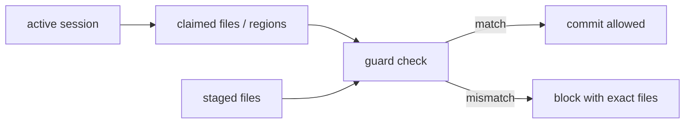

# Coordination Guard Turns Claims Into Policy

Multi-agent coding does not fail because agents forget to be polite. It fails because etiquette is not a protocol.

One agent says it is "touching auth." Another edits the middleware. A human stages a related file from a stale shell. A background docs agent updates generated content. Everyone meant well. The repo still ends up with unowned changes, overwritten assumptions, and a commit history no one can explain.

Port Daddy's Coordination Guard turns collaboration from etiquette into a commit-time contract.


## The Invariant

The guard's job is intentionally narrow:

> A commit should be attributable to an active session, and the staged files should match that session's claimed scope.

That invariant does not prove the design is good. It does not prove the code is correct. It proves the basic coordination record exists before code enters history.

For parallel agent work, that is a big deal.

## Sessions, Claims, And Locks

Port Daddy uses a few different primitives because "ownership" has different strengths:

| Primitive | Use it for | Strength |
| --- | --- | --- |
| Session | naming a unit of work | identity and audit trail |
| Note | intent, assumptions, validation, handoff | human-readable evidence |
| File claim | advisory edit ownership | coordination signal |
| Region claim | symbol or line-scoped ownership | narrower coordination signal |
| Lock | scarce non-mergeable resource | exclusive critical section |
| Guard | staged-file policy | commit-time enforcement |

The distinction matters. You do not need an exclusive lock for every file edit. You do need a claim when another human or agent might touch the same surface. You need a lock for things like migrations, generated release artifacts, or promotion steps where concurrent work would be dangerous.

## A Healthy Commit Loop

Here is a loop for a normal engineering task:

<!-- terminal -->
```bash
$ pd begin "Refactor auth middleware" --identity web:auth
session: session_01JZ...

$ pd note "Intent: preserve public API, split token parsing from policy checks."
note: saved

$ pd session files add apps/web/src/middleware/auth.ts
claimed: apps/web/src/middleware/auth.ts

$ git add apps/web/src/middleware/auth.ts
$ pd guard check --staged
pass: staged files are covered by active session claims
```

The commands are simple. The resulting state is what matters:

```json
{
  "sessionId": "session_01JZ...",
  "identity": "web:auth",
  "claimedFiles": ["apps/web/src/middleware/auth.ts"],
  "stagedFiles": ["apps/web/src/middleware/auth.ts"],
  "guard": "pass"
}
```

That state lets the control plane, future agents, and the human understand why this commit exists.


## What A Failure Should Look Like

A useful guard is not just a wall. It should explain the mismatch.

<!-- terminal -->
```bash
$ git add apps/web/src/routes/billing.ts
$ pd guard check --staged
fail: staged file is not claimed by the active session

active session:
  web:auth

unclaimed staged file:
  apps/web/src/routes/billing.ts

next:
  pd session files add apps/web/src/routes/billing.ts
  or split the billing change into a separate session
```

That failure is actionable. It does not say "policy failed." It names the staged file, the active session, and the next move.

## Generated Artifacts Need Stronger Coordination

Not every surface deserves the same primitive. A source file edit usually needs a claim. A generated asset, migration, package, or promotion step may need a lock because two concurrent writers cannot merge intent later.

<!-- terminal -->
```bash
$ pd lock acquire website:og-cards --ttl 20m
lock: acquired

$ npm --prefix website-v2 run generate:og
$ git add website-v2/public/img/og
$ pd guard check --staged
pass: staged generated assets are covered by active lock and session

$ pd lock release website:og-cards
lock: released
```

That distinction keeps the system from becoming either too loose or too rigid. Claims let work proceed in parallel. Locks protect scarce surfaces where parallelism would corrupt output.

## The Git Index Is The Enforcement Point

The guard belongs close to staging because the index is where intent becomes history. A chat message can be stale. A working tree can contain unrelated edits. The index is the exact set of paths about to enter a commit.

```ts
async function checkStagedFiles(staged: string[], session: Session) {
  const uncovered = staged.filter((path) => !session.claims.some((claim) => covers(claim, path)))

  if (uncovered.length > 0) {
    return {
      ok: false,
      reason: 'unclaimed staged files',
      files: uncovered,
      next: ['claim the files', 'split the commit', 'or start the right session']
    }
  }

  return { ok: true }
}
```

The implementation can evolve, but the invariant should stay stable: staged work should have a coordination story before it becomes commit history.

## Claims Are Not Permissions

File claims are advisory coordination signals, not a security boundary. That is the right tradeoff for normal code edits.

A claim says:

- I intend to edit this surface;
- route around me if you can;
- talk to me if our work overlaps;
- make the commit record explain the relationship.

A lock says:

- this resource cannot be safely shared right now;
- wait or fail.

Mixing those up makes collaboration miserable. If every edit takes a lock, agents serialize unnecessarily. If no edit takes a claim, agents clobber each other. Port Daddy needs both.

## Region Claims Make This Less Heavy

Whole-file claims are sometimes too broad. A large file can contain unrelated symbols. Port Daddy's region/symbol claim direction is about making ownership precise enough that agents can work near each other safely.

```json
{
  "path": "apps/web/src/routes/billing.ts",
  "regions": [
    {
      "symbolPath": "createInvoice",
      "intent": "make retry path idempotent"
    }
  ]
}
```

That kind of claim lets another agent work on `listInvoices` without assuming the entire file is contested.

## Why Chat-Only Coordination Breaks

Chat can express intent, but it is hard to enforce. A transcript can say:

> I am only touching auth.

The git index does not know that. A pre-commit hook does not know that. Another tool does not know that unless it scrapes prose and guesses.

Port Daddy turns the important parts into machine-readable state:



That does not remove the need for judgment. It removes a dumb failure mode.

## The Guard Cannot Judge Taste

The guard does not know whether the UI is good. It does not know whether the article is shallow. It does not know whether an abstraction is worth it.

That limitation is healthy. The guard should enforce operational invariants, not design opinions.

The human and agents still need to review:

- behavior changes;
- tests;
- visual quality;
- API shape;
- security boundaries;
- product coherence.

Coordination Guard simply makes sure the commit is not anonymous, stale, or outside the declared work boundary.

## Why Engineers Actually Use It

The loop has to be cheap. If coordination feels like a project management tax, engineers will route around it. Port Daddy's bet is that the smallest useful loop can be faster than the cleanup it prevents:

1. begin a named session;
2. claim the file or region;
3. leave one intent note;
4. stage the change;
5. run the guard.

That is five actions, and four of them produce reusable evidence. The next engineer can see the purpose, scope, touched files, and validation path. The next agent can avoid the claimed surface or ask for a handoff. The commit can be explained without reconstructing a chat transcript.

The experience should feel closer to `git status` than to filling out a form. You run the check, see the mismatch, fix the scope, and continue. That rhythm is what makes policy survivable in a real repo where humans and agents are both moving quickly.

## Why This Is Different

Many tools have "agent memory." Many have "tasks." Some have "plans." Fewer make local git staging part of the coordination contract.

Port Daddy's advantage is that it sits close enough to the repo to connect the social layer and the mechanical layer:

- session note says what is happening;
- file claim says where it is happening;
- git index says what will be committed;
- guard decides whether those agree.

That is the bridge from "please coordinate" to "coordination is checked before history changes."

## A Better Multi-Agent Default

The future is not one giant agent doing everything. It is several bounded roles working around the same repo:

- one reviews test failures;
- one updates docs;
- one investigates a UI bug;
- one prepares a release;
- the human edits the product decision.

That world needs lightweight policy. Coordination Guard is one piece of it. It makes the cheapest safe path also the normal path: start a session, claim the surface, leave a note, stage the work, check the guard, commit.

That loop is not glamorous. It is how parallel work survives contact with a real repository.
