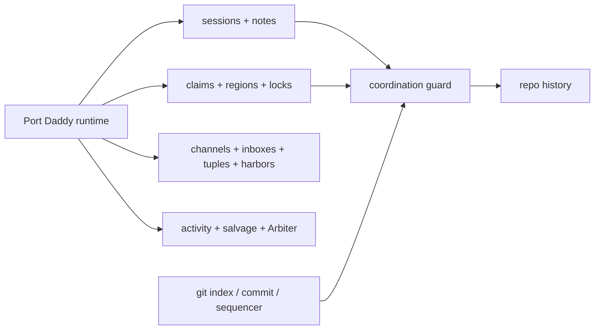
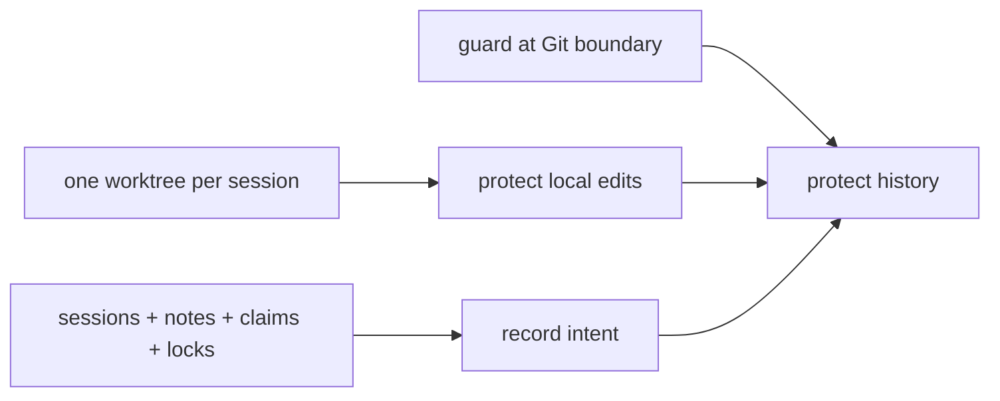

# Coordination Guard Exists Because Git Let Agents Stomp Each Other

> **Editorial note, May 6, 2026:** This article was substantially rewritten after publication. It keeps the same URL because the topic is the same, but the argument is more candid about why Coordination Guard exists and where Git fits. You can still read the [former version in the source archive](https://github.com/curiositech/port-daddy/blob/7aec5d09a58983f7d5e30f686fd89a5d145f8426/website-v2/src/data/blog/coordination-guard-claims-into-policy.md).

The embarrassing bit first: I made this sound cleaner than it was.

Trying to stop Port Daddy agents from clobbering each other set me down a rabbit hole of treating Git as an enforcement point. That phrase, "Git as a policy layer," sounded clever enough when I was moving fast and trying to explain the newest feature. Reading it back, I had made the checkpoint sound like the coordination model.

I had. In fact, those other primitives are the main system.

So the original framing was a little backwards. Git was not the beautiful first principle. Git was where the mess became impossible to ignore.


## What Actually Happened

Port Daddy already had sessions, notes, file claims, region claims, locks, channels, inboxes, tuples, activity, salvage, Arbiter checks, budget gates, and telemetry gates. Those were not hypothetical. Agents were using them.

And still, a normal Git command could wipe out the story.

One agent would leave a note saying it was touching a page. Another would claim a nearby file. A third would stage a broad slice because it had a green build. A cherry-pick would replay something without the same hook path. A reset would erase a local buffer. Nobody was trying to be reckless. The tooling just made the reckless path cheap.

That is how Coordination Guard happened. It was not me discovering that Git had a soul. It was me noticing that a repo history does not care how elegant your coordination model is if `git add -A` can still scoop up the wrong files.

Pretty good, distributed runtime. Bad ending, local checkout.

## The Better Answer

The cleaner version is:

> Port Daddy's policy lives in runtime primitives. Git is not the policy system. Git is the integration boundary where the policy system has to be consulted.

That distinction matters.

The Port Daddy runtime is where intent and ownership live. Git is where work becomes durable. Coordination Guard sits at that boundary and asks a small question before history changes:

> Does this staged change have an active session, and do the staged files match the scope that session claimed?

That is all. It is not a judge of taste. It is not a reviewer. It does not know if the UI is good or if the abstraction is silly. It only checks whether the commit has a coordination story.

## The Runtime Primitives

Here is the boring table, because the blog still needs to be useful.

| Primitive | What it is for | Where it is established or used |
| --- | --- | --- |
| Session | Names a unit of work and gives it an accountable identity | [`lib/sessions.ts`](https://github.com/curiositech/port-daddy/blob/main/lib/sessions.ts), [`routes/sessions.ts`](https://github.com/curiositech/port-daddy/blob/main/routes/sessions.ts), [`server.ts`](https://github.com/curiositech/port-daddy/blob/main/server.ts) |
| Note | Captures intent, assumptions, validation, and handoff evidence | [`lib/sessions.ts`](https://github.com/curiositech/port-daddy/blob/main/lib/sessions.ts), [`cli/commands/sessions.ts`](https://github.com/curiositech/port-daddy/blob/main/cli/commands/sessions.ts) |
| File claim | Says "I am editing this path; route around me if you can" | [`lib/sessions.ts`](https://github.com/curiositech/port-daddy/blob/main/lib/sessions.ts), [`routes/sessions.ts`](https://github.com/curiositech/port-daddy/blob/main/routes/sessions.ts), [`tests/unit/sessions.test.js`](https://github.com/curiositech/port-daddy/blob/main/tests/unit/sessions.test.js) |
| Region claim | Narrows ownership to a symbol or line range | [`tests/unit/region-claims.test.js`](https://github.com/curiositech/port-daddy/blob/main/tests/unit/region-claims.test.js), [`lib/sessions.ts`](https://github.com/curiositech/port-daddy/blob/main/lib/sessions.ts) |
| Lock | Protects a scarce thing that should not be edited concurrently | [`lib/locks.ts`](https://github.com/curiositech/port-daddy/blob/main/lib/locks.ts), [`routes/locks.ts`](https://github.com/curiositech/port-daddy/blob/main/routes/locks.ts), [`tests/unit/locks.test.js`](https://github.com/curiositech/port-daddy/blob/main/tests/unit/locks.test.js) |
| Channel | Publishes events for commits, status changes, wakeups, and UI state | [`lib/activity.ts`](https://github.com/curiositech/port-daddy/blob/main/lib/activity.ts), [`routes/activity.ts`](https://github.com/curiositech/port-daddy/blob/main/routes/activity.ts), [`server.ts`](https://github.com/curiositech/port-daddy/blob/main/server.ts) |
| Inbox | Gives a durable handoff to a named actor or role | [`lib/agent-inbox.ts`](https://github.com/curiositech/port-daddy/blob/main/lib/agent-inbox.ts), [`cli/commands/agents.ts`](https://github.com/curiositech/port-daddy/blob/main/cli/commands/agents.ts) |
| Tuple space | Stores machine-readable shared facts that other tools can query | [`lib/tuples.ts`](https://github.com/curiositech/port-daddy/blob/main/lib/tuples.ts), [`routes/tuples.ts`](https://github.com/curiositech/port-daddy/blob/main/routes/tuples.ts), [`cli/commands/tuples.ts`](https://github.com/curiositech/port-daddy/blob/main/cli/commands/tuples.ts) |
| Harbor | Gives a shared room and admission boundary to a spawned run or fleet run | [`lib/harbors.ts`](https://github.com/curiositech/port-daddy/blob/main/lib/harbors.ts), [`routes/harbors.ts`](https://github.com/curiositech/port-daddy/blob/main/routes/harbors.ts) |
| Salvage and resurrection | Finds work left behind when an agent dies | [`lib/resurrection.ts`](https://github.com/curiositech/port-daddy/blob/main/lib/resurrection.ts), [`routes/resurrection.ts`](https://github.com/curiositech/port-daddy/blob/main/routes/resurrection.ts), [`tests/unit/salvage-routes.test.js`](https://github.com/curiositech/port-daddy/blob/main/tests/unit/salvage-routes.test.js) |
| Arbiter | Watches coordination invariants that are broader than one commit | [`lib/arbiter.ts`](https://github.com/curiositech/port-daddy/blob/main/lib/arbiter.ts), [`routes/arbiter.ts`](https://github.com/curiositech/port-daddy/blob/main/routes/arbiter.ts), [`tests/unit/arbiter.test.js`](https://github.com/curiositech/port-daddy/blob/main/tests/unit/arbiter.test.js) |
| Budget and telemetry gate | Keeps launches from spending with opaque or missing telemetry | [`lib/spawner.ts`](https://github.com/curiositech/port-daddy/blob/main/lib/spawner.ts), [`lib/budget-guard.ts`](https://github.com/curiositech/port-daddy/blob/main/lib/budget-guard.ts), [`tests/unit/spawner-telemetry-policy.test.js`](https://github.com/curiositech/port-daddy/blob/main/tests/unit/spawner-telemetry-policy.test.js) |
| Coordination Guard | Checks staged files against active session ownership | [`cli/commands/guard.ts`](https://github.com/curiositech/port-daddy/blob/main/cli/commands/guard.ts), [`tests/unit/coordination-guard.test.js`](https://github.com/curiositech/port-daddy/blob/main/tests/unit/coordination-guard.test.js), [`routes/operator.ts`](https://github.com/curiositech/port-daddy/blob/main/routes/operator.ts) |
| Claim-aware staging | Makes the lazy staging path respect live claims | [`cli/commands/add.ts`](https://github.com/curiositech/port-daddy/blob/main/cli/commands/add.ts), [`tests/unit/add-command.test.js`](https://github.com/curiositech/port-daddy/blob/main/tests/unit/add-command.test.js) |

So the picture is not "Git runs policy." It is more like this:

<!-- figure: The runtime primitives — sessions, claims, locks, channels, salvage — feed into Coordination Guard, and Git's index and commit paths only reach repo history by passing through it; Git is the door, the runtime is the guest list. -->


Git is the door. The runtime is the guest list.

## The Failure That Made It Obvious

This is the part I should probably have led with.

We had a guard. We had notes. We had claims. It still failed.

1. A stale pre-commit wrapper printed a guard error and then returned success. The commit landed anyway.
2. Git sequencer operations, especially cherry-pick and rebase paths, could create commits without the same pre-commit route.
3. Broad staging and reset commands could ignore claim ownership because raw Git did not ask Port Daddy anything.

This code will fail, to borrow the old blog-post rhythm.

```bash
$ pd begin "repair blog nav" --identity website:nav --lifecycle durable
session: session-website-nav

$ pd note "Only touching SiteHeader and MacPreviewPage."
note: saved

$ pd session files add website-v2/src/components/site/SiteHeader.tsx
claimed: website-v2/src/components/site/SiteHeader.tsx

$ git add -A
# oops: this can stage unrelated files unless something checks it
```

The right path is not complicated:

```bash
$ pd add --dry-run -A
would stage:
  website-v2/src/components/site/SiteHeader.tsx

blocked by other active claims:
  none

$ pd add -A
Staged 1 path(s)

$ pd guard check --staged
pass: staged files are covered by active session claims
```

The interesting thing is not the command spelling. It is the invariant: before the commit exists, the staged paths should line up with live coordination state.


## Worktrees Would Have Helped

I also should have forced every editing session into a new worktree earlier.

That would have prevented a lot of the dumbest damage. If each agent has its own checkout, one agent's reset does not erase another agent's local edits. One `git add -A` cannot capture somebody else's uncommitted file. The working tree stops being a shared countertop covered in half-finished parts.

But worktrees do not answer everything.

They do not say which session owns the integration commit. They do not tell you whether two clean branches break the program together. They do not protect generated assets or migrations that need a lock. They do not [salvage a dead agent's intent](/blog/recovery-roadmap-map-truth). They do not make a cherry-pick explain itself.

So I now think the default should be:

<!-- figure: The default I landed on the expensive way — worktrees isolate each session's dirty buffer, runtime primitives record intent, and the guard at the Git boundary protects history; all three converge on a safe integration commit because no one of them is enough alone. -->


Worktrees keep agents from stepping on each other's dirty buffers. Coordination Guard keeps Git history from pretending that no one was responsible.

Both are needed. I learned that in the expensive order.

## What Spark, Spider, And Cartographer Kept Telling Me

The sidecar notes kept circling the same answer. I did not need one giant boss agent. I needed small facts in the right places.

Spark and Spider kept turning up the same themes:

- compare session notes with Git deltas, because intent and output drift;
- write intent tuples before work begins, not after the conflict;
- turn hot files and active claims into routing signals;
- surface stale ownership automatically instead of [hoping a human reads every note](/blog/attention-is-the-first-command);
- treat dead agents as salvage events quickly;
- prefer symbol claims when whole-file claims are too blunt;
- make staging and destructive Git operations claim-aware.

Cartographer turned those into the product chores: make enforcement fail closed, extend guard coverage past pre-commit, keep staging claim-preserving, and make coordination inconsistency visible.

That also lines up with the Jury-rig runtime-honesty warning. Planning topology is not runtime topology. A diagram can say "multi-agent team." The runtime has to say what facts it can actually enforce today.

Useful dossiers:

- [`skills/multi-agent-coordination/SKILL.md`](https://github.com/curiositech/port-daddy/blob/main/skills/multi-agent-coordination/SKILL.md) for worktree isolation, locking, messaging, shared state, and integration strategy.
- [`skills/semantic-conflict-prediction/SKILL.md`](https://github.com/curiositech/port-daddy/blob/main/skills/semantic-conflict-prediction/SKILL.md) for the gap between Git-clean textual merges and broken semantic integration.
- [`skills/runtime-verification-for-agents/SKILL.md`](https://github.com/curiositech/port-daddy/blob/main/skills/runtime-verification-for-agents/SKILL.md) for independent runtime checks over live coordination invariants.
- [`skills/hong-et-al-2024-metagpt/references/publish-subscribe-as-coordination-primitive.md`](https://github.com/curiositech/port-daddy/blob/main/skills/hong-et-al-2024-metagpt/references/publish-subscribe-as-coordination-primitive.md) for publish-subscribe as a coordination primitive.
- [`skills/port-daddy-agent-skill/references/coordination-theory.md`](https://github.com/curiositech/port-daddy/blob/main/skills/port-daddy-agent-skill/references/coordination-theory.md) for the local rule of thumb: use the primitive whose lifetime matches the fact.

## What The Guard Should Not Do

Coordination Guard should stay narrow.

It should not decide whether an abstraction is elegant. It should not decide whether a landing page sounds corny. It should not decide whether the product is good.

It should answer the boring operational questions:

- is there an active session;
- do the staged files match that session's claims;
- are scarce artifacts protected by locks;
- did a sequencer path bypass the normal hook;
- did enforcement actually fail closed?

That is enough. Review can handle taste. Tests can handle behavior. Humans can handle judgment. The guard handles the small mechanical lie that causes too much damage: "this commit just happened," with no ownership trail behind it.

## The Version I Would Write Now

Port Daddy's real policy lives in runtime primitives: sessions, notes, claims, region claims, locks, channels, inboxes, tuples, harbors, activity, salvage, Arbiter checks, budget gates, and telemetry gates.

Git matters because it is where local work becomes history. The guard exists because my own agents kept finding ways to use Git that bypassed the coordination layer. I overstated the theory because I was moving quickly. The honest version is less glamorous and more useful: Git is the checkpoint, not the constitution.

That is a better design sentence anyway.

Coordination should not depend on every agent remembering to be careful. The system should make careful the easiest path.
