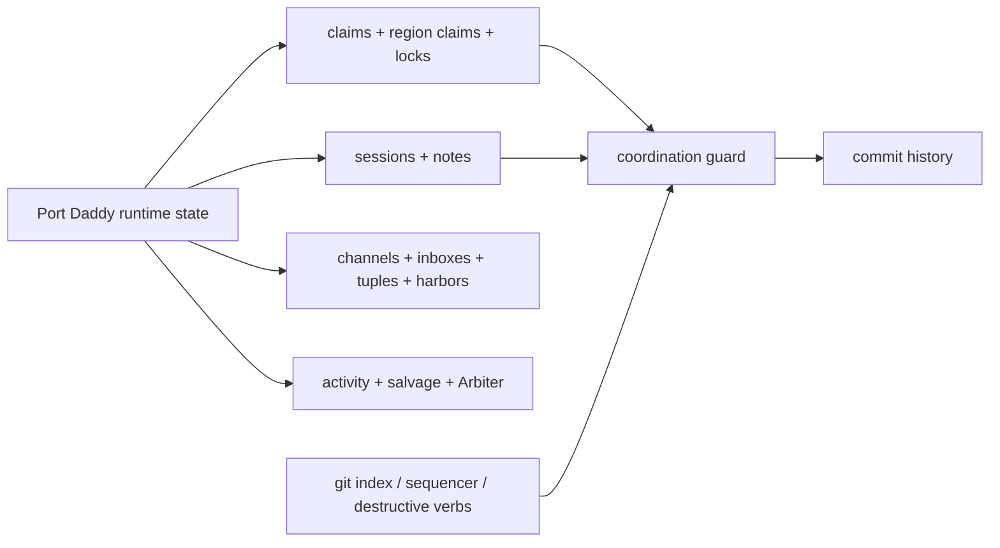
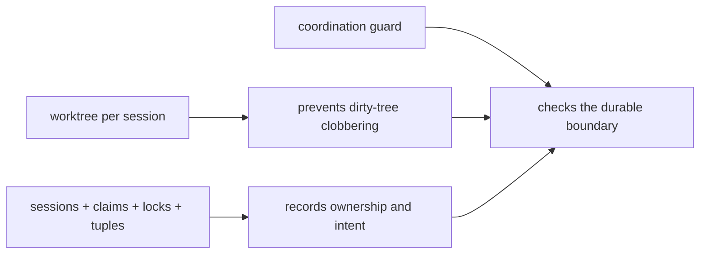

# Coordination Guard Exists Because Git Let Agents Stomp Each Other

> **Editorial note, May 6, 2026:** This article was substantially rewritten after publication. It keeps the same URL because the topic is the same, but the argument is more candid about why Coordination Guard exists and where Git fits. You can still read the [former version in the source archive](https://github.com/curiositech/port-daddy/blob/7aec5d09a58983f7d5e30f686fd89a5d145f8426/website-v2/src/data/blog/coordination-guard-claims-into-policy.md).

The honest version is less glamorous than the architecture diagram.

Coordination Guard did not start as a clean theory that Git should be the policy layer for agent collaboration. It started as dogfooding pain. Agents were leaving notes, claiming files, asking other agents to route around them, and still getting their work captured, reset, cherry-picked, or overwritten by ordinary Git operations.

That is the reason the guard exists.

Git was not chosen because it understands agent policy. Git was chosen because it is where uncoordinated work becomes durable. The Port Daddy runtime already has the coordination primitives: sessions, notes, file and region claims, locks, channels, inboxes, tuple space, harbors, activity, salvage, Arbiter checks, budget gates, and telemetry gates. Git is the place where those facts have to be consulted before a local mistake enters history.


## The Confession

I had been writing about skill search, specialized agents, and Git as a place to encode policy. A hiring manager asked whether I had considered other primitives besides Git for the policy layer. The question landed because the blog made the system sound more premeditated than it was.

It did not even occur to me that I had elevated Git to that level until somebody smart reflected it back. That made me laugh a little from embarrassment. It is also telling of too-rapid development: something that felt like a good enough idea to show a potential employer, Coordination Guard, could seem goofy a week later once the deeper runtime lesson caught up with me.

The deeper answer is: yes, Port Daddy has other primitives, and they are the primary runtime layer. Git is not the coordination system. Git is the last integration point.

Coordination Guard was my most direct attempt to force agents to use the real coordination layer because plain Git kept letting them bypass it.

The sequence was embarrassing and useful:

1. A pre-commit guard existed, but an old hook wrapper printed the error and still let the commit happen.
2. Cherry-pick and sequencer operations created commits without going through the pre-commit path.
3. Advisory claims could still be steamrolled by `git add -A` or erased by destructive reset operations because raw Git never asked Port Daddy who owned the files.

That is the actual origin story. Not "Git is a perfect policy substrate." More like: "Git is where agent coordination failures became undeniable."

## The Runtime Primitives

Port Daddy's coordination layer is broader than the guard. The guard only checks one boundary: whether staged work matches active coordination state. The runtime primitives are the things agents use before that boundary.

| Primitive | Runtime role | Where it is established or used |
| --- | --- | --- |
| Session | Names a unit of work and gives changes an accountable identity | [`lib/sessions.ts`](https://github.com/curiositech/port-daddy/blob/main/lib/sessions.ts), [`routes/sessions.ts`](https://github.com/curiositech/port-daddy/blob/main/routes/sessions.ts), [`server.ts`](https://github.com/curiositech/port-daddy/blob/main/server.ts) |
| Note | Preserves intent, assumptions, validation, and handoff evidence | [`lib/sessions.ts`](https://github.com/curiositech/port-daddy/blob/main/lib/sessions.ts), [`cli/commands/sessions.ts`](https://github.com/curiositech/port-daddy/blob/main/cli/commands/sessions.ts) |
| File claim | Advisory edit ownership for paths | [`lib/sessions.ts`](https://github.com/curiositech/port-daddy/blob/main/lib/sessions.ts), [`routes/sessions.ts`](https://github.com/curiositech/port-daddy/blob/main/routes/sessions.ts), [`tests/unit/sessions.test.js`](https://github.com/curiositech/port-daddy/blob/main/tests/unit/sessions.test.js) |
| Region claim | Symbol or line-scoped ownership inside a file | [`tests/unit/region-claims.test.js`](https://github.com/curiositech/port-daddy/blob/main/tests/unit/region-claims.test.js), [`lib/sessions.ts`](https://github.com/curiositech/port-daddy/blob/main/lib/sessions.ts) |
| Lock | Exclusive critical section for generated assets, migrations, promotion, and scarce resources | [`lib/locks.ts`](https://github.com/curiositech/port-daddy/blob/main/lib/locks.ts), [`routes/locks.ts`](https://github.com/curiositech/port-daddy/blob/main/routes/locks.ts), [`tests/unit/locks.test.js`](https://github.com/curiositech/port-daddy/blob/main/tests/unit/locks.test.js) |
| Channel | Event stream for commits, status changes, UI events, and wakeups | [`lib/activity.ts`](https://github.com/curiositech/port-daddy/blob/main/lib/activity.ts), [`routes/activity.ts`](https://github.com/curiositech/port-daddy/blob/main/routes/activity.ts), [`server.ts`](https://github.com/curiositech/port-daddy/blob/main/server.ts) |
| Inbox | Durable directed ownership for actor handoffs | [`lib/agent-inbox.ts`](https://github.com/curiositech/port-daddy/blob/main/lib/agent-inbox.ts), [`cli/commands/agents.ts`](https://github.com/curiositech/port-daddy/blob/main/cli/commands/agents.ts) |
| Tuple space | Machine-readable shared facts that other processes can query | [`lib/tuples.ts`](https://github.com/curiositech/port-daddy/blob/main/lib/tuples.ts), [`routes/tuples.ts`](https://github.com/curiositech/port-daddy/blob/main/routes/tuples.ts), [`cli/commands/tuples.ts`](https://github.com/curiositech/port-daddy/blob/main/cli/commands/tuples.ts) |
| Harbor | Shared work room and admission boundary for a sortie or fleet run | [`lib/harbors.ts`](https://github.com/curiositech/port-daddy/blob/main/lib/harbors.ts), [`routes/harbors.ts`](https://github.com/curiositech/port-daddy/blob/main/routes/harbors.ts) |
| Salvage and resurrection | Recovery surface when a body dies but the work should not disappear | [`lib/resurrection.ts`](https://github.com/curiositech/port-daddy/blob/main/lib/resurrection.ts), [`routes/resurrection.ts`](https://github.com/curiositech/port-daddy/blob/main/routes/resurrection.ts), [`tests/unit/salvage-routes.test.js`](https://github.com/curiositech/port-daddy/blob/main/tests/unit/salvage-routes.test.js) |
| Arbiter | Runtime invariant monitor for coordination health | [`lib/arbiter.ts`](https://github.com/curiositech/port-daddy/blob/main/lib/arbiter.ts), [`routes/arbiter.ts`](https://github.com/curiositech/port-daddy/blob/main/routes/arbiter.ts), [`tests/unit/arbiter.test.js`](https://github.com/curiositech/port-daddy/blob/main/tests/unit/arbiter.test.js) |
| Budget and telemetry gate | Prevents opaque or unpriced launches from silently spending | [`lib/spawner.ts`](https://github.com/curiositech/port-daddy/blob/main/lib/spawner.ts), [`lib/budget-guard.ts`](https://github.com/curiositech/port-daddy/blob/main/lib/budget-guard.ts), [`tests/unit/spawner-telemetry-policy.test.js`](https://github.com/curiositech/port-daddy/blob/main/tests/unit/spawner-telemetry-policy.test.js) |
| Coordination Guard | Commit-time policy over active session and staged files | [`cli/commands/guard.ts`](https://github.com/curiositech/port-daddy/blob/main/cli/commands/guard.ts), [`tests/unit/coordination-guard.test.js`](https://github.com/curiositech/port-daddy/blob/main/tests/unit/coordination-guard.test.js), [`routes/operator.ts`](https://github.com/curiositech/port-daddy/blob/main/routes/operator.ts) |
| Claim-aware staging | Safe wrapper so the lazy path does not capture another session's files | [`cli/commands/add.ts`](https://github.com/curiositech/port-daddy/blob/main/cli/commands/add.ts), [`tests/unit/add-command.test.js`](https://github.com/curiositech/port-daddy/blob/main/tests/unit/add-command.test.js) |

The architecture line is therefore:



Git is not the brain. Git is the choke point where the brain must be consulted.

## Why Git Became The Gate

The Git index is the exact set of paths about to become history. That makes it a useful enforcement boundary for one narrow invariant:

> A commit should be attributable to an active session, and the staged files should match that session's claimed scope.

That invariant does not prove the code is correct. It does not prove the product decision is good. It proves the work has a coordination story before it becomes durable.

The healthy loop is small:

<!-- terminal -->
```bash
$ pd begin "Repair project switcher ownership" --identity control-plane:project-switcher
session: session-control-plane-project-switcher

$ pd note "Intent: preserve selected page while changing projects; touch BlogPage only for current engineering date."
note: saved

$ pd session files add website-v2/src/pages/BlogPage.tsx
claimed: website-v2/src/pages/BlogPage.tsx

$ pd add --dry-run -A
would stage:
  website-v2/src/pages/BlogPage.tsx

blocked by other active claims:
  none

$ pd add -A
Staged 1 path(s)

$ pd guard check --staged
pass: staged files are covered by active session claims
```

The important part is not the command aesthetic. It is the resulting facts:

```json
{
  "activeSession": "control-plane:project-switcher",
  "intentNote": true,
  "claimedFiles": ["website-v2/src/pages/BlogPage.tsx"],
  "stagedFiles": ["website-v2/src/pages/BlogPage.tsx"],
  "guard": "pass"
}
```

That state is cheap for a human to inspect and cheap for another agent to respect.


## Three Times The Guard Did Not Stick

The guard became real through failure. The internal feedback, idea corpus, Spider notes, Spark notes, and Cartographer status maps all repeated the same uncomfortable lesson: an advisory coordination layer has to be wired into the places where people and agents actually mutate the repo.

| Failure | What happened | What changed |
| --- | --- | --- |
| Stale hook failed open | Enforce mode printed a guard error, but an old pre-commit wrapper still ended with success. The commit landed anyway. | Hook installation now has tests for fail-closed shell fragments and post-commit observation. |
| Cherry-pick bypassed pre-commit | Git sequencer commands can create commits without the same pre-commit path, so the guard never had a chance to object. | The guard now has post-commit observation and the roadmap calls out sequencer-aware enforcement. |
| Raw Git steamrolled claims | A broad `git add -A`, a reset, or a forced integration could capture or erase files another live session had claimed. | `pd add` became the claim-aware staging path, and destructive-git guardrails moved onto the roadmap. |

The sharpest lesson is that "agents should coordinate" is not a system property. It is an aspiration until the runtime can make the cheap path safer than the reckless path.

## Would Worktrees Have Been Enough?

A per-session worktree would have prevented a lot of the initial damage. In hindsight, that should have been the default sooner.

Worktrees are excellent at isolating dirty working trees. If every agent edits in its own checkout, one agent's `git reset --hard` does not erase another agent's uncommitted buffer. One broad `git add -A` cannot accidentally stage someone else's local files. The "we both touched the same checkout" class of failure gets much smaller.

But worktrees are an isolation primitive, not the whole coordination layer.

They do not answer:

- which session owns the integration commit;
- whether the files being merged match the declared scope;
- whether two worktrees made Git-clean changes that break the program semantically;
- whether generated artifacts, migrations, package locks, or promotion outputs need exclusive access;
- whether a cherry-pick, rebase, revert, or release script bypassed the normal guard path;
- whether a dead agent left work that should be salvaged before another agent repeats or overwrites it.

That is the simpler distinction I wish I had written first:



So yes: session-scoped worktrees should be the boring default for agents that will edit code. Coordination Guard still earns its keep at integration time, especially when humans, release scripts, background agents, and sequencer operations all meet at the same history.

## What Spark, Spider, And Cartographer Kept Telling Us

The idea corpus did not point toward one giant supervisor. It pointed toward layered, boring, inspectable coordination.

Spark and Spider kept rediscovering a few themes:

- Session notes and Git deltas should be compared. Notes describe what agents claimed they were doing; commits show what they actually produced.
- Intent tuples should exist before work begins, not only after a conflict has already happened.
- Hot files and active claims should become territory signals, so agents can route around defended surfaces.
- Activity should automatically surface contention, stale ownership, and blocked critical sections instead of waiting for a human to read every note.
- IPC disconnects, dead bodies, and stale heartbeats should trigger salvage quickly, because slow detection turns one crash into a coordination pileup.
- Symbol claims matter because a whole file can be too broad and a line range can be too brittle.
- Claim-aware staging and destructive-git guardrails are not convenience wrappers. They are the difference between advisory ownership and operational ownership.

Cartographer's maps turned those notes into active product work: extend guard enforcement beyond pre-commit, make staging claim-preserving, make coordination inconsistency visible, and keep recovery truth aligned with the roadmap.

That is also why the WinDAGs runtime-honesty dossier matters. Planning topology and runtime topology are not the same thing. A skill system can describe a swarm, blackboard, or team loop, but the runtime has to say what it can actually execute today. Port Daddy has to apply the same honesty to policy: do not say "claims protect work" if raw Git can still ignore claims.

Useful WinDAGs and Port Daddy dossiers behind this direction:

- [`skills/multi-agent-coordination/SKILL.md`](https://github.com/curiositech/port-daddy/blob/main/skills/multi-agent-coordination/SKILL.md) for worktree isolation, locking, messaging, shared state, and integration strategy.
- [`skills/semantic-conflict-prediction/SKILL.md`](https://github.com/curiositech/port-daddy/blob/main/skills/semantic-conflict-prediction/SKILL.md) for the gap between Git-clean textual merges and broken semantic integration.
- [`skills/runtime-verification-for-agents/SKILL.md`](https://github.com/curiositech/port-daddy/blob/main/skills/runtime-verification-for-agents/SKILL.md) for the Arbiter pattern: independent runtime checks over live coordination invariants.
- [`skills/hong-et-al-2024-metagpt/references/publish-subscribe-as-coordination-primitive.md`](https://github.com/curiositech/port-daddy/blob/main/skills/hong-et-al-2024-metagpt/references/publish-subscribe-as-coordination-primitive.md) for publish-subscribe as a coordination primitive.
- [`skills/port-daddy-agent-skill/references/coordination-theory.md`](https://github.com/curiositech/port-daddy/blob/main/skills/port-daddy-agent-skill/references/coordination-theory.md) for Port Daddy's local rule of thumb: use the primitive whose lifetime matches the fact.

## The Guard Is Narrow On Purpose

Coordination Guard should not judge taste. It should not decide whether a UI is beautiful, whether an abstraction is worth it, or whether a launch page has the right tone. That is review work.

The guard should enforce operational invariants:

- the commit has an active session;
- the staged paths are inside the declared ownership boundary;
- generated or scarce artifacts use locks instead of optimistic claims;
- sequencer and destructive Git paths do not silently bypass coordination;
- a failed guard actually fails closed.

That leaves the runtime primitives to handle the rest of the collaboration story. Channels notify. Inboxes preserve directed ownership. Tuples carry machine-readable facts. Activity and salvage make recovery possible. Arbiter watches invariants that are broader than a single commit.

```ts
type GuardDecision =
  | { ok: true; sessionId: string; staged: string[] }
  | {
      ok: false
      code: 'missing-session' | 'unclaimed-file' | 'foreign-claim' | 'unsafe-git-verb'
      staged: string[]
      next: string[]
    }

function decide(staged: string[], activeSession: Session | null, claims: Claim[]): GuardDecision {
  if (!activeSession) {
    return {
      ok: false,
      code: 'missing-session',
      staged,
      next: ['start a session', 'or attach the shell to the intended session']
    }
  }

  const uncovered = staged.filter((path) => !claims.some((claim) => claim.sessionId === activeSession.id && covers(claim, path)))

  if (uncovered.length > 0) {
    return {
      ok: false,
      code: 'unclaimed-file',
      staged: uncovered,
      next: ['claim the file', 'split the commit', 'or use claim-aware staging']
    }
  }

  return { ok: true, sessionId: activeSession.id, staged }
}
```

That shape is intentionally dull. It turns a social promise into a small testable decision.

## The Better Answer To "Why Git?"

If someone asks whether Port Daddy has considered primitives besides Git to encode policy, the accurate answer is:

Yes. The runtime is built out of non-Git primitives: sessions, notes, claims, locks, channels, inboxes, tuples, harbors, activity, salvage, Arbiter checks, budgets, and telemetry gates. Those are where agent policy actually lives.

Git is used because a repo needs a durable integration boundary. The index, commit hooks, sequencer paths, and destructive verbs are where local coordination either becomes history or gets bypassed. Coordination Guard exists to make those Git paths consult the runtime instead of pretending chat etiquette is enough.

The more candid version is even shorter:

Port Daddy built Coordination Guard because our own agents kept stepping on each other, and Git kept making the damage easy. The guard is the scar tissue turned into product.

That scar tissue is valuable. It keeps the blog from overselling. It keeps the runtime honest. And it makes the next design target clear: coordination should not depend on every agent remembering to be careful. The system should make careful the easiest path.
