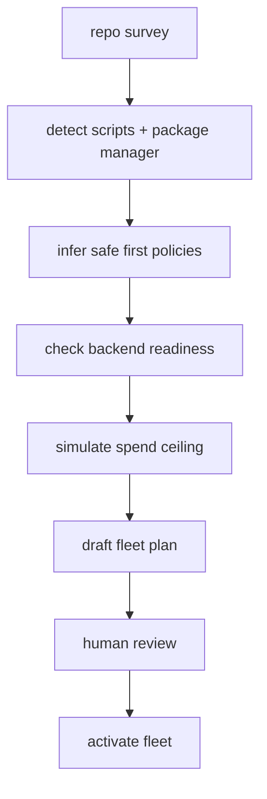

# Cold Start Without Surprise Launches

The first-run problem for agent tools is not "how fast can we spawn something?" It is "how do we know this repository is ready for agents at all?"

That sounds less glamorous, but it is the difference between a useful developer tool and a slot machine with a terminal theme. A repo has conventions, test commands, secrets, generated artifacts, package managers, branch rules, deployment scripts, and human expectations. If an agent launcher ignores those facts, it starts by manufacturing cleanup work.

Port Daddy's cold-start philosophy is simple: inspect first, propose second, launch last.


## The Wrong First Run

The common first-run flow looks like this:

1. Ask for a prompt.
2. Pick a model.
3. Run the model.
4. Hope the repo survives.

That flow optimizes for demo speed. It does not optimize for software engineering. It ignores three questions that matter immediately:

- What can this repo safely run?
- What should an agent be allowed to touch?
- What proof will the human get before spend or mutation happens?

An agent cannot responsibly operate a codebase until those questions have answers. Port Daddy treats those answers as product state, not hidden setup trivia.

## The Better Shape

A serious cold start should look more like a preflight.



The output should be a plan the operator can edit, not "agent started":

- roles and responsibilities;
- triggers and schedules;
- model tiers;
- budget ceilings;
- file boundaries;
- expected validation commands;
- what happens when a role fails.

This matters because background automation has a long half-life. A bad one-time run is annoying. A bad always-on agent is operational debt.

## A Fleet Plan Should Be Boring

A good initial fleet config is not clever. It is conservative and readable.

```yaml
fleet:
  name: acme-web
  limits:
    budget_usd_per_day: 4.00
    max_active_agents: 2

  agents:
    test-triage:
      trigger: test:failed
      backend: codex
      model_tier: low
      prompt: |
        Read the failing test output.
        Identify the likely owner and write a session note.
        Do not edit files unless the operator creates a file claim.

    docs-review:
      trigger: git:committed
      backend: claude
      model_tier: low
      prompt: |
        Check whether the commit changed public behavior.
        If docs need an update, leave a handoff with exact files.

    release-helper:
      trigger: manual
      backend: codex
      model_tier: mid
      requires_human_approval: true
      prompt: |
        Inspect release notes, build artifacts, and checksums.
        Never publish without explicit operator confirmation.
```

This is intentionally not a swarm fantasy. It is a small set of roles with explicit triggers. The point is to make useful automation cheap to reason about.

## Readiness Is More Than API Keys

Most tools ask whether an API key exists. Port Daddy needs more than that.

| Readiness check | Why it matters |
| --- | --- |
| Credentials | The daemon needs access where it actually runs. |
| SDK or CLI dependency | A key is useless if the launch path cannot import or execute the backend. |
| Model catalog | Low, mid, and high tiers must map to known models. |
| Pricing | Spend policy needs exact rates, not rough estimates. |
| Usage telemetry | A launch should prove tokens and cost. |
| Project policy | Some repos require claims, tests, or human gates before mutation. |


That readiness surface is where Port Daddy starts to feel different from a typical agent launcher. A blocked launch is not a failure of the demo. It is the system refusing to lie.

## Inspect Before You Design

A cold-start flow can infer a surprising amount before asking the human for a prompt:

<!-- terminal -->
```bash
$ pd setup
$ pd status
$ pd scan
$ pd fleet propose --project acme-web
```

Ignore the exact command names. The interesting part is the shape of the evidence:

```json
{
  "project": "acme-web",
  "packageManager": "pnpm",
  "testCommands": ["pnpm test", "pnpm lint"],
  "frameworks": ["vite", "react", "fastify"],
  "backends": {
    "cloudflare": { "ready": true, "telemetry": "exact" },
    "codex": { "ready": false, "reason": "manual auth check required" },
    "claude": { "ready": false, "reason": "missing SDK package" },
    "custom": { "ready": false, "reason": "exact telemetry unavailable" }
  },
  "recommendedLimits": {
    "maxActiveAgents": 2,
    "dailyBudgetUsd": 4
  }
}
```

That's the kind of artifact a software engineer can argue with. Maybe the test command is wrong. Maybe Codex should be mid-tier for this repo. Maybe docs review should not run on every commit. Great. Edit the plan before it becomes live automation.

## Simulation Changes The Conversation

The important design move is that the first proposal is simulated. A developer should be able to ask, "what would happen if I turned this on?" and get a concrete answer before any watcher starts.

```yaml
simulation:
  triggers:
    git:committed:
      would_start: [docs-review]
      blocked: []
    test:failed:
      would_start: [test-triage]
      blocked: []
  blocked_launches:
    - agent: release-helper
      reason: requires manual approval
  spend:
    daily_limit_usd: 4.00
    estimated_worst_case_usd: 0.82
  mutations:
    default_mode: notes-only
    requires_claim_for_edits: true
```

That artifact is an execution preview, not a settings screen. It tells the operator which events matter, which roles would wake up, which launches are blocked, and what the expected spend envelope looks like. It also gives the cold-start UI a reason to exist beyond decoration: the UI is where the human edits the operating model.

Without simulation, onboarding is a cliff. With simulation, onboarding becomes a negotiation between the repo's discovered facts and the developer's risk tolerance.

## What Not To Launch First

Cold start is also about restraint. The first generated fleet should avoid roles that sound impressive but create ambiguous authority.

| Avoid at first | Better first version |
| --- | --- |
| "Fix all failing tests automatically" | Summarize failing tests and propose owned next steps. |
| "Keep docs always perfect" | Detect public behavior changes and leave a docs handoff. |
| "Review every commit with the best model" | Run a low-tier exact-telemetry review with a small budget. |
| "Deploy when green" | Assemble release evidence and wait for a human gate. |

This is where Port Daddy's worldview differs from a launch-button product. The goal is a local operating model that can safely grow, not maximum autonomy on day one. Once the operator trusts the notes-only test triage role, they can grant it file claims. Once release evidence is reliable, they can add packaging steps. Authority expands because the system earned it.

A conservative first fleet isn't a lack of ambition; it's how durable automation starts. The developer should be able to see a path from "observe and report" to "claim and patch" to "package and wait for approval" without ever losing the ability to inspect the policy that permits each step.

## Human Review Is Part Of The Architecture

The phrase "human in the loop" gets abused. In many products it means "we show a confirmation box." That's not enough.

In a Port Daddy cold start, the human should be able to review the actual operating model:

- what will wake this agent up;
- what budget can it spend;
- what files can it claim;
- whether it can mutate files or only leave notes;
- what validation it must run;
- how it reports failure;
- how to stop it.


A first-run flow is successful when the user feels more in control after enabling automation, not less.

## Why This Gets Engineers Excited

The exciting version of agents is not "a bot that writes code somewhere." It is a local system where useful roles can sit next to your repo, wake up on meaningful events, and operate inside constraints you can inspect.

That gets you workflows that are hard to build with a chat box:

- A test failure can become a structured event instead of a pasted stack trace.
- A docs review can run after a commit and leave a handoff, not a noisy PR comment.
- A release helper can assemble artifacts while the operator sees exact readiness and checksums.
- A repo can have a small always-on fleet without giving every role unlimited authority.

The cold-start process is what makes that possible. It turns "let an agent loose" into "install a small local operating model."

## The Rule

If the setup flow cannot explain what will run, why it will run, what it can touch, what it can spend, and how to stop it, it should not launch.

Port Daddy's cold-start work is about making that rule pleasant enough that developers actually use it. Inspect first. Propose second. Launch last.
