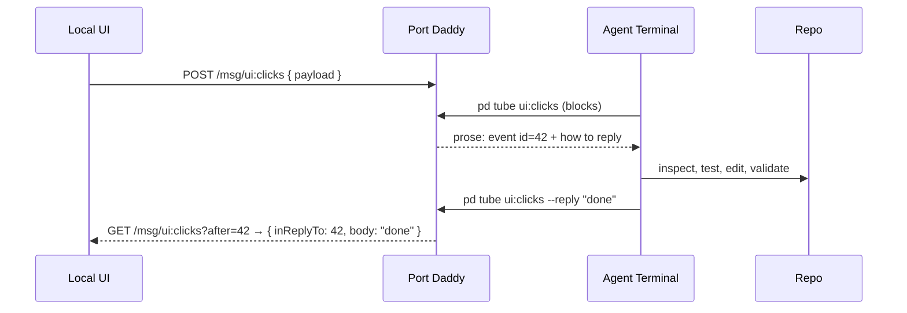

# PD Tube Turns UI Events Into Agent Work

The fastest way to make agents useful is not always to build a full product backend. Sometimes the right move is smaller: let a local UI event ask the already-running agent for help, then get a threaded answer back.

That is PD Tube.

PD Tube is Port Daddy's local event-reply loop for developer tools. A button, test reporter, browser prototype, editor helper, or webhook adapter publishes a structured event. An agent subscribes in the terminal with a single command, inspects the repo, does real work, and replies — with the same single command.


## Why This Exists

Most agent integrations take one of two shapes:

- a cloud backend receives product events and calls a model;
- a chat UI receives human intent and returns text.

Both are useful. Neither is ideal when you are building local developer workflows. A failing test, a selected code snippet, or a prototype button should not require a hosted queue just to ask a local agent a question. It should also not disappear into a chat transcript with no structured reply path.

PD Tube keeps the loop small and inspectable.

<!-- figure: The whole event-reply loop on one channel — a local UI POSTs an event, the agent blocks on `pd tube`, does real work in the repo, and replies with the same command, while the browser polls the channel and reads the threaded answer back; no hosted queue anywhere in the path. -->


The point is not that PD Tube replaces a backend. The point is that a large class of local agent workflows should not need one.

## The Single Command That Unlocks The Agent Loop

Here is the trick that makes the whole thing work: every `pd tube` invocation **returns**. There is no infinite loop holding the agent's bash tool hostage. Each call blocks until the next event arrives, prints a prose &quot;crank-handle&quot; block telling the agent how to reply, and exits.

```bash
$ pd tube ui:clicks
tube waiting on ui:clicks as pd-tube/myapp/ui_clicks (up to 600s; Ctrl+C to exit)

──── event id=42 · channel ui:clicks ────
From: web-demo · 2026-04-30T22:01:11.000Z
Body:
  {"button":"deploy-staging","user":"erich"}

Act on the event above, then post your response by running:

    pd tube ui:clicks --reply "your response here"

That command posts a reply correlated to id=42 AND continues
listening. Use --raw / --json for machine output. Ctrl+C to exit.
──────────────────────────────────────
```

The bash tool yields control back to the model. The model reads the block, does the work, then runs the suggested command on its next turn. That call posts the reply **and** blocks for the next event, which means the agent is now in a real loop with the world.

## Reply In One Command

The other half of the trick is auto-correlation. `--reply "body"` figures out which event to thread against by looking at the per-channel cursor — specifically, the most recent event from someone other than this listener.

```bash
$ pd tube ui:clicks --reply "Deployed to staging. CI is green."
SUCCESS: tube: posted id=43 to ui:clicks
tube waiting on ui:clicks as pd-tube/myapp/ui_clicks (up to 600s; Ctrl+C to exit)
…blocks for the next event…
```

That is the whole protocol from the agent's side. Two shapes of one command: read, reply.

For long bodies the agent can pipe stdin (`echo "long body" | pd tube ch --reply -`). For deterministic threading against a known parent id, pipe the body with `--reply-to=42`. For human terminal use, `--tail` brings back the infinite loop.

## The Smallest Useful Publisher

The browser side of the checked-in `examples/pd-tube` demo is just `fetch()`:

```html
<button id="deploy">Deploy to staging</button>
<div id="reply"></div>
<script>
  const PD_URL = window.location.pathname.startsWith('/fleet-ui')
    ? ''
    : new URLSearchParams(location.search).get('daemon') ?? window.__PORT_DADDY_URL__
  if (!PD_URL && !window.location.pathname.startsWith('/fleet-ui')) {
    throw new Error('Choose a daemon endpoint or open this page inside the embedded dashboard.')
  }
  document.getElementById('deploy').onclick = async () => {
    await fetch(PD_URL ? new URL('/msg/ui:clicks', PD_URL) : '/msg/ui:clicks', {
      method: 'POST',
      headers: { 'Content-Type': 'application/json' },
      body: JSON.stringify({
        payload: { button: 'deploy-staging', user: 'erich' },
        sender: 'web-demo',
      }),
    });
    pollForReply();
  };
</script>
```

No SDK. No MCP. No websocket. Plain HTTP and a tiny envelope on the wire:

```json
{ "v": 1, "kind": "tube.msg", "body": "Deployed to staging. CI is green.", "inReplyTo": 42 }
```

The daemon stores it in the same SQLite-backed channel system Port Daddy already ships. Any other process that can `GET /msg/ui:clicks?after=<cursor>` can read the agent's reply, including the original browser page.

## Why Threaded Replies Matter

Threading is the difference between an event stream and a usable product surface.

Without a reply handle, every UI integration has to invent its own state machine. Did the agent answer? Which event did it answer? Did another agent answer first? Can the UI show progress? Can the user retry?

With a reply handle, the event is a tiny work item. The reply is another message on the same channel with `inReplyTo` set to the parent's id. The browser correlates by `inReplyTo` and renders the answer next to the button that asked.

That shape is boring in the best way. It means simple local tools can build useful UI around agent work without becoming an orchestration platform.

## Six Practical Uses

### 1. Button To Agent

A prototype page exposes a button that asks an agent to inspect the current route, run an accessibility check, or explain a failing state.


### 2. Failing Test To Agent

A jest or pytest reporter publishes the failing assertion, command, environment, and changed files on `test:failed`. The agent diagnoses the failure or opens a bounded session.

```ts
publishTubeEvent({
  channel: 'test:failed',
  payload: {
    command: 'pnpm test apps/web/invoices.test.ts',
    failure: 'expected 409, received 500',
    changedFiles: ['apps/web/src/routes/invoices.ts'],
  },
})
```

### 3. Editor Lightbulb To Agent

A VS Code lens publishes a selected range and asks for a structured explanation on `editor:explain`. The agent answers with citations to local code and suggested commands.


### 4. Webhook To Local Agent

A local webhook adapter bridges GitHub, Linear, CI, or staging events into the same event-reply substrate on `chat:mention`. The agent stays local; the event is just a payload.

### 5. Git Hook To Agent

A `post-commit` hook publishes the diff and message on `git:committed`. The agent runs lint, regenerates docs, or drafts a release note while the developer keeps typing.

### 6. Jupyter Cell To Agent

A notebook hook publishes traceback + cell source on `notebook:exception`. The agent debugs against the real repo state and replies inline with a fix.

## Different From A Queue

PD Tube is not trying to be Kafka. It is intentionally small:

- local-first;
- human-readable in the terminal;
- reply-aware;
- connected to Port Daddy sessions, notes, and claims;
- cheap enough to use in prototypes.

A production system may eventually graduate to a real queue. Fine. PD Tube gives engineers a way to test the interaction pattern before inventing infrastructure.

## Different From Chat

Chat asks &quot;what do you want?&quot; PD Tube asks &quot;what just happened?&quot;

That distinction matters. A UI event already has structure: selected file, failing test, user action, route, browser state, payload, timestamp. Sending that to a chat box wastes the structure. Sending it through a tube preserves it.

The agent can still reason in natural language. The system around the agent does not have to be natural language all the way down.

## The Payload Is The Contract

The difference between a cute demo and a useful tube is the payload. A good event gives the agent enough context to do work without scraping the UI.

```ts
type TubeEvent =
  | {
      channel: 'ui:explain-selection'
      payload: {
        project: 'acme-web'
        file: string
        range: { startLine: number; endLine: number }
        question: string
        visibleRoute?: string
      }
    }
  | {
      channel: 'test:failed'
      payload: {
        command: string
        framework: 'vitest' | 'jest' | 'playwright'
        failure: string
        changedFiles: string[]
        artifacts?: string[]
      }
    }
```

That looks ordinary because it should. PD Tube works best when product surfaces publish boring typed events. The agent can then use Port Daddy's session, activity, and file-claim state to decide whether it should answer, start a session, or hand off to the human.

The payload should be rich enough to avoid a second interrogation step, but small enough that the UI author can understand it. That balance is what makes PD Tube attractive for prototypes: the integration can start as one typed event and later grow into a real product feature without changing the interaction model.

It also keeps responsibility clear. The UI owns the event. Port Daddy owns delivery, sessions, and replies. The agent owns reasoning and any follow-up work it is allowed to perform.

## A Test Reporter Adapter

Here is a small adapter shape for a test runner. The reporter does not need to know which model will answer. It only has to describe what happened.

```ts
async function publishFailedTest(result: FailedTestResult) {
  const PD_URL = process.env.PORT_DADDY_URL ?? readPublishedDaemonUrl()
  await fetch(new URL('/msg/test:failed', PD_URL), {
    method: 'POST',
    headers: { 'content-type': 'application/json' },
    body: JSON.stringify({
      sender: 'jest-reporter',
      payload: {
        command: result.command,
        framework: result.framework,
        failure: result.message,
        changedFiles: result.changedFiles,
        artifacts: result.screenshots,
      },
    }),
  })
}
```

In a production integration the URL should come from `PORT_DADDY_URL` or the published daemon.port file rather than a literal. The important product point is that the reporter remains tiny. It publishes the failure and lets the [local control plane](/blog/control-plane-is-the-product) decide how agents, budgets, claims, and replies should work.

## What The UI Should Render

The UI should not show a generic &quot;agent thinking&quot; spinner forever. A tube-aware UI can render the lifecycle:

| State | Useful UI |
| --- | --- |
| Event published | Show the exact payload summary and channel. |
| Agent received | Show which session or listener picked it up. |
| Agent working | Show touched files, notes, and commands if available. |
| Reply delivered | Show the threaded answer next to the original event. |
| No listener | Offer to start a listener or save the event for later. |

That is the payoff of keeping replies structured. The browser does not have to guess whether the terminal work belongs to this button click. The `inReplyTo` envelope field ties the loop together.

## The Product Bet

The next wave of useful agent features will not only be giant autonomous runs. It will be [dozens of small local loops](/blog/your-ai-subscription-powers-the-fleet):

- explain this UI state;
- inspect this failing test;
- summarize this event payload;
- produce a patch plan for this selected range;
- reply to this webhook with local repo context.

PD Tube is the Port Daddy primitive for those loops. It makes local UI events agent-addressable without turning every experiment into a hosted product. The agent that's already running is the backend. Port Daddy is the event bus your local agent was missing.
