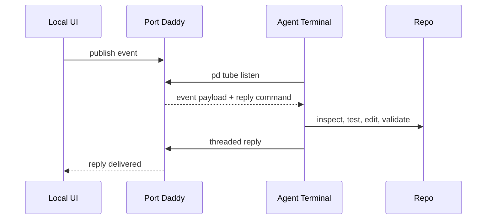

# PD Tube Turns UI Events Into Agent Work

The fastest way to make agents useful is not always to build a full product backend. Sometimes the right move is smaller: let a local UI event ask the already-running agent for help, then get a threaded answer back.

That is PD Tube.

PD Tube is Port Daddy's local event-reply loop for developer tools. A button, test reporter, browser prototype, editor helper, or webhook adapter can publish a structured event. An agent can subscribe in the terminal, inspect the repo, do real work, and reply to the original event.


## Why This Exists

Most agent integrations take one of two shapes:

- a cloud backend receives product events and calls a model;
- a chat UI receives human intent and returns text.

Both are useful. Neither is ideal when you are building local developer workflows. A failing test, a selected code snippet, or a prototype button should not require a hosted queue just to ask a local agent a question. It should also not disappear into a chat transcript with no structured reply path.

PD Tube keeps the loop small and inspectable.



The point is not that PD Tube replaces a backend. The point is that a large class of local agent workflows should not need one.

## The Smallest Useful Loop

Start a tube listener:

<!-- terminal -->
```bash
$ pd tube ui:explain-selection
[ui:explain-selection] waiting for messages...
```

Publish an event from a UI, test runner, or script:

```ts
await fetch('/__pd/tube', {
  method: 'POST',
  headers: { 'content-type': 'application/json' },
  body: JSON.stringify({
    channel: 'ui:explain-selection',
    type: 'selection.explain.requested',
    payload: {
      file: 'apps/web/src/routes/invoices.ts',
      range: { startLine: 42, endLine: 88 },
      question: 'Why does this retry path duplicate invoice events?'
    }
  })
})
```

The listening agent receives the payload with a reply handle:

<!-- terminal -->
```bash
event: selection.explain.requested
file: apps/web/src/routes/invoices.ts
range: 42-88
question: Why does this retry path duplicate invoice events?

reply:
  pd tube reply msg_01JZ... --body <answer>
reply command ready for threaded response
```

Now the agent has a real job. It can inspect the file, run tests, open related modules, and answer the UI in context. The UI gets a structured response tied to the original event instead of a generic notification.


## Why Threaded Replies Matter

Threading is the difference between an event stream and a usable product surface.

Without a reply handle, every UI integration has to invent its own state machine. Did the agent answer? Which event did it answer? Did another agent answer first? Can the UI show progress? Can the user retry?

With a reply handle, the event is a tiny work item:

```json
{
  "id": "msg_01JZ8F2T4NX",
  "channel": "ui:explain-selection",
  "type": "selection.explain.requested",
  "replyTo": null,
  "status": "open",
  "payload": {
    "file": "apps/web/src/routes/invoices.ts",
    "question": "Why does this retry path duplicate invoice events?"
  }
}
```

The reply becomes another message:

```json
{
  "id": "msg_01JZ8G9P93B",
  "channel": "ui:explain-selection",
  "type": "agent.reply",
  "replyTo": "msg_01JZ8F2T4NX",
  "payload": {
    "summary": "The retry loop reuses the original event id after a timeout.",
    "nextStep": "Move idempotency key creation above the retry boundary."
  }
}
```

That shape is boring in the best way. It means simple local tools can build useful UI around agent work without becoming an orchestration platform.

## Four Practical Uses

### 1. Button To Agent

A prototype page can expose a button that asks an agent to inspect the current route, run an accessibility check, or explain a failing state.


### 2. Failing Test To Agent

A test reporter can publish the failing assertion, command, environment, and changed files. The agent can reply with a diagnosis or open a bounded session.

```ts
publishTubeEvent({
  channel: 'tests:failed',
  type: 'test.failure',
  payload: {
    command: 'pnpm test apps/web/invoices.test.ts',
    failure: 'expected 409, received 500',
    changedFiles: ['apps/web/src/routes/invoices.ts']
  }
})
```

### 3. Editor Lightbulb To Agent

An editor helper can publish a selected range and ask for a structured explanation. The agent can answer with citations to local code and suggested commands.


### 4. Webhook To Local Agent

A local webhook adapter can bridge GitHub, Linear, CI, or staging events into the same event-reply substrate. The agent stays local; the event is just a payload.

## Different From A Queue

PD Tube is not trying to be Kafka. It is intentionally small:

- local-first;
- human-readable in the terminal;
- reply-aware;
- connected to Port Daddy sessions, notes, and claims;
- cheap enough to use in prototypes.

A production system may eventually graduate to a real queue. Fine. PD Tube gives engineers a way to test the interaction pattern before inventing infrastructure.

## Different From Chat

Chat asks "what do you want?" PD Tube asks "what just happened?"

That distinction matters. A UI event already has structure: selected file, failing test, user action, route, browser state, payload, timestamp. Sending that to a chat box wastes the structure. Sending it through a tube preserves it.

The agent can still reason in natural language. The system around the agent does not have to be natural language all the way down.

## The Payload Is The Contract

The difference between a cute demo and a useful tube is the payload. A good event gives the agent enough context to do work without scraping the UI.

```ts
type TubeEvent =
  | {
      type: 'selection.explain.requested'
      channel: 'ui:explain-selection'
      payload: {
        project: 'acme-web'
        file: string
        range: { startLine: number; endLine: number }
        question: string
        visibleRoute?: string
      }
    }
  | {
      type: 'test.failure'
      channel: 'tests:failed'
      payload: {
        command: string
        framework: 'vitest' | 'jest' | 'playwright'
        failure: string
        changedFiles: string[]
        artifacts?: string[]
      }
    }
```

That looks ordinary because it should. PD Tube works best when product surfaces publish boring typed events. The agent can then use Port Daddy's session, activity, and file-claim state to decide whether it should answer, start a session, or hand off to the human.

The payload should be rich enough to avoid a second interrogation step, but small enough that the UI author can understand it. That balance is what makes PD Tube attractive for prototypes: the integration can start as one typed event and later grow into a real product feature without changing the interaction model.

It also keeps responsibility clear. The UI owns the event. Port Daddy owns delivery, sessions, and replies. The agent owns reasoning and any follow-up work it is allowed to perform.

## A Test Reporter Adapter

Here is a small adapter shape for a test runner. The reporter does not need to know which model will answer. It only has to describe what happened.

```ts
async function publishFailedTest(result: FailedTestResult) {
  await fetch('http://127.0.0.1:9876/tube', {
    method: 'POST',
    headers: { 'content-type': 'application/json' },
    body: JSON.stringify({
      channel: 'tests:failed',
      type: 'test.failure',
      payload: {
        command: result.command,
        framework: result.framework,
        failure: result.message,
        changedFiles: result.changedFiles,
        artifacts: result.screenshots
      }
    })
  })
}
```

In a production integration the URL should come from daemon discovery rather than a literal. The important product point is that the reporter remains tiny. It publishes the failure and lets the local control plane decide how agents, budgets, claims, and replies should work.

## What The UI Should Render

The UI should not show a generic "agent thinking" spinner forever. A tube-aware UI can render the lifecycle:

| State | Useful UI |
| --- | --- |
| Event published | Show the exact payload summary and channel. |
| Agent received | Show which session or listener picked it up. |
| Agent working | Show touched files, notes, and commands if available. |
| Reply delivered | Show the threaded answer next to the original event. |
| No listener | Offer to start a listener or save the event for later. |

That is the payoff of keeping replies structured. The browser does not have to guess whether the terminal work belongs to this button click. The event id ties the loop together.

## The Product Bet

The next wave of useful agent features will not only be giant autonomous runs. It will be dozens of small local loops:

- explain this UI state;
- inspect this failing test;
- summarize this event payload;
- produce a patch plan for this selected range;
- reply to this webhook with local repo context.

PD Tube is the Port Daddy primitive for those loops. It makes local UI events agent-addressable without turning every experiment into a hosted product.
