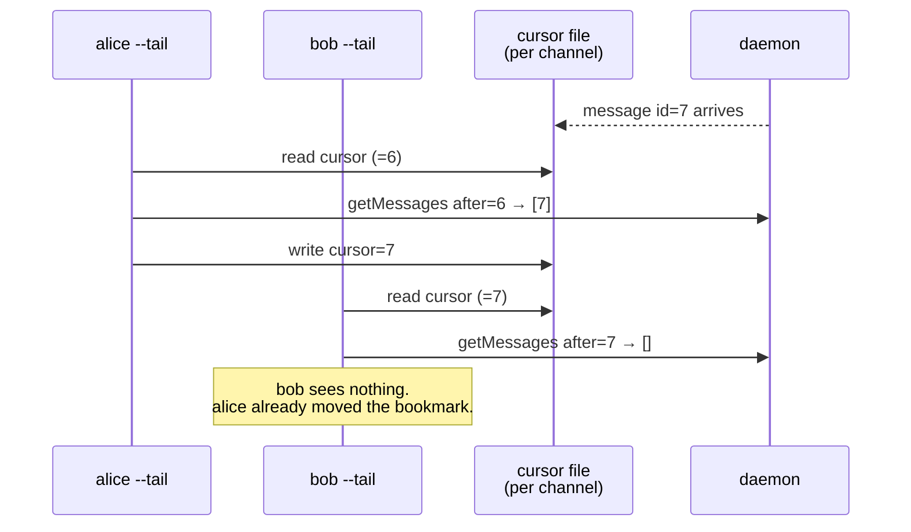
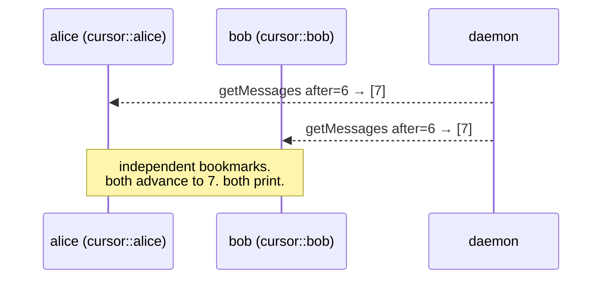

# One Send, Every Listener: pd tube Goes Multi-Subscriber

I built a demo to show off `pd tube` — a human in one terminal, a live coding agent in another, talking to each other over a single named channel. Two panes, real messages, no backend. It worked the first time. Then I added a third pane. And the bug fell out of the sky.

The third listener got nothing. Neither did the second, sometimes. Whichever terminal *happened to poll first* swallowed the message, and the rest stared at an empty channel like guests who showed up to a party that had already been cleaned up. For a thing whose entire pitch is "a shared real-time channel for agents and teammates to coordinate," that is roughly the worst possible failure: it looks like it's working, right up until more than one of you is listening.

This post is about that bug — why a "broadcast" channel was quietly behaving like a vending machine, and the one-line-of-cursor-logic fix that turned it into an actual fan-out. It shipped in **Port Daddy v3.16.2**.


<!-- sidenote: what's pd tube? -->
**`pd tube`** is Port Daddy's local event-reply channel (`lib/tube.ts`). A producer posts a structured message to a named channel; a listener subscribes from the terminal with one command, does work, and replies — and the command *returns* instead of holding the terminal hostage. If you've never seen it, start with [PD Tube Turns UI Events Into Agent Work](/blog/pd-tube-event-reply-loop).

## The party where only one guest hears you

Here is the shape of the demo that broke. One sender, three listeners, one channel:

<!-- terminal -->
```bash
# three terminals, one channel
pd tube standup:demo --tail --as you
pd tube standup:demo --tail --as claude-code
pd tube standup:demo --tail --as gardener-bot

# a fourth terminal sends one message
echo "deploy window opens at 14:00" | pd tube standup:demo --send --as broadcaster
```

You'd expect all three `--tail` listeners to print that line. With the fix, they do — here's the actual recording, one send landing in all three subscribers plus the sender's own confirmation:


Before the fix, exactly one of them printed it, and *which one* was a coin-flip. The pub/sub wasn't the problem — the daemon's in-memory notifier (`lib/messaging.ts`) loops over a `Set` of every subscriber and calls them all. The problem was one layer up, on disk, and it's a beautiful little example of how a feature meant to *help* can quietly defeat the feature it's helping.

<!-- sidenote: the tell -->
The diagnostic that cracked it: running both listeners with **`--no-history`** made them *both* receive. Disabling the resume cursor fixed the symptom — which means the cursor *was* the symptom.

## The cursor that everyone shared

`pd tube --tail` doesn't hold a socket open and wait. It polls: "give me messages after id N," prints them, advances N, sleeps, repeats. So it needs to remember N between polls — otherwise every wake-up would re-print the whole channel. That memory is a tiny **resume cursor**<!-- sidenote: resume cursor --> a one-number-per-channel bookmark (`lastSeenId`) persisted to `~/.port-daddy/tube-history-<channel>.json`, so a listener that reconnects picks up where it left off instead of replaying history. on disk.

The cursor was keyed by **channel**. One file per channel. And that's the whole bug in one sentence: *two listeners on the same channel shared one bookmark.*


<!-- figure: A shared per-channel cursor turns a broadcast into a race — first poll wins, the rest get an empty result. -->

Whoever polled first advanced the shared bookmark; everyone else asked the daemon for "messages after 7," and the daemon — correctly, honestly — said *there are none*. A broadcast channel had quietly become a work queue with exactly one winner. No error. No warning. Just a silent single-consumer pretending to be a bus.


<!-- sidenote: queue vs bus -->
A **work queue** delivers each message to *one* consumer (that's the point — don't do the job twice). A **bus** delivers each message to *every* subscriber. Tube was sold as a bus and implemented, accidentally, as a queue. The two are a config flag apart — and that flag was the cursor's filename.

## The fix: give every listener its own bookmark

The cursor is the right idea. Sharing it across distinct listeners is the wrong scope. So the fix is to namespace the cursor by *who is listening*, not just *what they're listening to*. `listen()` gains an optional `historyKey` (default: the channel), and the CLI sets it to `channel::<identity>`:

<!-- terminal -->
```bash
# each --as identity now gets its own cursor file:
#   tube-history-standup_demo__you.json
#   tube-history-standup_demo__claude-code.json
#   tube-history-standup_demo__gardener-bot.json
pd tube standup:demo --tail --as you
```


<!-- figure: Per-listener cursors: distinct identities keep independent bookmarks, so every listener receives every message. -->

That's the entire fix. Two consequences fall straight out of it, and they're the part I actually like:

- **Distinct `--as` identities → independent cursors → true fan-out.** A human, an agent, and a second agent each have their own identity, so each receives every message. The thing you'd naturally do now just works.
- **The same identity still resumes.** Two invocations as `--as you` share a cursor on purpose — that's one logical listener reconnecting, exactly the case the cursor was built for. Resume didn't regress; it got *scoped correctly*.

<!-- sidenote: why not just broadcast live? -->
A fair question: why not drop the poll-and-cursor model and hold a live socket per listener? Because the cursor also buys **durable catch-up** — a listener that was asleep when the message landed still gets it on its next poll. Live-only delivery loses that. Per-listener cursors keep both: catch-up *and* fan-out.

## "Confirming the repro is fixed is part of the test plan"

A fix you can't point a test at is a rumor. This one ships with two, both exercising the real failure:

- a **multi-subscriber** unit test: two listeners on one channel with distinct keys *both* receive the message;
- a **single-consumer regression** test that reproduces the *old* behavior on purpose — shared cursor, second listener gets nothing — so the day someone "simplifies" the cursor key, the suite screams.

<!-- sidenote: runtime matters -->
Port Daddy's daemon ships as a `bun build --compile` binary, and the same week this fix landed, two *other* bugs sailed past green tests because the tests ran under a different engine than the one operators run. Lesson re-learned, with feeling: a test that passes under the wrong runtime is a comforting lie. Verify the repro where the bug actually lives.

And then the demo I started with — the one that exposed the bug — finally runs the way it always claimed to. Human on the left, a live Claude Code session on the right, both holding their own bookmark on one channel:


## Try it

It's one command per listener and it's live in v3.16.2:

<!-- terminal -->
```bash
brew upgrade port-daddy
# terminal 1
pd tube standup --tail --as you
# terminal 2 (or a second agent, or a third)
pd tube standup --tail --as claude-code
# anywhere
echo "ship it" | pd tube standup --send --as ci
```

Full command reference lives in [the `pd tube` docs](/docs/cli/tube). The short version: a channel is now a channel. Everyone listening hears you — and everyone keeps their own place in line.
