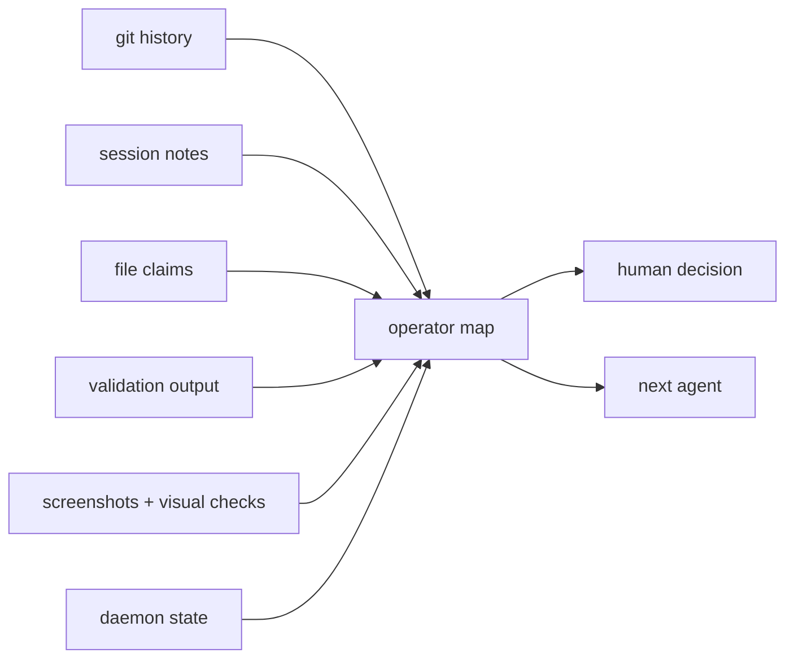

# Keeping The Map Honest

Large codebases do not have one source of truth. They have commits, docs, issues, test output, local services, feature flags, generated assets, design screenshots, session notes, and the human memory of what happened ten minutes ago.

Agent-assisted work adds more surfaces. Now there are background runs, handoffs, file claims, channel messages, failed launches, model decisions, and partial attempts. If those surfaces drift, the team loses trust quickly.

Port Daddy's map work is about one thing: make the current state legible enough that the next human or agent can act without archaeology.


## Why Roadmaps Drift

Roadmaps usually lie by becoming stale. They are written at planning time, but the repo changes at execution time. A feature may be half-built, renamed, blocked by a dependency, or superseded by a better path. The markdown file still says "next."

Agents make drift faster. A good agent can move a slice quickly. A bad or interrupted one can leave partial files, screenshots, notes, and broken assumptions. Either way, the map has to keep up.

The map should answer:

- What is actually on `main`?
- What is in flight?
- What was abandoned?
- What evidence proves a feature is done?
- What needs human decision?
- Which surfaces disagree?

That is a different job from writing a roadmap. It is reconciliation.

## The Map Is A Projection

Port Daddy does not need every piece of truth in one file. It needs a projection that can cite the underlying evidence.



A useful map is not a perfect database. It is a current-enough explanation of where work stands and why.


## How The Projection Gets Built

A map projection should be boring to compute. Pull small facts from the surfaces that already exist, normalize them, then keep the evidence links.

```ts
type MapFact =
  | { kind: 'commit'; sha: string; subject: string; touched: string[] }
  | { kind: 'session'; id: string; state: 'active' | 'done' | 'stale'; identity: string }
  | { kind: 'claim'; sessionId: string; path: string; region?: string }
  | { kind: 'validation'; command: string; status: 'pass' | 'fail'; observedAt: string }
  | { kind: 'runtime'; daemon: 'current' | 'stale' | 'unknown'; detail: string }

function projectMap(facts: MapFact[]) {
  return groupBySlice(facts).map((slice) => ({
    title: slice.title,
    state: inferState(slice),
    evidence: slice.facts,
    risks: inferRisks(slice),
    nextActions: inferNextActions(slice)
  }))
}
```

The inference can be conservative. If validation is missing, say validation is missing. If runtime is stale, mark runtime stale. If a session is active in one surface and absent in another, call that out. The map earns trust by preserving uncertainty instead of smoothing it away.

## Drift Should Be A First-Class Object

The best map is not only a pretty status page. It should represent disagreement explicitly:

```json
{
  "kind": "drift",
  "severity": "operator-review",
  "surfaces": ["git", "runtime", "website"],
  "summary": "Source includes the new blog renderer, but the deployed site is still serving the previous bundle.",
  "evidence": [
    "commit contains BlogPostPage renderer change",
    "browser bundle hash predates commit",
    "changed route screenshot still shows old terminal styling"
  ],
  "next": "redeploy latest main and resmoke /blog"
}
```

That object is more useful than a stale green badge. It tells the operator where to look and what action would resolve the disagreement.

## Evidence Beats Status Labels

"Done" is not enough. "Blocked" is not enough. "In progress" is barely information.

Better map entries include evidence:

```json
{
  "slice": "PD Tube tutorial",
  "state": "landed",
  "evidence": [
    "tutorial route exists",
    "CLI reference route exists",
    "demo gif renders in browser",
    "website build passed",
    "sitemap includes canonical route"
  ],
  "remainingRisk": "needs user-facing copy pass for first-time readers"
}
```

That shape lets a future agent continue intelligently. It does not need to re-litigate whether the route exists. It can focus on the remaining risk.

## What A Software Engineer Wants To Know

When you return to a repo after several agents worked on it, you want a short operational briefing:

| Question | Useful answer |
| --- | --- |
| What changed? | Named slices with commits and touched surfaces. |
| What was validated? | Commands, screenshots, and browser checks. |
| What is unsafe to touch? | Active claims, dirty worktrees, pending decisions. |
| What is stale? | Old docs, outdated generated assets, abandoned branches. |
| What should happen next? | A small ordered list with evidence. |

The map is not for ceremony. It saves engineering time.

## A Concrete Agent Handoff

A good handoff is a map entry in miniature:

```md
Slice: checkout onboarding copy
State: needs review
Touched: website-v2/src/pages/MacPreviewPage.tsx
Validated:
- npm --prefix website-v2 run lint
- npm --prefix website-v2 run build
- Playwright desktop screenshot
Risk:
- mobile screenshot still has cramped CTA text
Next:
- tighten mobile CTA labels
- rerun visual check at 390px width
```

Notice what is absent: no vague "be careful," no local machine path, no private scratch directory, no internal-only TODO. The note is useful to any engineer who has the repo.

## The Map Has An Audience

A roadmap written for executives and a map written for a working engineer are different artifacts. Port Daddy's map is for the person about to take the next action. That person needs enough context to avoid repeating work, not a perfect historical essay.

A good entry should fit this rule: after reading it, a capable engineer can decide whether to inspect, continue, abandon, or ask for a human decision. If the entry cannot support one of those choices, it is probably status theater.

That audience pressure also keeps the writing honest. Do not say "the website is better" when the useful statement is "the blog renderer now supports GFM tables and the build passed." Do not say "agent coordination improved" when the useful statement is "staged files now fail guard checks unless the active session has matching claims." Engineers trust maps that make the observable thing explicit.

That is why a map should prefer small, verifiable claims over grand summaries. A commit hash, route, screenshot, test command, launch record, or blocked preflight is a better building block than an adjective. The map can still synthesize. It just has to synthesize from evidence that another engineer can check.

When the evidence is missing, the map should say so plainly. Unknown is not embarrassing; hidden unknowns are what waste the next hour.

## The Map Needs Runtime Truth

Static project state is not enough. A local control plane also needs runtime evidence:

- which daemon is serving the UI;
- which port or socket clients are using;
- which project is selected;
- which agents are live;
- which backend launches are blocked;
- which generated bundle is being served.

Runtime drift is one of the fastest ways to waste time. A source file can be correct while the browser still serves an old build. A daemon can be alive while pointing at the wrong checkout. A UI can show stale project state because it is connected to the wrong runtime.

That is why Port Daddy treats runtime provenance as part of the map.

## How This Differs From A Project Board

A project board tracks work items. Port Daddy's map tracks operational truth.

A project board might say:

> "Build PD Tube examples."

The map should say:

> "The button-to-agent example, test reporter, editor helper, and webhook adapter exist. The demo gif renders. The tutorial route is indexed. The remaining risk is whether the examples explain the local security boundary clearly enough."

That second version is much more useful to a software engineer. It names evidence and risk.

## Why This Matters For Agents

Agents are good at local reasoning and bad at guessing stale human context. If the map is current, an agent can start from evidence. If the map is stale, the agent burns time rediscovering the same facts or, worse, trusts wrong ones.

Port Daddy gives agents a better starting point:

<!-- terminal -->
```bash
$ pd briefing
SUCCESS: Briefing generated: .portdaddy/briefing.md
$ pd activity --since 24h
[session.note] Cartographer updated roadmap truth
$ pd sessions --all-worktrees
session-cartographer-feedback  in_progress
$ pd salvage --project acme-web --limit 10
No recoverable work for acme-web
```

Those commands are useful because they put the messy world into a queryable shape. They do not replace judgment. They reduce the amount of guessing before judgment starts.

## The Product Bet

The next generation of agent tooling will not be judged only by how well it writes code. It will be judged by how well it preserves context across many small runs.

Keeping the map honest is how Port Daddy turns agent work from a series of disconnected attempts into an operating history. That history is what lets engineers trust the next move.
