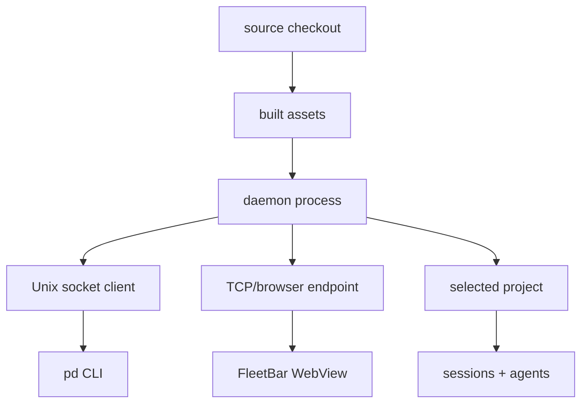

# Running Is Not the Same as Current

You fixed the bug an hour ago. You changed `ProjectPicker.tsx`, the daemon answers `pd status` with a cheerful "reachable," and the browser tab in front of you still shows the old, broken picker. So you fix it again. Same edit, slightly different. Still broken in the tab. You start to doubt your own diff — until you notice the daemon is serving a bundle it built before lunch, and the tab you have been staring at was never going to show your work no matter how many times you wrote it.

Nothing in that scene was *down*. The daemon was alive. The CLI was on your path. The browser rendered a perfectly good UI. Every health check was green, and every one of them was answering the wrong question. That is the failure mode local-first tools quietly carry that cloud products hide: a process can be alive and still be the wrong process. A daemon serves an older bundle. A CLI points at a different install root. A tab talks to the wrong TCP port. A native companion app embeds stale assets. From the user's seat, everything is "running." From an operator's seat, the state is not current — and the gap between those two words is where an hour goes to die. That is why Port Daddy treats runtime provenance as a product feature: agent work is only as trustworthy as the local substrate underneath it.


## Alive Is A Low Bar

Most local tooling starts with a binary health check:

<!-- terminal -->
```bash
$ pd status
daemon: reachable
project: acme-web
```

That is useful, but it is not sufficient. Reachable only answers one question: can the client talk to something? It does not answer:

- which checkout started the daemon;
- which TCP port serves browser clients;
- which socket the CLI is using;
- whether FleetBar is embedded against the same server;
- whether the generated UI bundle matches source;
- whether a stale process survived a restart;
- whether the shell shim points at the expected binary.

In a system that coordinates agents, those details matter. An agent can make the correct edit in source while the operator keeps looking at an old UI. A background watcher can publish events into the wrong project. A guard can appear missing because [the installed CLI is stale](/blog/backend-readiness-is-dependency-truth).

## The Provenance Stack

Runtime truth has layers. Port Daddy needs to expose all of them clearly.

<!-- figure: The provenance stack from source checkout down to live sessions, showing the layers a runtime mismatch can hide in — a bug can sit at any one of them while every layer above reports "fine." -->


A bug can live at any layer. If the operator cannot see the layers, debugging becomes guesswork.

## Portable Debugging Checklist

A good provenance check should be portable. Avoid hardcoded user IDs, machine paths, or branch names. Ask the machine what it is actually running.

<!-- terminal -->
```bash
$ pd status --json
$ brew services info port-daddy
$ cat ~/.port-daddy/daemon.port
$ command -v port-daddy
$ port-daddy doctor
```

The output should let a developer answer four questions:

1. Is the daemon reachable?
2. Who launched it?
3. What endpoint are browser clients using?
4. Which binary is the shell invoking?

If those answers disagree, the tool should say so. The ideal product experience is not "read five commands and infer the mismatch." The ideal experience is a provenance panel that tells the operator exactly which layer is stale.


## Socket Truth And Browser Truth Can Diverge

Local tools often use multiple transport paths. A CLI may talk over a Unix socket while a browser talks over TCP. That can create subtle split-brain behavior:

| Surface | Typical transport | Failure mode |
| --- | --- | --- |
| CLI | Unix socket | works while browser endpoint is stale |
| Fleet Control Center | TCP/HTTP | serves old bundle or wrong project |
| FleetBar | embedded browser | loses query context or opens old route |
| Background watcher | in-process channel | survives daemon restart if unmanaged |

Port Daddy's runtime needs to treat those as first-class facts. A status command that only verifies one path can give false confidence.

## Bundle Freshness Is Runtime Truth

Frontend source is not what the operator sees. The operator sees the built bundle currently served by the daemon or dev server.

That distinction matters when a UI bug is being fixed. A developer can change `ProjectPicker.tsx`, run a build, and still inspect a browser tab that is serving a previous artifact. Or a native app can embed the right route but a stale web bundle.

The control plane should surface enough information to make stale bundles obvious:

```json
{
  "daemon": {
    "pid": 73122,
    "startedAt": "2026-04-29T16:04:12Z",
    "installRoot": "/opt/port-daddy"
  },
  "web": {
    "bundleHash": "index-CHC3Vkxt.js",
    "servedFrom": "public/fleet-ui",
    "builtAt": "2026-04-29T15:58:02Z"
  },
  "client": {
    "surface": "FleetBar",
    "embed": true,
    "projectDir": "/workspace/acme-web"
  }
}
```

That is boring metadata until it saves an hour.


## Clients Should Carry Provenance Too

The daemon cannot be the only source of provenance. Clients should identify the surface they represent and the project they think they are viewing. That lets the server detect split-brain states earlier.

```ts
await fetch('/fleet/models', {
  headers: {
    'x-port-daddy-surface': 'fleetbar',
    'x-port-daddy-project': '/workspace/acme-web',
    'x-port-daddy-client-build': 'fleetbar-2026.04.29'
  }
})
```

Those headers are not security by themselves. They are observability. If a FleetBar WebView drops embed context, or a browser tab points at a stale port, the control plane has enough information to explain the mismatch.

## Currentness Should Block Dangerous Actions

A stale UI can be tolerated while reading. It should not be tolerated while launching, committing, or promoting.

<!-- terminal -->
```bash
$ pd spawn --backend codex --tier mid --budget 0.50 -- "Run the release helper"
blocked: runtime provenance mismatch

daemon:
  installRoot: /Applications/Port Daddy.app
  bundleHash: index-CHC3Vkxt.js

client:
  cliRoot: ./node_modules/.bin/port-daddy
  expectedBundle: index-B4qpV2r9.js

next:
  restart the daemon or switch the shell to the installed CLI
```

That is the experience Port Daddy should optimize for. Do not let a user discover stale runtime state after an expensive or mutating operation. Block early, name the disagreement, and give the next command or UI action.

This is also why provenance belongs in normal product UI, not only diagnostics. A tiny "served by daemon pid 73122 from installed app" line in a resources panel can prevent the wrong debugging story. A bundle hash in an about menu can prove that a screenshot was taken against the current build. A project identity label in FleetBar can stop an operator from launching an agent into the wrong repo. These details feel small until they are missing.

The practical rule is simple: any surface that can spend money, mutate files, start watchers, or publish project events must know which runtime it is speaking to. Read-only screens can tolerate a warning. Mutating screens should require currentness.

That rule gives product designers a useful default. Put provenance near dangerous buttons. Put stale-state warnings where they block the mistaken action, not in a buried diagnostics page. A local agent tool should make the safe path obvious at the moment the operator is about to do something irreversible.

## What Other Tools Tend To Hide

Many developer tools assume a single runtime target. Agent tools cannot get away with that. The same repo may be touched by:

- an IDE assistant;
- a terminal agent;
- a background fleet role;
- a native menu bar app;
- a browser control plane;
- a post-commit hook;
- an MCP client.

If those clients do not share runtime discovery, they will eventually disagree. Port Daddy's job is to make disagreement visible.

That is why hardcoded daemon URLs, implicit project names, and stale long-running watchers are product bugs. They are not small implementation details. They decide whether the human can trust what the control plane says.

## A Better Error Message

The best provenance UX prevents the bad action:

> Launch blocked: FleetBar is connected to daemon pid 73122 from `/Applications/Port Daddy.app`, but this shell is using a development CLI from another install root. Reopen FleetBar or switch the shell shim before launching agents.

That message is much better than:

> HTTP 404

The first message tells the operator what disagrees. The second sends them digging.

## Verification Loop

When debugging a runtime-facing issue, use a small repeatable loop:

<!-- terminal -->
```bash
$ pd status --json
$ pd fleet projects --json
$ pd doctor
$ npm --prefix website-v2 run build
$ pd restart
$ pd status --json
```

Then verify the actual surface:

- open the control plane route;
- confirm the selected project;
- confirm the bundle hash or build time if exposed;
- confirm the route renders the expected feature;
- capture a screenshot if the change is visual.

The important rule is simple: process success is not visual success. Runtime truth is not source truth. The control plane has to make that distinction impossible to miss.

## The Product Bet

As agent tooling gets more local and more parallel, provenance becomes a trust boundary. Developers will not accept mystery automation running from unknown state. They will want the system to say what is alive, what is current, and what is safe to trust.

Port Daddy makes that a [core product concern](/blog/control-plane-is-the-product). Running is table stakes. Current is the thing that matters.
