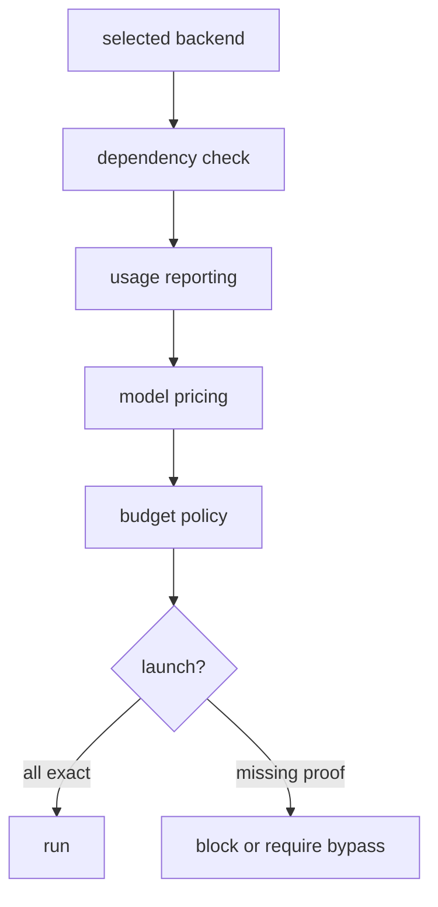

# Telemetry Is a Launch Gate

You press Launch. A spinner turns. Somewhere a model you did not choose starts reading your repo, burning tokens at a rate you cannot name, against a budget nobody set, writing a cost that lands in no ledger. The run finishes, green and cheerful. You will find out what it cost at the end of the month, the way you find out about a leaking pipe — by the water bill.

That spinner is the whole problem in one image. Agent platforms love launch buttons because launch buttons are easy. The hard part is the sentence that should come before the button ever lights up: *proving that this launch should have been allowed.* If a tool cannot say which model ran, how many tokens it used, what rate was applied, which budget policy accepted it, and where the cost was recorded, it is not operating a fleet. It is hoping the bill is fine. So Port Daddy moves telemetry to the front: it is a launch gate, not an afterthought.


## Why Spend Control Is A Product Feature

In 2026, model choice is an engineering decision. A low-tier model may be perfect for a docs sweep. A high-tier model may be justified for a tricky architecture review. A local model may be better for private or repetitive work. A backend without exact usage may still be useful, but it should not silently join unattended automation.

The operator should see those differences before launch.

The mistake is treating cost as accounting. It is not. Cost is a control-plane primitive:

- it determines which work can run unattended;
- it determines whether a failed launch should retry;
- it determines whether a fleet can wake up on every commit;
- it determines whether a human must approve a model tier;
- it determines whether a backend is ready for production use.

If cost is invisible, every automation looks cheap until it is not.

## The Gate

Port Daddy's policy is intentionally strict for operator-facing launches:

| Requirement | Launch implication |
| --- | --- |
| Exact token counts | Estimates are not enough for unattended work. |
| Known model rate | A backend-level guess is not enough. |
| Persisted cost record | Console output is not a ledger. |
| Budget policy | Every run needs a ceiling. |
| Human bypass metadata | Overrides must be explicit and inspectable. |

The launch path should be able to produce a record like this:

```json
{
  "launchId": "run_01JZ9M6A",
  "backend": "codex",
  "model": "gpt-5.3-codex",
  "modelTier": "mid",
  "usage": {
    "inputTokens": 18420,
    "outputTokens": 3120
  },
  "pricing": {
    "inputUsdPerMillion": 1.50,
    "outputUsdPerMillion": 6.00
  },
  "costUsd": 0.04635,
  "budget": {
    "scope": "project-day",
    "limitUsd": 4.00,
    "remainingUsd": 3.21
  }
}
```

That record is not just for finance. It is operational evidence. It tells the next agent, the human, and the control plane why the launch was allowed.


## The Ledger Has To Be Queryable

Console output is not enough. A launch record should be queryable by the control plane, the CLI, and future agents. That means the ledger needs stable fields, not a blob of terminal text.

```sql
launch_id
project_id
session_id
backend
model
model_tier
telemetry_mode
input_tokens
output_tokens
input_rate_usd_per_million
output_rate_usd_per_million
cost_usd
budget_scope
budget_limit_usd
allowed_by
created_at
```

With that shape, a Resources view can explain daily spend, an Activity view can explain why an agent woke up, and a guard can decide whether an unattended launch violated policy. More importantly, the next engineer can debug the system with data instead of folklore.

The ledger also makes failure useful. A blocked launch should still leave a preflight record:

<!-- terminal -->
```bash
$ pd agent "Review this release" --backend custom --model-tier high --dry-run
blocked: backend telemetry is opaque

preflight:
  backend: custom
  model: custom-high
  pricing: missing
  budget: project-day / 4.00 USD
  next: add pricing metadata or launch with explicit human bypass
```

That output is boring, but it is the difference between "the agent did not start" and "the system protected the budget because a required proof was missing."

## Estimates Are A Different Mode

There is nothing wrong with estimates when they are labeled. A local experiment, a manual one-off run, or a backend that does not expose usage can still be useful.

The problem is letting estimates masquerade as exact telemetry.

Port Daddy draws the line like this:

```ts
type TelemetryMode = 'exact' | 'estimated' | 'opaque'

function canLaunchUnattended(mode: TelemetryMode, hasHumanBypass: boolean) {
  if (mode === 'exact') return true
  if (hasHumanBypass) return true
  return false
}
```

That simple boundary changes system behavior. A backend can appear in the catalog while still being blocked for unattended fleet work. The UI can explain why. The operator can decide whether to override.

This is much better than pretending every backend is equally ready.

## Model Tiers Need Real Ladders

"Use the smart model" is not a policy. A fleet needs a ladder.

```yaml
models:
  codex:
    low: gpt-5.4-mini
    mid: gpt-5.3-codex
    high: gpt-5.4
  claude:
    low: claude-haiku-4-5-20251001
    mid: claude-sonnet-4-5-20250929
    high: claude-opus-4-1-20250805
  cloudflare:
    low: "@cf/zai-org/glm-4.7-flash"
    mid: "@cf/qwen/qwen3-30b-a3b-fp8"
    high: "@cf/moonshotai/kimi-k2.6"
```

The ladder is not only about cost. It is about expectation. A low-tier docs watcher should not silently become a high-tier architecture agent because a wrapper default changed. A high-tier run should be an explicit choice.

## Model Routers Need Guardrails Too

Model routers are useful when they pick the cheapest model that can do the job. They are dangerous when they silently change the launch contract. A router should return a decision object that the control plane can inspect:

```json
{
  "requestedTier": "mid",
  "selectedBackend": "codex",
  "selectedModel": "gpt-5.3-codex",
  "reason": "repo-scale code review with exact telemetry",
  "maxCostUsd": 0.35,
  "requiresHumanApproval": false
}
```

If the router wants to escalate to a high tier, that should be visible before execution:

```json
{
  "requestedTier": "mid",
  "selectedModel": "gpt-5.4",
  "requiresHumanApproval": true,
  "reason": "requested task crosses architecture-review policy"
}
```

That is the standard Port Daddy is aiming for: smart defaults, but no invisible premium default. Engineers can accept escalation when it is justified. They should not discover it on a bill.

## The UI Should Refuse Quietly Wrong States

A launch form that hides telemetry status teaches users to ignore it. Port Daddy should instead make readiness visible at the point of action:

- "Ready: exact usage and pricing."
- "Blocked: SDK missing."
- "Blocked: model rate unknown."
- "Manual only: usage estimated."
- "Manual only: no daily budget configured."

That is not a worse user experience. It is a better one. The operator knows what to fix.

<!-- figure: The launch decision walked as a chain — backend, dependency, usage, pricing, budget — where a run only proceeds when every link reports exact data, which is why readiness has to be visible at the point of action. -->


## What Everyone Else Gets Wrong

Many systems treat telemetry as a dashboard after the fact. That is too late. By the time the chart updates, the run already happened.

Port Daddy treats telemetry as part of launch authorization. That creates a cleaner mental model:

- readiness is not only "can I call the API";
- readiness includes "can I account for the run";
- spend is not a monthly surprise;
- manual experiments stay possible;
- unattended automation gets a stricter contract.

This is especially important for local fleets. A background agent that wakes up on every commit can generate a lot of useful work. It can also generate a lot of cost. The control plane should make both visible.

## Spend Policy Is Also A Safety Policy

Cost gates are not only about dollars. They limit blast radius. A runaway watcher with a two-dollar daily ceiling is annoying. The same watcher without a ceiling can become an incident. A high-tier model behind a manual gate can be an excellent architecture reviewer. The same model behind a noisy trigger can become a liability.

Port Daddy's launch gate treats those as the same design problem:

- What event caused the run?
- Which model tier is allowed for that event?
- How much budget remains?
- Can usage be measured exactly?
- Does this role need human approval?
- Where will the decision be recorded?

That is why telemetry belongs before launch. Once the prompt is sent, all the interesting control decisions have already happened.

The bigger idea is that telemetry turns automation from a mood into an accountable resource. When the resource is accountable, engineers can discuss tradeoffs precisely: this watcher is worth seventy-five cents a day, this release review is worth a manual high-tier run, and this opaque backend is useful only for interactive experiments until it reports usage.

## The Developer Payoff

The exciting part is not the cost math. The exciting part is what cost math enables.

Once launches are accountable, you can safely build policies:

```yaml
agents:
  docs-review:
    trigger: git:committed
    model_tier: low
    budget_usd_per_day: 0.75

  architecture-review:
    trigger: manual
    model_tier: high
    requires_human_approval: true

  test-triage:
    trigger: test:failed
    backend: cloudflare
    model_tier: mid
```

Those policies make agent work feel less like a gamble and more like infrastructure. The operator can decide where cheap automation is welcome, where expensive reasoning is worth it, and where no agent should run without approval.

Telemetry is the launch gate because responsible automation starts before the prompt is sent.
