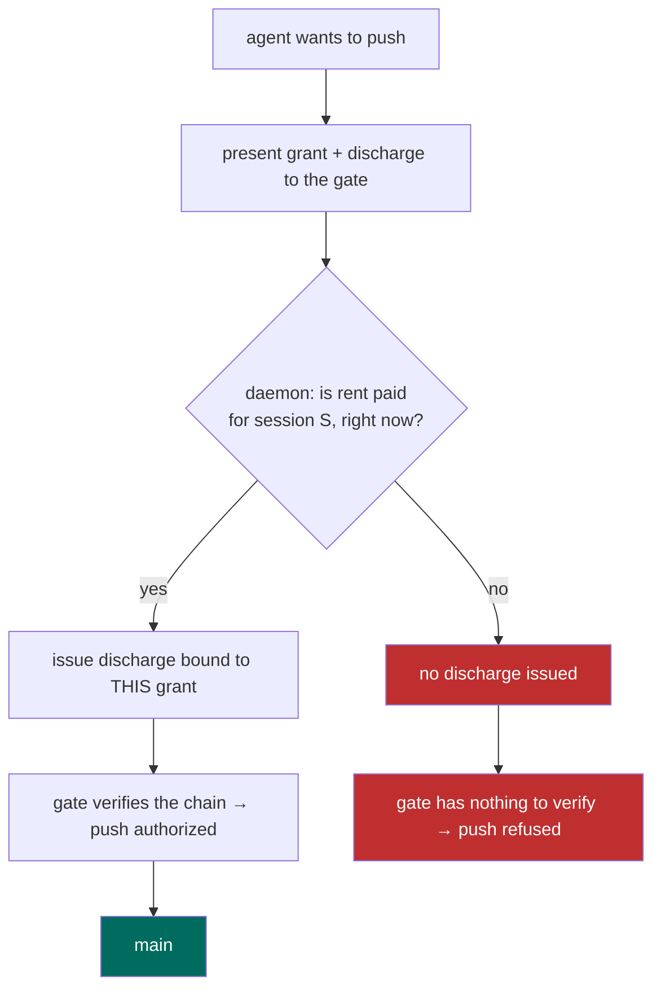
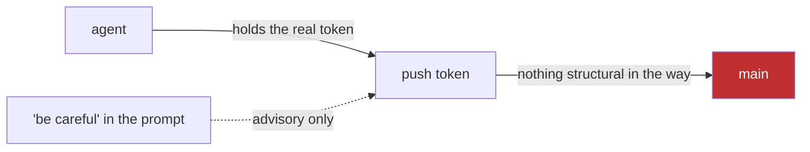

# Your Coding Agent Has Your Push Token

Here is the uncomfortable part of letting an agent work in your repo: it has your credentials. Not a sandboxed copy, not a read-only mirror — the real `gh` token, the real push access, the same keys you use. You go to bed. The agent keeps going. At three in the morning it decides the cleanest way to resolve a conflict is to force-push to `main`, or it commits a `.env` file it found, or it runs `git push` against [a branch you protect by convention](/blog/bond-pricing-is-a-market) and nothing else.

What stops it? Usually one thing: the sentence in the prompt that said *be careful*. That is not a control. It is a hope wearing a control's clothes.

<!-- sidenote: 1 -->
> Port Daddy is the daemon that ends up holding the other end of this problem: a coordination service for fleets of coding agents that sits between them and the irreversible things they can do. The rest of the vocabulary gets defined as it shows up.

The instinct, once you feel this, is to reach for a wrapper. Put a shim in front of `git`. Have it check a rule — "no pushes to `main` unless the session is in good standing" — and refuse the bad ones. We built exactly that. It worked, in the sense that it printed a stern message and exited non-zero. It also had an environment variable that turned it off, because of course it did: the wrapper runs as the agent, with the agent's privileges, inside the agent's process. Anything the agent is told it can bypass, it will bypass, because some future turn will read the error text, find the escape hatch named right there in the message, and take it.

That is the whole problem with in-band enforcement, stated plainly: **if the thing being restrained holds the capability, the restraint is advice.** You can make the advice loud. You cannot make it binding. The agent still has the token.

So the move is not to add a better rule. The move is to take away the capability and hand back something weaker — something the agent can narrow but can never widen.

## A credential that only shrinks

The primitive for this is a **macaroon**.

<!-- sidenote: 2 -->
> Macaroons come from a 2014 Google paper (Birgisson et al., *"Macaroons: Cookies with Contextual Caveats"*). The name is a joke on "cookie." The useful idea: a bearer token whose holder can append restrictions but can never remove them, because each restriction is folded into a running HMAC chain. Tamper with one and the signature breaks.

A macaroon is a bearer token — whoever holds it can use it — with one unusual property. The holder can **attenuate** it: add a caveat like `branch != main`, or `expires in 20 minutes`, or `repo = this-one-only`. Each caveat is chained into a keyed hash, so the token carries its own restrictions and can't be peeled back to a broader version. You can hand an agent a push grant and let it narrow that grant all day. It can mint a token good for one branch for the next five minutes. It cannot mint a token good for everything forever, because the root key that would let it do that never leaves the daemon.

That handles attenuation. It does not yet handle the thing we actually want, which is *conditional* authority — a push that is allowed only while the agent is coordinating like a good citizen. For that you need one more piece: a caveat the agent cannot satisfy on its own.

<!-- sidenote: 3 -->
> "Coordinating like a good citizen" is concrete here, not a mood. It means the session is real, [files are claimed, there's a note per commit](/blog/coordination-guard-claims-into-policy), and the branch is rebased on the canonical head. Port Daddy already evaluates this — it calls the result *rent*. The agent pays rent in coordination, not dollars.

The push grant carries a **third-party caveat**: *"valid only while the Port Daddy daemon attests that coordination rent is paid for session S."* A third-party caveat isn't checked by the verifier directly. It's discharged by someone else — here, the daemon — who issues a second small token, a **discharge**, that says "yes, rent is paid, as of now, for this exact grant." No discharge, no valid push. And the agent cannot write its own discharge, because the discharge is keyed by a secret only the daemon holds.

The shape of the thing:

<!-- figure: The push grant attenuates freely, but the teal seal — the rent-paid discharge — can only be stamped by the daemon. -->


Here is the same idea as control flow. The push only happens when the daemon, not the agent, signs off:

<!-- figure: The gate authorizes a push only on the "yes" branch, where the daemon issues a discharge bound to this grant — every other path dead-ends at refused. -->


Compare that to the old picture, where the only thing between the agent and `main` was the prompt:

<!-- figure: The old design — the agent holds the real token and reaches main directly, with "be careful" hanging off to the side as a dotted, advisory-only line. -->


## We didn't just assert it. We checked it.

It is easy to draw a diagram where the bad arrow is red and feel safe. The diagram is not the guarantee. The interesting question is whether an attacker — an agent that has the public grant, and maybe a leftover discharge from some other session — can get a push authorized that the daemon never blessed.

So we wrote the construction down in **ProVerif** and let it look for that attack.

<!-- sidenote: 4 -->
> ProVerif is an automated protocol verifier. You describe the messages and the secrets in a small modelling language; it explores every interleaving an attacker could produce — replays, reorderings, forgeries — and either finds an attack trace or proves the property holds for all of them. It is the same family of tool used to check TLS handshakes and signal protocols.

The load-bearing property — call it Q1 — is that the gate authorizes a push *only if* the daemon actually issued a discharge bound to that exact grant. Not a discharge for some other grant. Not a forged one. That one.

<!-- syllogism: macaroon_discharge_v1.pv -->
```
PREMISE: the discharge is keyed by a secret only the daemon holds (caveat_key).
PREMISE: the discharge is bound to the grant's signature via HMAC(BIND0, grant_sig || discharge_sig).
THEREFORE: an attacker holding the public grant cannot forge a discharge, nor transfer another grant's discharge onto it.
CONFIDENCE: proof
```

ProVerif returns `RESULT ... is true` for that query, under an active attacker who sees every public grant and discharge on the wire. Good. But a proof is only as honest as the question. So we asked the dual: what if the gate got *lazy* — what if it checked that the discharge was well-formed but skipped the part that binds it to this specific grant?

That model is unsound, and ProVerif finds the attack: two grants that share a rent caveat, one of them legitimately discharged, and the attacker replays that discharge onto the *other* grant. The check passes; the wrong push goes through.

<!-- sidenote: 5 -->
> This is not a bug we shipped — it's the regression test for the design. The attack ProVerif reconstructs is exactly the one the request-binding exists to stop. Proving the lazy verifier *breaks* is what tells you the binding in the real verifier is load-bearing and not decoration.

Which is the entire point of doing this with a machine instead of a whiteboard: the binding is not there because it felt rigorous. It is there because removing it produces a concrete, named, reconstructable attack, and keeping it produces a property that holds against every interleaving the checker can build.

## The swarm and the sovereign

Now the philosophy, and only one slide of it, because this is a blog post and not a seminar.

Thomas Hobbes argued that rational agents with no common authority drift into a "war of all against all" — not because any of them is evil, but because nothing makes cooperation safe. A fleet of coding agents, each holding raw credentials, is that state of nature with a CI pipeline. Two of them claim the same file. One force-pushes over another's work. Each is locally reasonable; the aggregate is a mess.

<!-- figure: Left, five agents each clutching their own key, arrows crossing into conflict. Right, the same five mediated by a single coordinator, orderly flow. -->


The fix Hobbes proposed was a sovereign — a Leviathan — that everyone defers to so that none has to trust the others directly. The macaroon gate is a small, specific version of that. The agents don't have to trust each other, and you don't have to trust the agents. You trust one thing: a daemon whose job is to attest rent and sign discharges, and whose correctness on that one job is not a matter of opinion. It is a proof.

That is a narrower claim than "your agents are now safe," and I want to be precise about how narrow.

## What this does and doesn't buy you

The gate makes the push capability **unforgeable** and the audit trail **real**: every authorized push corresponds to a discharge the daemon issued, against a session whose coordination was current. That is a genuine wall, and it holds even while the push still flows through your ordinary `gh` token.

It does **not** confine a malicious agent running as your own user that copies a live discharge inside its 20-minute window and uses it for something you'd disapprove of. Same user, same machine, live credential — that's a different layer of defense (separate UID, forced egress), and pretending otherwise would be the kind of overclaim this whole exercise exists to avoid. The honest summary: this removes "the agent quietly minted itself broader authority" from your threat model. It does not remove "I ran a hostile agent as root and looked away."

## Try it

The macaroon library and the ProVerif models are in the Port Daddy repo today; the daemon-side gate is wiring up behind it. The part you can run right now — the coordination a discharge is gated on — is one command to start and a few to stay honest:

<!-- terminal -->
```bash
brew install curiositech/tap/port-daddy

# start a coordinated session — this is the "rent" a push grant will check
pd begin --identity myapp:api --purpose "refactor auth"
pd session files claim "$PD_SESSION" src/auth.ts
pd note "race condition in token refresh; fixing the retry path"

# if this agent dies, the next one sees exactly where it was
pd salvage
```

If you want the formal side first, the two models — the one that proves the gate sound and the one that proves the lazy verifier broken — are re-runnable with [ProVerif](https://bblanche.gitlabpages.inria.fr/proverif/) against the `.pv` files in `core/kernel/pd-anchor/formal/proverif/macaroon-discharge/`. Start the checker, watch it say `true`, then delete the binding line and watch it find the attack. That second run is the one that'll convince you.

The token was always the problem. The fix is to hand the agent something it can only ever make smaller.
