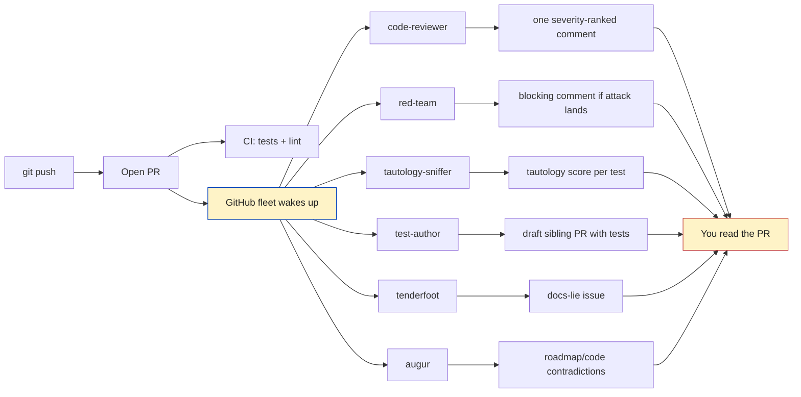
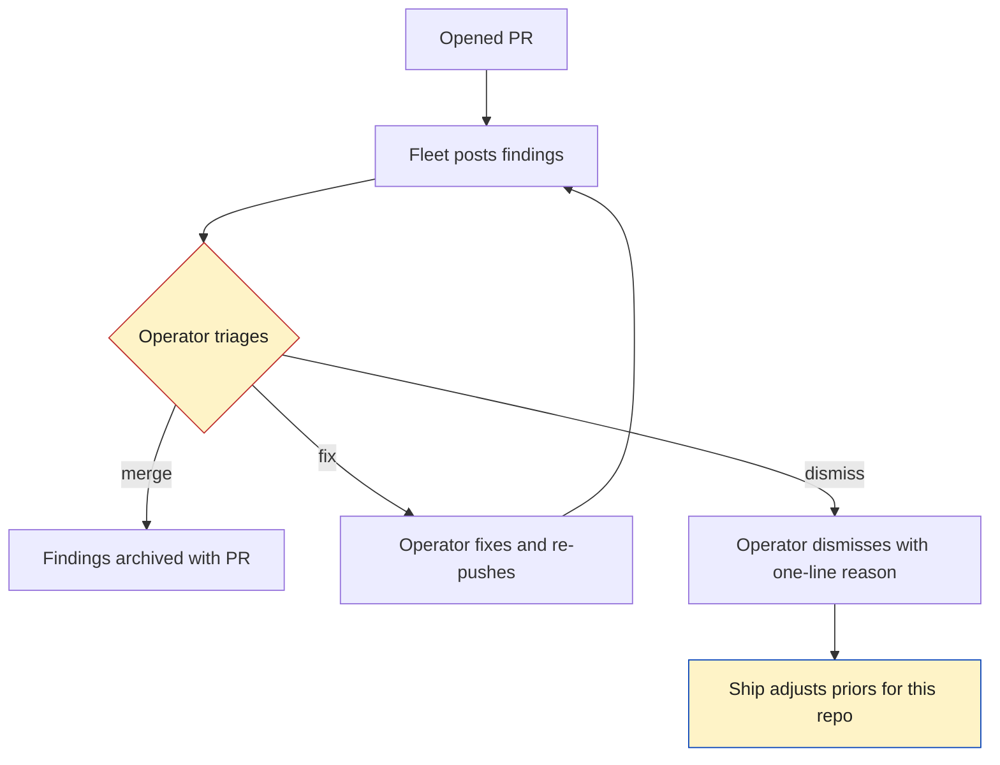

# The PR That Reviews Itself


It is eleven at night. You have rebased twice. You have written the commit message that you wish you had written first. You squint at the diff, run the tests one more time because the universe owes you a green, and you push.

You open the pull request. The little CI gear-wheel spins. You wait.

The CI gear-wheel is, as a matter of plain fact, the only thing standing between you and shipping a bug. Humans review when they're free, and tonight nobody is free. Your tests pass because you wrote them — they are a portrait the code painted of itself. The reviewer who would have caught the *real* problem is the one who knows the codebase the way you knew it three months ago, before the thing you forgot started mattering again.

What if every PR you opened arrived with the adversarial review you would have asked for — automatically, in the same `git push` you were already doing? Not a single noisy bot dumping nits, but a chorus of paid critics, each opinionated about one specific axis, each willing to file a blocking comment when they smell smoke?

That's this post. Six ships, all on the same PR. They are not nice. They are not cruel. They are *useful*.

---

## The PR you wish you had written

Here is what code review actually is when you strip the org-chart away from it. Someone reads your diff. They check it against a model of the system that they hold in their head. When the diff diverges from that model — by accident, by laziness, by something the author didn't see — they say so, in writing, on the PR.

<!-- sidenote: 1 -->
> The thing your CI does is necessary and unloved: it runs the same suite against your branch that it ran against `main`. The thing a reviewer does is the *interesting* part: they bring outside knowledge to bear on inside changes. Code review is a hostile-environment epistemic check. CI is a vital-signs monitor.

The trouble is that reviewers are expensive. A staff engineer who could spot the regression *also* has their own PR open, their own oncall page going off, their own children to feed. So the review you actually get is some compromise between the review your code deserved and the review the reviewer had time to give.

This is where the public defender's office image becomes useful, painful, and instructive. The defendant — your PR — has a constitutional right to representation. The state, if it cares about justice, pays for that representation regardless of whether the defendant can afford it. We do not, as a society, let the prosecutor cross-examine themselves. We expect a *paid critic* in the room.

A repo is the same kind of room. You wrote the PR. CI is the bench clerk. Without an adversary in the room, the question "is this change actually good?" has nobody asking it on the defendant's behalf — or, worse, on the *codebase's* behalf, because the codebase is the one that has to live with what you ship.

The GitHub fleet is six paid critics. They do not replace your human reviewers. They get to the easy findings first, so the humans can spend their attention on the genuinely hard calls.

<!-- figure: One `git push` fans out to six opinionated critics — code-reviewer, red-team, tautology-sniffer, test-author, tenderfoot, and augur — each producing its own kind of finding, all funneling back to the one operator at the bottom; the fan-out is the whole shape of it. -->


The fan-out is the whole shape of it. One push, six critics, one operator at the bottom of the funnel reading the consolidated case.

## Six ships, each opinionated, all on the same PR

The fleet is six members because six is the number of axes that empirically matter when somebody opens a non-trivial pull request. Fewer than six and you miss a class. More than six and reviewers stop reading. The names are deliberately *human*: a ship is not a bot, it is a role in a kitchen, a role in a courtroom, a role in a chorus. Each ship has a job, a fire-condition, and a voice.

<!-- sidenote: 2 -->
> Every ship runs on the same fleet primitive that runs the personal agents elsewhere in Port Daddy. The substrate is identical. The *opinions* are the differentiator. See [the personal fleet post](#) for the morning-briefing variant of the same pattern.

### code-reviewer — the opinionated senior who actually read your code


The `code-reviewer` ship is the one that posts the single, severity-ranked PR comment. It is loaded with **operator-priors** — your `AGENTS.md`, your project ADRs, your house style for that repo — and it reviews the diff the way a senior engineer reviews it: as someone who already has opinions and is unafraid to use them.

<!-- sidenote: 3 -->
> Operator-priors are how the ship sounds like *you* and not like a generic bot. The priors include: ADR catalog, banned-pattern list, "the way we do things" notes from your project's CLAUDE.md, and the post-mortem corpus of bugs you've already paid for once.

What makes this ship survive contact with reality is severity ranking. A PR comment that reads "blocking: ADR-0017 says we don't use mutable globals; this change introduces one in `lib/spawner.ts:142`" is *useful*. A PR comment that reads "nit: consider extracting this into a helper" is *noise*. The ship is allowed exactly one comment per PR, and the comment is forced into the schema `BLOCKING / CONCERN / NIT`. If it has nothing blocking and nothing of concern, it says so out loud, and the operator reads "no findings" instead of a wall of nits and thinks *good, this one's clean*.

A sample comment that the ship would actually post:

<!-- terminal -->
```
BLOCKING (1)
  • lib/sugar.ts:88 — Reverses the "done() requires explicit agentId"
    guarantee from ADR-0023. The fallback path returns the most recent
    session unconditionally, which is the exact behavior the ADR was
    written to forbid.
CONCERN (1)
  • routes/sugar.ts:204 — New 'auto' field is undocumented in OpenAPI
    spec. The schema test passes because the field is additive but
    consumers will not know it exists.
NIT (0)
```

That is the format. The voice is the senior who actually read the diff. The blocking comment cites an ADR by number, which is how the ship signals it is not making things up.

### red-team — the chef who tastes the dish for poison


`red-team` is sampled — not on every PR, but on every PR that touches an adversarial surface. Auth code, file-claim mutations, token issuance, anything that crosses a trust boundary. The ship's job is not to *think* about attacks. It is to **construct them**.

<!-- sidenote: 4 -->
> A PR touches an adversarial surface if it modifies a file under `auth/`, `routes/identity/`, `lib/sessions.ts`, the bond ledger, or any file the operator has tagged `surface: trust-boundary` in the repo manifest. The sampler is deterministic per-commit-hash, so reruns are stable.

The output is an attack story. The ship writes the smallest plausible attack against the change and then *tries it* in a scratch worktree. If the attack lands — if the test it wrote against the new code passes when it should fail — the ship files a blocking comment with the failing exploit attached. If the attack fails to land, the ship files a small green "tried X, didn't work, here is why" note so the next reviewer can see the territory was checked.

The line between this ship and the `code-reviewer` is the line between *opinion* and *evidence*. `code-reviewer` says "I think this is wrong." `red-team` says "Here is the curl command that proves it."

### test-author — the chef who notices the missing dish


The `test-author` ship is downstream of `test-hunter` (which lives in the local fleet and runs continuously against `main`). When test-hunter flags an uncovered code path that the current PR has *added* code to, `test-author` opens a draft *sibling* PR with proposed tests for the path.

<!-- sidenote: 5 -->
> The "sibling PR" pattern matters. The tests do not go *into* your PR — they go into a separate PR that depends on yours. You can ignore them, you can pull them in by merging the sibling into your branch, or you can dismiss the sibling with a reason. The original PR is never modified by the ship.

The draft sibling lands with a comment on the parent PR: *"I drafted three tests for the new code path in `lib/spawner.ts`. Branch: `pr/auto-tests-2814`. Pull at will."* No moralizing about your test discipline. No "you should have written these." It just drafts the tests.

The reason this is a separate ship and not part of `code-reviewer` is that *writing* tests and *judging* tests are different skills. The `code-reviewer` is loaded with priors and is fast. The `test-author` is loaded with the codebase under test and is slow. Different prompts, different models, different cost tiers. Splitting them lets each one do the work it's actually good at.

### tautology-sniffer — the chef who notices the dish tastes like the cookbook


This is the most interesting ship and the one most likely to save you from yourself. `tautology-sniffer` scores every *changed test* in the PR on a single axis:

> *Does this test verify external reality, or does it pin the implementation to its own assumptions?*

A test like `assertEqual(parseDate("2026-01-15"), Date(2026, 0, 15))` is verifying external reality — there is a date out there in the world, and the test pins the parser's output to it. A test like `assertEqual(parser._internalIndex, 4)` after calling `parser.parse("foo")` is a tautology — it pins the parser's behavior to its own implementation, which means the test will pass for any implementation that walks the index to 4, including a broken one.

The ship reads each changed test, traces the assertions back to their roots, and scores them on the **tautology axis** from 0 (pure reality-check) to 1 (pure self-pin). A test scoring above 0.7 gets called out in the PR comment with a small worked example of how the test would still pass if the production code were quietly broken.

This is the ship that catches the bug below.

### tenderfoot — the chef who reads the recipe from page one


`tenderfoot` is the new-developer auditor. On any PR that touches the README, the install path, the docs, or any onboarding surface, this ship spins up a *fresh* worktree — no shell history, no cached credentials, no operator memory — and tries to follow the docs from scratch. End to end. Until something breaks or it gets all the way to a working setup.

<!-- sidenote: 6 -->
> The crucial property is *no operator memory*. Most "does the README work" checks fail because the person running the check has implicit knowledge — they know to set `GEMINI_API_KEY`, they know which directory the daemon reads `.env.local` from, they know the brew tap name. `tenderfoot` knows none of that. It only knows what the README told it.

If `tenderfoot` gets stuck — a missing step, a wrong path, a command that the docs claim works but doesn't — it files an issue (not a PR comment, an *issue*, because the bug is in the docs, not the code) and links it from the PR. The author of the PR sees the link and can decide whether to fix the docs in this PR or in a follow-up.

The single most valuable property of `tenderfoot` is that it *cannot* lie to you about whether the docs work. It has no incentive to. It has no ego. If the docs say `brew install foo` and the command is actually `brew install bar/tap/foo`, `tenderfoot` will say so, calmly, every time.

### augur — the chef who reads the receipts


`augur` (the name is sibling-pending; it may end up as `unspider` instead) is the contradiction-finder. Its input is not just the PR diff — it's the PR diff *plus* the roadmap docs, the recent commit history, the open issues, and the ADRs. Its job is to spot **contradictions between what the PR claims and what other documents in the repo claim is true**.

<!-- sidenote: 7 -->
> Concrete fire-conditions: PR changes a function that an ADR documented as frozen; PR adds a behavior the roadmap says is deprecated; PR introduces a dependency that the architecture doc bans; PR claims to close an issue that the issue body says requires three other things first.

A pure code-review ship can't catch any of those, because they don't live in the diff. They live in the *relationship between* the diff and everything else. The ship's comment is the small, irritating, valuable kind: *"This PR is marked 'closes #487' but #487 also requires the rate-limit work in #492, which is still open. Are we intentionally partial-closing?"*

Contradiction-finding is the rarest skill on a team and the one most likely to be left undone. `augur` is the cheapest cure: a ship whose entire job is to do the boring cross-reference work nobody else has time for.

## The per-ship trade-offs, side by side

| Ship | When it fires | Output | Blocking? | Cost class |
| --- | --- | --- | --- | --- |
| code-reviewer | every PR | one severity-ranked comment | only if BLOCKING | cheap, fast |
| red-team | trust-boundary PRs | attack attempted + result | yes, if attack lands | mid, slow |
| test-author | when test-hunter flags gap | draft sibling PR with tests | no | mid, slow |
| tautology-sniffer | every PR with test changes | score per test, callouts | no | cheap, fast |
| tenderfoot | docs/onboarding PRs | issue if docs lie | no | cheap, slow (sandbox spin-up) |
| augur | every PR | cross-doc contradictions | only when explicit conflict | mid, fast |

The asymmetry is intentional. Only two ships are allowed to block — `code-reviewer` for the ADR-divergent change, `red-team` for the demonstrated exploit. Everything else is advisory. The operator is in charge; the ships are paid critics, not gatekeepers.

## The bug the ship caught

Here is the concrete example that sold me on this whole architecture. It is small, embarrassing, and exactly the kind of thing that ships if no critic is in the room.

A recent PR in this repo added a salvageable-sessions count to a briefing endpoint. The change shipped with **14 green tests**. The tests covered the new field's existence, its type, its presence in the JSON shape, the absence of the field when the operator opted out, and a small handful of edge cases. Every test passed locally. CI was green.

The count was structurally always zero.

The new code computed the count from an in-memory map that the live daemon never populated, because the daemon writes salvageable sessions to a separate table in SQLite and the in-memory map was a vestigial cache from an earlier iteration. The tests passed because *they used the same in-memory map* — every fixture in the test suite seeded the map directly, asserted the count, and tore the map down. The test author had not lied. They had tested the only thing they had wired up.

<!-- sidenote: 8 -->
> This is the textbook tautology. The test pinned the function's behavior to a data structure (`in-memory map → count`) that the production daemon did not use. Production reality lived in a SQLite table containing, at the time of the bug's discovery, **181 salvageable agent sessions** — none of which the new endpoint ever saw.

Against the live daemon, the new endpoint returned `0` to every operator who hit it, for as long as the bug lived. The dashboard panel that depended on the field rendered an empty list. The operator looked at "0 salvageable sessions" and assumed the salvage system was working. It wasn't.

`tautology-sniffer` would have caught it. The traceback from `count` to the in-memory map is exactly the shape it scores. A test that asserts on a value derived from a mock that the test itself constructed scores near 1.0 on the tautology axis. The ship's PR comment would have been something like:

<!-- terminal -->
```
TAUTOLOGY (high — score 0.91)
  tests/unit/briefing.test.js:142
    The salvageable-sessions count is asserted against a value the
    test inserted into the in-memory map fixture three lines earlier.
    Production reads from `salvageable_sessions` (SQLite). This test
    will pass even if the production endpoint returns 0 every time.
    Suggested: add an integration test that seeds the SQLite table
    and reads through the daemon.
```

Fourteen green tests, one PR comment, one paragraph in plain English. The bug never ships. The operator never sees "0" and assumes anything.

<!-- sidenote: 9 -->
> The point is not that the test author was bad. The point is that *writing the test alone* and *judging whether the test verifies external reality* are different cognitive tasks, and the second one is almost never done. A ship that does only the second task is enormously valuable for a tiny amount of compute.

## What happens to your time

The operator's time before the fleet:

1. Open PR.
2. Wait for CI.
3. Wait for a human reviewer.
4. Address review comments.
5. (Repeat 3–4.)
6. Merge.

The operator's time *with* the fleet:

1. Open PR.
2. CI runs. Fleet runs.
3. Read the consolidated comment from `code-reviewer`. If it says "no findings," merge. If it says BLOCKING, fix the blocking issue and force-push.
4. Glance at the tautology scores. Address the ones above 0.7 if they're real. Dismiss the ones that are false positives with a one-line reason.
5. Look at the sibling-PR test drafts. Pull them in if they're good; close them if not.
6. Get a human review for the genuinely hard calls — the architectural decision, the API shape, the thing no ship can have an opinion about.
7. Merge.

The arithmetic that matters is on step 6. *Most* of what a senior engineer used to do during code review was the work the fleet now does — ADR divergence, missing tests, tautology detection, "does the README still work." The senior's actual scarce skill is judgment on the hard calls. The fleet hands them back the hours they used to spend on the easy ones.

<!-- sidenote: 10 -->
> Time-budget math, on a real PR cadence: a team of five doing ten PRs a week spends roughly fifteen reviewer-hours on PR review. About eight of those hours are the easy findings the fleet now lands automatically. That's a working *day per week* of senior engineer time, returned to the senior engineer. Not because the fleet is smart; because the fleet doesn't get tired of looking for ADR divergences at 4pm on a Friday.

## The honest fine print

A paid critic that you can't fire is a hostage situation. The fleet is built so it never becomes one.

<!-- figure: The triage loop that keeps the operator in charge — every finding can be merged, fixed, or dismissed with a one-line reason, and a dismissal feeds back into the ship's priors so false positives get rarer on the operator's own schedule, not a vendor's. -->


Three properties the operator has to be able to rely on:

1. **Dismiss with reason.** Every finding has a "dismiss" button. The dismiss requires a one-line reason. The reason is stored, and the ship reads it the next time it runs on this repo. False positives get rarer, on the schedule of the operator's own annotations, not on a vendor's release cycle.
2. **Daily cost cap.** The fleet has a single hard daily spend cap, set at install. If the fleet would cost more than the cap, it falls back to running only `code-reviewer` and `tautology-sniffer` — the two cheapest ships — and posts a small note explaining why the others didn't run. The cap is a *floor on safety*, not a budget for optimism.
3. **The chat transcripts are visible.** Every ship's reasoning trail lands in the Port Daddy dashboard, attached to the PR. If you want to know *why* `red-team` thought your auth change was attackable, you click into the transcript. The ship can be wrong; it cannot be opaque.

The civility property is also load-bearing. The ships are opinionated — that's the whole point — but they are *not* cruel. The system prompt for `code-reviewer` includes the instruction to write the comment a senior engineer would write to a colleague they respected: blunt, citing evidence, calling the change wrong when it's wrong, and *not* sneering. A paid critic is allowed to disagree. A paid critic is not allowed to be a dick.

<!-- sidenote: 11 -->
> "Adversarial" means *adversarial in the legal-process sense*, not adversarial in the playground sense. The defense lawyer and the prosecutor are adversaries. They are also expected to be civil, to cite their authorities, and to address the bench in complete sentences. That is the bar.

## Connecting to the universe of fleets

Everything in this post runs on the same fleet primitive that runs the personal agents in Port Daddy. The `morning-briefing` agent that reads your calendar and prepares your day is the same shape as `code-reviewer` reading your diff and preparing your review. Different prompts. Different priors. Same substrate.

<!-- sidenote: 12 -->
> The unified fleet is the bet. Personal agents and dev-repo agents look like different products, but they are the same animal eating different food. Sharing the substrate means the cost model, the cap, the dashboard, and the dismiss-with-reason loop are all one system instead of six.

If you want the morning-briefing version, see the [personal-fleet post](#) (sibling, in flight). If you want the CLI-backed view of how the GitHub fleet is wired into push events, see [The CLI Is For The Robots](/blog/the-cli-is-for-the-robots) and the [`/cli-backend` reference](/cli-backend).

## Try it

The whole thing is one tap-installed binary and one daily cap.

<!-- terminal -->
```bash
brew install curiositech/tap/port-daddy
pd fleet up
pd fleet cap set --daily 5
```

`pd fleet up` registers the GitHub fleet against the repos you give it explicit access to. `pd fleet cap set` is the cost cap — five dollars a day is the default and is enough to review roughly forty non-trivial PRs. Walk away. Open a PR on a branch you don't expect to merge yet, just to see what the fleet says. Read the comment. Dismiss anything that's a false positive with a reason. The fleet learns the reasons.

The PR you open tomorrow is going to come back to you with the adversarial review you would have asked for. You will not have asked for it. The brigade will have been already cooking.
