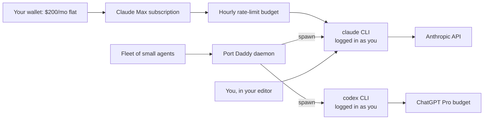
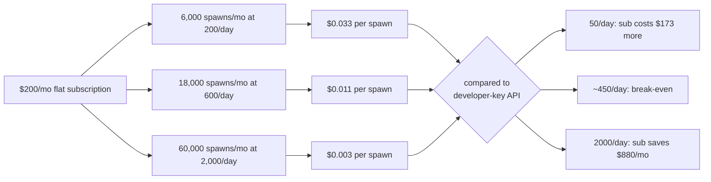

# Your AI Subscription Already Powers A Fleet

I am in Claude Code or Codex about ten hours a day, which sounds like the subscription is fully utilized until you remember a person can only have one cursor at a time. The subscription is a piece of capacity. I am one stream of consumption against it. The other streams — the worktrees running on a different branch, the agents that fire at midnight, the post-commit hook that opens a draft PR before I've even closed the editor — are free to share.

That used to feel like an accounting curiosity. It is the load-bearing fact of the entire setup. The interesting question stopped being *how much of my subscription am I using* and started being *how much of it can a thing that isn't me put to work while I am elsewhere*.

This post is about what happens when you let that thing exist — through a small local daemon called *Port Daddy* and a Unix-shaped primitive called `pd tube`. The pitch in one line: your $20–$200/mo AI subscription, but you wake up to features that weren't there last night.

> **Port Daddy** is a local daemon I run on my laptop that helps multiple AI agents work in the same repo without stepping on each other. It's the thing this post will lean on. You don't need to install it to follow along; the idea travels.


## The one-cursor problem

The wallet line item says *Claude Max, $200/month*. The dashboard says I spent eight hours and forty-one minutes in the CLI yesterday. By any reasonable definition of "using a subscription," I am using it. And yet, while I was using it — in a single editor, on a single file, in a single thought — the same wallet was paid up for a model that could be doing work somewhere else on the same machine. In a different worktree. On a branch I'd forgotten I cut. At three in the morning when I was asleep.

> *Parallel capacity* is the frame I want you to leave with. A subscription buys you a budget of model calls per hour. A human, even a maximally caffeinated one, can only drive one chat at a time. Whatever fraction of that hourly budget your interactive session doesn't claim is parallel capacity — capacity that's already paid for and waiting on somebody to be the second consumer.

The constraint is not "is the subscription idle." The constraint is "can another stream of work share the budget without crowding me out of mine." Those are very different questions. The first one has the smug answer *yes, obviously*. The second one is honest, has teeth, and produces the architecture that makes this post worth reading.

Most of the time, the answer is: *yes, the other streams can share, easily*. I read a paper for forty minutes. The fleet got forty minutes of headroom. I sat in a meeting; the fleet got an hour. I went to dinner; the fleet ran for two hours and left me a tidy diff on a docs branch I forgot I'd started. Then sometimes — the loud hours, the focus blocks where I'm pushing through a refactor and the fleet picks the same hour to be busy — the answer is *no, not without queuing*. And queuing has a cost. Both of us pay for it in latency, and we'll get to that math in the fine-print section, because the fine-print section is where this post earns its keep.

The thing I keep going back to: the *killer experience* of an agent fleet is not "saves me money." It is **waking up to a feature that wasn't there last night**. A docs page that used to be three paragraphs and is now an interactive diagram. A design-token sweep across nine files I'd been meaning to do for a month. A prototype of an idea I'd mumbled into a planning note, executed well enough that I have to argue with it on its own terms rather than dismissing it as an unfinished thought. Port Daddy is shipping a primitive called `pd nightshift` for exactly this — a sibling agent is scoping it in another worktree right now, and the surface looks roughly like `pd nightshift propose / queue / run / review` paired with `pd morning` for the wake-up summary. More on that at the bottom.

> *Killer experience* is borrowed from the early-PC press, when a "killer app" was the one program that justified buying the machine. The fleet has many small wins (cost, tidy notes, fewer typos). The killer experience is the one that justifies the whole frame. For me it's the morning diff.

## What `pd tube` is, and why it makes this possible

Port Daddy ships with a primitive called `pd tube`. It is, mechanically, a thin wrapper around a local CLI process. You hand it the name of a command-line tool — `claude` or `codex` are the two interesting ones here — and `pd tube` runs that tool as a subprocess, with a structured prompt on stdin and a captured response on stdout. The CLI does the actual model call against the vendor's API. Port Daddy does the bookkeeping: which agent, which session, how much it nominally cost, where the reply lives, who's allowed to read it.

> A *CLI subprocess* is just one program starting another and reading its output. The same way `ls | grep foo` works, `pd tube` runs the vendor's CLI tool and reads back what the model said. Nothing magical, but it lets a daemon pretend to be an agent typing in a chat window — at the speed and scale a daemon can run, not the speed a human types.

The crucial trick is the *authentication boundary*. The `claude` CLI is logged in **as you**, the human, with your Claude Max subscription. It hits Anthropic's API the same way the desktop app does. When Port Daddy invokes it as a subprocess, the API call is billed against your subscription's flat-rate plan, not against a per-token developer key. Your wallet doesn't move. Your *capacity sharing* does.



<!-- figure: pd-tube routes fleet spawns and your interactive session through the same CLI binary, against the same hourly budget — same wallet, same auth, two streams of consumption -->

The wrapper is intentionally boring. It is not a clever API client. It is not a re-implementation of the vendor's protocol. It does not try to be smarter than the official CLI. It just lets the daemon talk to the same binary your terminal already talks to, with a payload format Port Daddy understands on the other end.

That boring shape is what unlocks the economics. The vendor sees an authenticated subscription user — sometimes typing fast, sometimes typing slow, sometimes apparently typing in their sleep. The daemon sees a programmable agent loop. Both are correct. Both are happy. The hourly rate-limit budget is the seam where they meet, and the rest of this post is about how to share that seam without pinching either side.

## The fleet that runs on it

A "fleet," in Port Daddy's vocabulary, is a roster of small specialized agents that hold opinions about a repo. They aren't a single brilliant generalist. They are eight to fifteen mediocre specialists — most of them a hundred lines of prompt and a clear job — coordinated to act in parallel.

Mine looks roughly like this:

| Ship | Job | Fires on |
| --- | --- | --- |
| **gardener** | Background cleanup of stale notes, dead session rows, orphaned claims. | Cron, every 5 min |
| **qa** | Re-reads the diff on each commit and asks "would I have done this differently?" | post-commit hook |
| **code-reviewer** | Posts inline feedback on the active session's most recent change. | Diff threshold |
| **red-team** | Adversarial. Reads the docs and tries to break the claims in them. | New whitepaper draft |
| **test-author** | When code lands without a test, writes one. | post-commit hook |
| **tautology-sniffer** | Hunts for circular reasoning in docs and removes it. | docs/ diff |
| **tenderfoot** | Onboards new repos. Reads the README and asks: "what's missing?" | Manual |
| **cartographer** | Builds a map of the repo's symbols and watches for drift. | Hourly |
| **spider** | Crawls the issue tracker and proposes follow-up roadmap items. | Hourly |

> An *agent* in this post just means: a model invocation with a job description, a context window, and the ability to write back to a shared system. Not autonomous in the science-fiction sense — autonomous in the sense that *I didn't have to be in the chair when it ran*.


Each ship is cheap to write — they are sixty-line prompt files with a `pd-fleet.yml` entry that says when to fire and which backend to use. The hard part has never been writing the ships. The hard part has always been *paying for them to run continuously and not crowd out my own session*. Which brings us back to the budget.

## The setup, three lines

Here is the entire thing, end to end, on a Mac with Homebrew installed:

<!-- terminal -->
```bash
brew install curiositech/tap/port-daddy
claude --login        # or: codex auth login
PD_USE_CLI_BACKEND=claude-code pd fleet up
```

The first line installs Port Daddy and the `pd` binary. The second logs the official `claude` (or `codex`) CLI into your existing subscription — same auth flow as the desktop app; nothing exotic. The third line tells the daemon: *for every fleet spawn from now on, route through the CLI subprocess instead of a paid developer key*.

The environment variable is the load-bearing piece. `PD_USE_CLI_BACKEND=claude-code` overrides whatever per-agent backend is declared in `pd-fleet.yml` and forces every spawn through the local subscription tube. You can flip it the other way — set it back to a developer key — when you want a specific ship to burst past the subscription's rate limit without contending with your interactive session. But in steady state, on a $200/mo Max plan, the env var stays set and the fleet stays on the subscription. See the [CLI backend docs](/cli-backend) for the full matrix of which agent ends up on which auth.

> *Rate limits* are the obvious caveat. Claude Max and ChatGPT Pro both impose per-hour and per-day caps. They're generous, but they are not infinite, and they are the only number in this whole post that actually matters. A fleet that fires twenty times a minute will queue. So will you, sitting next to it. Port Daddy throttles spawns per-agent, per-project, and per-hour, and the daemon backs off when the CLI returns a rate-limit error and retries with jitter. None of this requires you to touch it. It just runs at a pace the subscription allows — and, more importantly, at a pace that yields to *you* when you and the fleet collide.

The friction-removal here is the whole reason the architecture becomes interesting. If the setup were eight commands and a config file and a vault, the fleet wouldn't compound — too few people would cross the activation barrier. Three lines is a different shape of thing entirely. It's the difference between *I should try that someday* and *I'll do it during lunch*.

## The math, honestly

This is the section I most want you to leave with. Let me walk it cold.

Assume Claude Max at $200/month and a fleet that fires **200 spawns per day** — meaning each of the nine ships runs an average of ~22 times in a 24-hour day, which is roughly what mine does. Thirty days a month = 6,000 spawns/month.

The per-spawn marginal cost on your wallet is:

$$\frac{\$200}{6000} = \$0.033 \text{ per spawn}$$

> The exact same call, billed through Anthropic's API at developer rates (Claude Sonnet 4.6, with the prompt sizes and output sizes I actually see in `lib/cost-tracker.ts`), runs about **$0.018/spawn** — call it $108/month for the same 6,000 spawns. So if your fleet is *small* and your interactive use is *low*, the subscription is slightly worse than pay-as-you-go. The subscription wins by leverage, not by per-call price.

Now triple it. **600 spawns per day**, 18,000/month. The math:

$$\frac{\$200}{18000} = \$0.011 \text{ per spawn}$$

At this rate, the same workload on the developer-key API would be **$324/month**. The subscription saves you $124. And the fleet is, importantly, *idle for most of those spawns* — it's just gardener and cartographer and the cron-driven ships running on autopilot, doing the unglamorous maintenance that keeps the repo a place where humans want to live.

Now ten-x it. **2,000 spawns per day**, 60,000/month:

$$\frac{\$200}{60000} = \$0.0033 \text{ per spawn}$$

That same workload on the developer-key API would be $1,080/month. The subscription saves you $880. You will *probably* be brushing against Claude Max's rate limit at this rate, and you will *definitely* feel it when the fleet and your interactive session collide. The cost of being throttled is "the gardener has to wait twelve seconds" or, worse, "I have to wait twelve seconds." Not "my credit card bill ate the rent."

The shape of the cost curve, drawn as a flow:



<!-- figure: subscription savings scale super-linearly past ~450 spawns/day, because the per-spawn cost asymptotes to zero while the developer-key cost is constant per call -->

Here is the same trajectory laid out as a table, with the numbers checked against the live rate sheet in `docs/fleet/backend-costs.md`:

| Spawns/day | Spawns/mo | Per-spawn (sub) | Same load via developer key | You save |
| ---: | ---: | ---: | ---: | ---: |
| 50    | 1,500   | $0.133 | $27   | -$173 (sub overshoots) |
| 200   | 6,000   | $0.033 | $108  | -$92 (sub still overshoots) |
| 600   | 18,000  | $0.011 | $324  | **+$124** |
| 2,000 | 60,000  | $0.003 | $1,080 | **+$880** |
| Idle  | 0       | $0     | $0    | $0 marginal — but you were paying $200 anyway |

> The crossover point is around **450 spawns/day**. Below that, the developer-key route is cheaper per call. Above that — which is most of what a real fleet does over a month, because cron is a relentless little metronome — the subscription wins outright. The break-even moves up if you mostly use cheaper models like Haiku, and moves down if you mostly use Opus.

What changes when you internalize this: the fleet stops being an *additional* cost. It is the cost you were already paying *finally getting a second customer*, which is you and the fleet sharing the budget your wallet already wrote a check against.

## The honest fine print: rate-limit contention

This would not be an Erich post without the part where I tell you the things that bit me. And the thing that bites hardest, the thing that earlier drafts of this post buried under economics, is **rate-limit contention**.

When I am ten hours into a focus block and the fleet picks the same hour to be loud, we are both consumers of the same hourly budget. The fleet does not have a magical second pool. There is one bucket, the subscription is one bucket, and we are two faucets dropped into it. The fleet pays in latency. *I* pay in latency. Sometimes the Claude CLI says "please wait a minute" and I sigh, because it's not the model being slow — it's the model honoring the cap, and the fleet just ate the headroom I needed.

> The contention is sharpest when interactive and fleet fire in the same hour. The mitigation isn't *less fleet*, it's *better-scheduled fleet*. The gardener doesn't care if it runs at 2:14am or 2:23am. Code-reviewer on a fresh commit, on the other hand, is time-sensitive. Per-ship daily caps and per-ship preferred-hour windows in `pd-fleet.yml` are the load-bearing knob.

**The CLIs were not designed for fleet use.** They were designed for one human, one terminal, one session at a time. They mostly behave under concurrent invocation, but the official `claude` CLI is happiest when there's a single instance running. Port Daddy serializes per-CLI access with a small lock so two ships don't try to drive `claude` simultaneously. If you bypass that — by, say, having two terminals running `claude` directly while the fleet is also running — you'll occasionally see auth handshakes get confused. The fix is "let Port Daddy own the CLI process." The cost is "you can no longer use `claude` directly from your shell while the fleet is up." For most people, this is fine, because they were going to use the fleet anyway.

**Rate limits surface as queueing, not failure.** When Claude Max throws a rate-limit code, Port Daddy backs off, marks the spawn `queued`, and retries with jitter. The fleet does not crash. But spawns can pile up — I've had a 40-deep queue during a particularly chatty hour while the model was busy doing other things. The gardener doesn't mind waiting. The code-reviewer's verdict on a commit you just landed *does* mind, because the diff has moved on by the time it arrives.

> If you want to *guarantee* a low-latency ship, set `PD_USE_CLI_BACKEND=` empty for that specific agent in `pd-fleet.yml` and let it pay developer-key prices. It's an explicit declaration that this ship's latency is worth more than its marginal cost. Fleet-wide subscription routing is the default; per-ship API routing is the escape hatch.

**You will eat your own interactive Claude Code budget if you're sloppy.** If you're like me — ten hours a day in the CLI — every fleet spawn comes out of the same rate-limit bucket. A loud fleet *can* starve interactive work. The mitigation is throttling: cap each agent's spawns-per-day in `pd-fleet.yml`, prioritize the agents you actually need, and give the cron-driven ships preferred hours that avoid your focus blocks. I keep my fleet at roughly 600 spawns/day, with most of them scheduled between 10pm and 7am. Interactive Claude Code rarely complains, because most of the fleet is firing while I'm asleep.

**Subscription pricing can change.** Anthropic raised Max from $100 to $200 in late 2025. OpenAI's Pro plan has bounced around. The math above is current for May 2026; I check `docs/fleet/backend-costs.md` whenever the credit-card line item moves, and so should you. If subscription pricing ever uncouples from flat-rate — if vendors start metering subscription calls — the entire post collapses. So far, they haven't. Vendors love selling flat-rate plans to underutilized capacity. That's the whole business model. The fleet is just refusing to leave the capacity sitting on the dock.

## The morning diff: `pd nightshift`

The pitch at the top of this post said the killer experience is waking up to work that wasn't there last night. Let me close the loop on what that actually looks like, because it's the part of the architecture I'm most excited about and also the part still being built.

Port Daddy is shipping a primitive called `pd nightshift`. A sibling agent is scoping it in a worktree on `feat/nightshift-first-cut` as I write this — by the time you read it, the surface should be something like:

<!-- terminal -->
```bash
pd nightshift propose      # "here's what I noticed the repo wants tonight"
pd nightshift queue        # operator approves a subset, hands them to the fleet
pd nightshift run          # fleet actually executes them, overnight, against a per-ship cap
pd morning                 # wake-up summary: PRs opened, diffs written, things I should look at
```

> `pd nightshift` is the orchestrator; `pd morning` is the reader. The two have to be split, because *proposing* is cheap and constant, but *running* needs operator consent — you don't want the fleet shipping arbitrary changes to your repo while you sleep just because it had ideas. The consent gate is the whole game, and it's why the queue verb sits between propose and run.

The shape of the experience I want is: I push my last commit at 11pm. The fleet's proposer wakes up at 11:05 — it knows the repo, it has been reading the cartographer's map all day, it has been listening to red-team complain about the docs, and it has a list of small, scoped, won't-break-the-build improvements it thinks would land cleanly. It writes them down. I look at the queue on my phone before bed and approve four of them. The fleet runs them between 1am and 6am, on the rate-limit headroom I am not consuming because I am asleep. At 7am, `pd morning` shows me four draft PRs, ranked by how confident the fleet is that I'll like them, with a one-paragraph rationale each. I drink coffee. I read. I merge two, send one back for revision, close one as not-this-week.

The morning isn't *waste recovered*. The morning is *capacity I never had*. I cannot work on four small repo improvements between 1am and 6am because I am not at the keyboard between 1am and 6am. The fleet is.


The deeper move underneath all of this — and this is where I'd point if you want to read further — is that local agent coordination tools like Port Daddy let you treat AI as an *operating-system service*, not an *API call*. You log in once. The OS routes traffic. The wallet is set by your subscription, not by your per-call habits. The fleet behaves like a set of cooperative-multitasking processes sharing a single capability, in the same way the kernel multiplexes one CPU across many programs. Once you see it that way, the question stops being "how much per call" and starts being "what would I do with capacity I already paid for, while the part of me that types is doing something else."

> *Cooperative multitasking* was the OS model from System 6 through Windows 3.1 — programs voluntarily yielded the CPU to each other, no preemption. It worked when programs were polite, broke when one was greedy. Modern OSes are preemptive. Port Daddy's fleet is closer to cooperative: ships yield when they can, and the operator (or the rate limit) preempts when they can't. The interactive session is the program that gets to be a little greedy, because there's only one of it.

What would I do with that capacity? I would write code-reviewer. And red-team. And tautology-sniffer. And the eight others. And I would let them run while I sleep, on a budget I was already paying for, against a wallet that did not move when I added them. The bill is the same. The morning is different.

That is the pitch. Your $20–$200/mo subscription. Agents work when you don't. Same wallet. Much more useful agent.

## Read next

If the fleet sounds interesting, the right next post is [The CLI Is For The Robots](/blog/the-cli-is-for-the-robots) — a sibling argument that the operator should not be typing `pd` commands; they should be pressing buttons, and the CLI is reserved for the agents themselves. The post you are reading is about *what* the fleet does with your subscription; the CLI-for-robots post is about *who* should be talking to it.

If the morning-diff experience is interesting, the companion post is [The PR That Reviews Itself](/blog/the-pr-that-reviews-itself) — a slightly different angle on the same idea: the moment you push at eleven at night and somebody is already reviewing it. Same primitive, narrower frame.

If the underlying plumbing is interesting, [PD Tube Turns UI Events Into Agent Work](/blog/pd-tube-event-reply-loop) walks through `pd tube` from a different angle — how the same wrapper that fans out to fleet ships also handles browser button clicks and failing-test hooks. Same plumbing. Different consumers.

If the *control plane* idea is interesting — the operating-system-shaped frame I waved at near the end — [The Control Plane Is The Product](/blog/control-plane-is-the-product) is the long version of that argument. The fleet is one of the things the control plane controls. There are several others.
